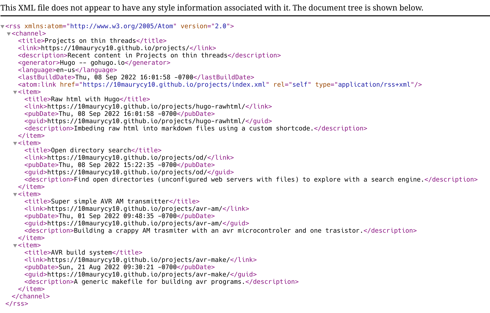

# What is RSS

RSS is a simple way for a server to provide a feed.

If you have ever seen this logo: , it indicates that the site supports RSS.

If you try to open the feed in a browser, you will likely get unrendered XML:

RSS has declined in popularity as sites like Facebook and Twitter have discontinued RSS feed integration. 
(Youtube actually supports RSS, if you open the inspector and search for 'rss' on a channel page, you will find a feed link)

This has resulted in a lot of commercial rss clients/readers like Google Reader being discontinued.

## How to use RSS

You need to install an rss client, I personally use newsboat (a commandline rss client).

I can recommend [Akregator from the KDE project](https://apps.kde.org/akregator/) as a graphical client.

A lot of sites have RSS feeds that can be found in the document metadata with the inspector browser debugging tool.

# Why is RSS better than (Twitter, Reddit, Discord)

Social media sites have a lot of problems:

- Celebrity gossip if your feed, often with no way to remove it.

- Non chronological ordering

- Surveillance of everything you do. (RSS servers cant see if you click on a post, just that you subscribed to the feed)

- Random censorship or downranking for opaque reasons. On some sites you cant even use the word 'cracker' without getting downranked or silently removed.

