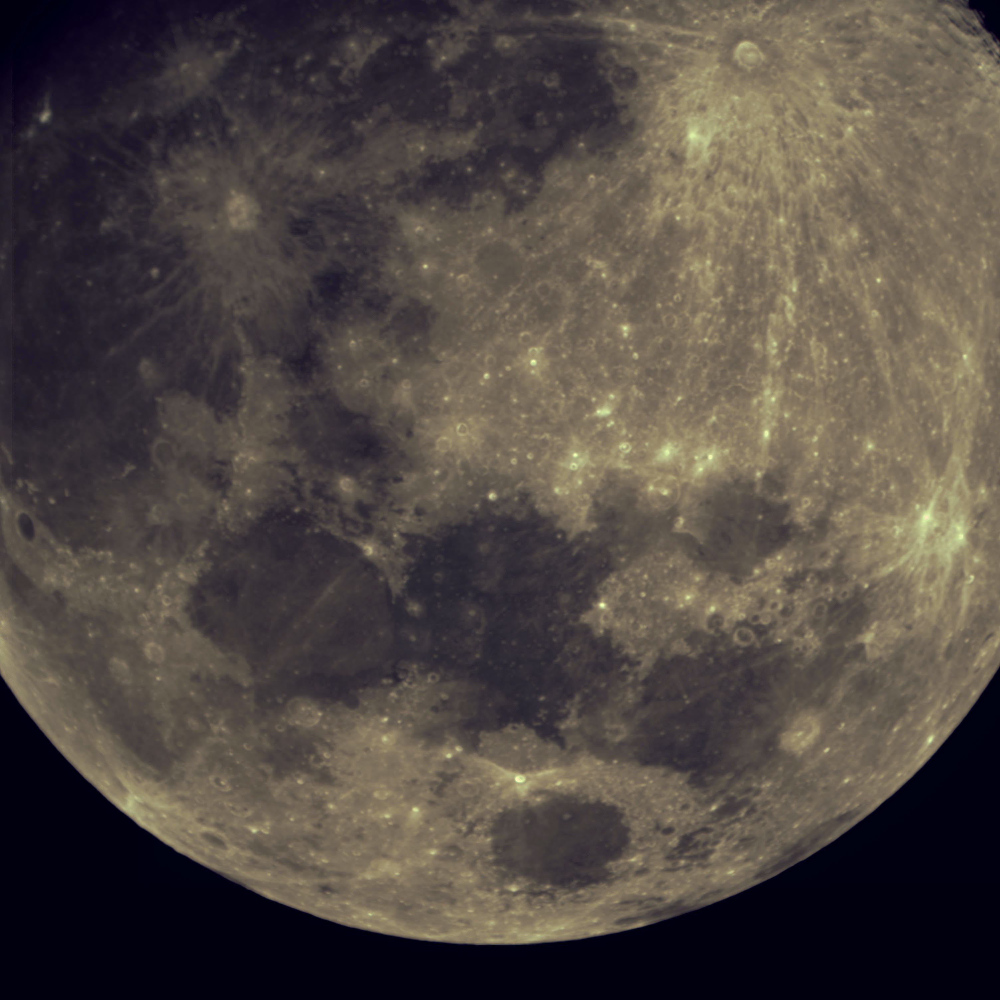
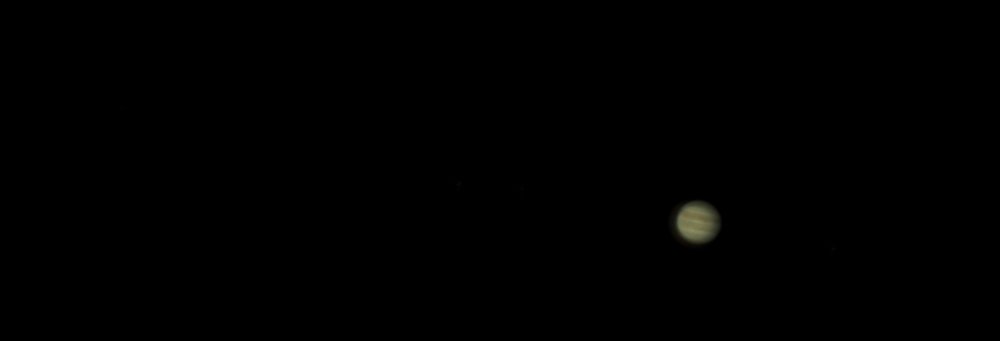
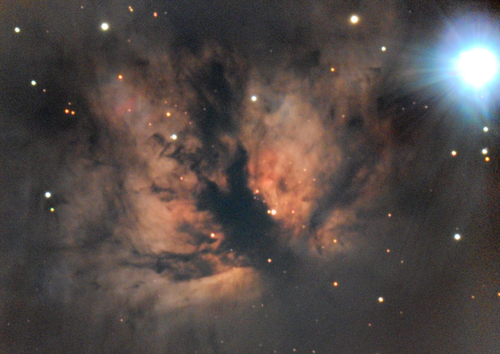
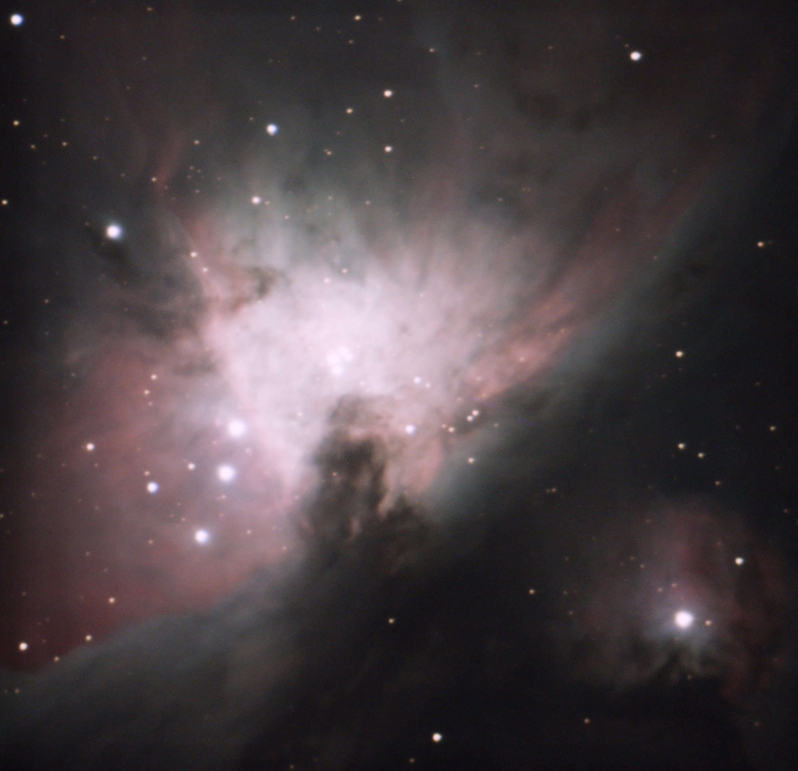
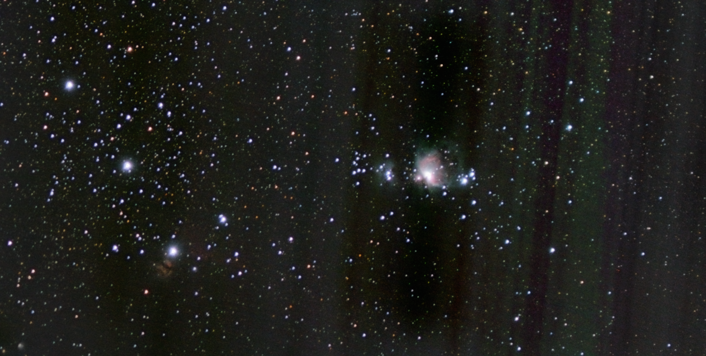
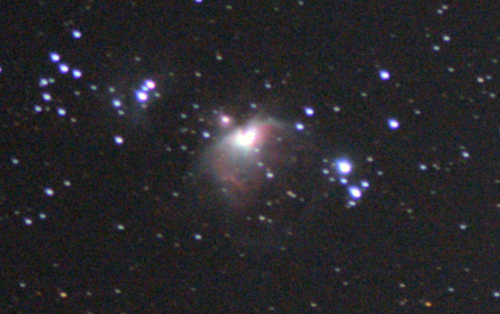
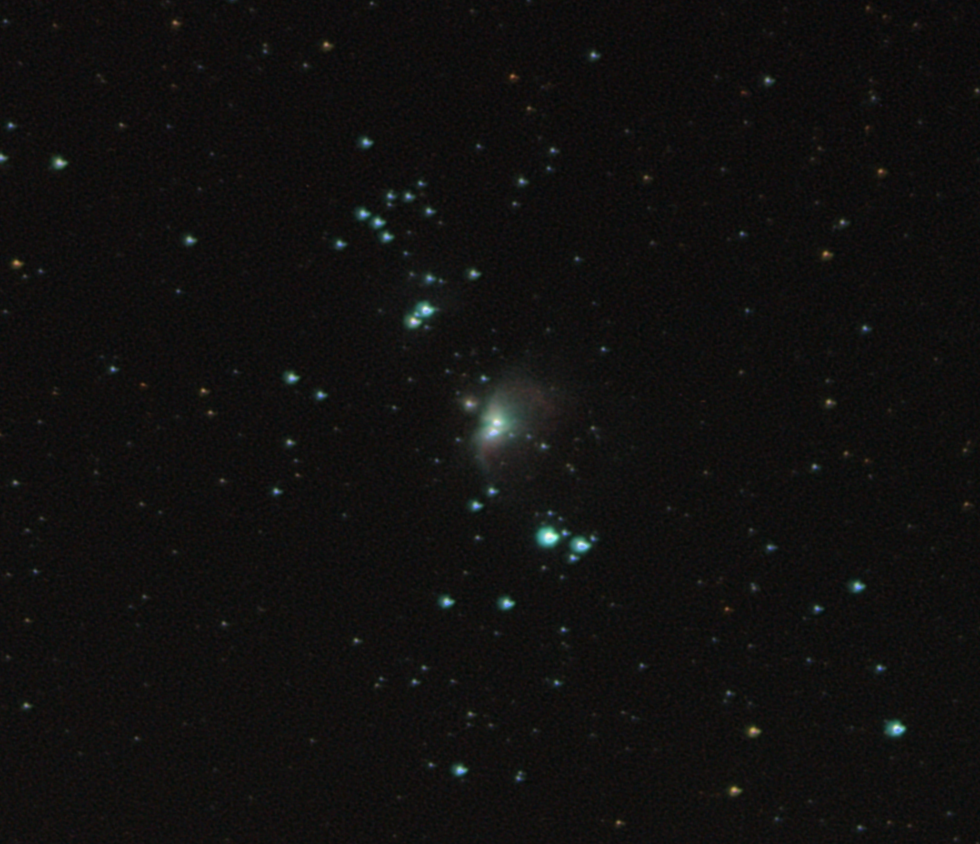

## M42: Large [2025-02-19]

Total exposure: 6 minutes (36 x 10 seconds)

Shot with a ASI533, 0.63 reducer and C9.25 SCT on an equatorial mount.
Processed with Siril.

## Horsehead nebula [2025-02-12]

Total exposure: 8 minutes (50 x 10 seconds) (during full moon)

Shot with a ASI533, 0.63 reducer and C9.25 SCT on an equatorial mount.
Processed with Siril.

I had issues finding the Horsehead, and only ever had it in the corner of the frame.
Any part of the Horsehead was only included in around 15 frames, for around 2.5 minutes of effective exposure. 

## Earth's moon [2025-02-10]

Total exposure: 1 second (1000 x 1 ms)

Shot with a ASI533, 0.63 reducer and C9.25 SCT on an equatorial mount.
Processed with Siril.

## Jupiter [2025-02-10]

Total exposure: 1 second (100 x 10 ms)

Shot with a ASI533, 0.63 reducer (not a good idea here) and C9.25 SCT on an equatorial mount.
Processed with Siril.

## Flame nebula [2025-02-10]

Total exposure: 1.2 hours (870 x 5 seconds) (during full moon)

Shot with a ASI533, 0.63 reducer and C9.25 SCT on an equatorial mount.
Processed with Siril.

## M42: With a telescope [2025-01-28]

Total exposure: 100 seconds. (100 x 1 second)

Shot with a ASI533 and C9.25 SCT on an equatorial mount.
Processed in DeepSkyStacker and Siril.

## M42: More data [2025-01-26]

Total exposure: 1 hour, 12 minutes (240 x 13 seconds)

Shot with a Canon EOS M6 mark II, using the included lens (45 mm focal length), on an equatorial mount.
Processed in DeepSkyStacker and Siril.

The flame and Horsehead are in there if you squint.

## M42: First tracked image [2025-01-24]

Total exposure: 4 minutes (20 x 13 seconds)

Shot with a Canon EOS M6 mark II, using the included lens (45 mm focal length), on an equatorial mount.
Processed in DeepSkyStacker and Siril.

## M42: First image [2025-01-22]

Total exposure: 20 minutes

Shot with a Canon EOS M6 mark II, using the included lens (45 mm focal length), untracked.
Processed in DeepSkyStacker and Siril.
