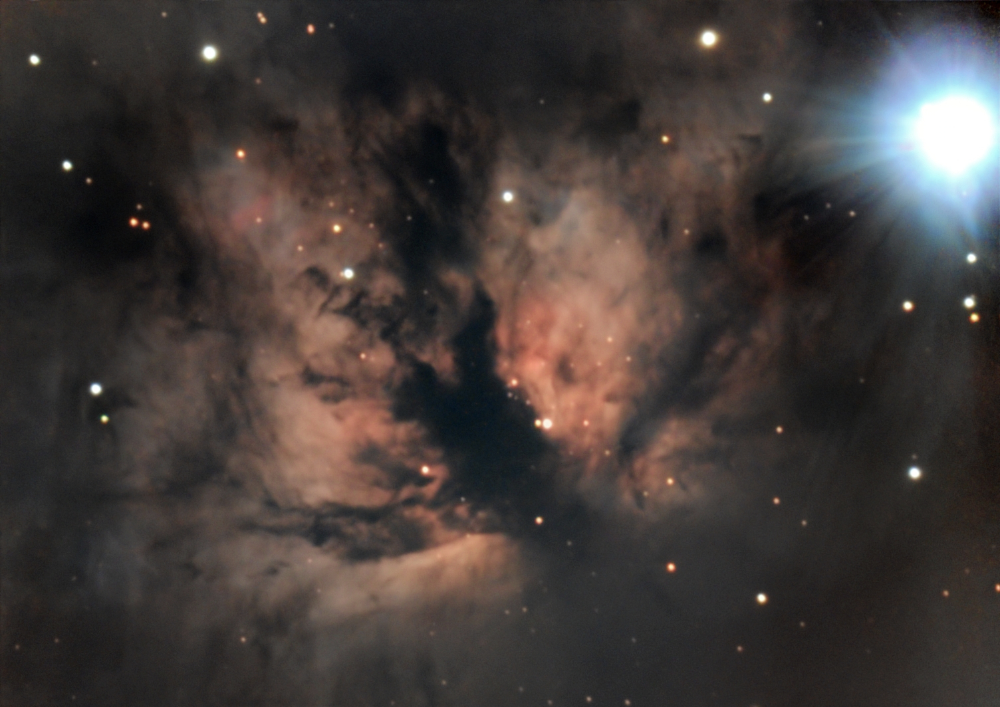

## M42: Orion nebula [2025-02-19]

> 
North is left.

Total exposure: 6 minutes (36 x 10 seconds)

Shot with a ASI533, 0.63 reducer and C9.25 SCT on an equatorial mount.
Processed with Siril.

## B33 + IC434: Horsehead nebula [2025-02-12]

> 
North is left.

Total exposure: 8 minutes (50 x 10 seconds) (during full moon)

Shot with a ASI533, 0.63 reducer and C9.25 SCT on an equatorial mount.
Processed with Siril.

I had issues finding the Horsehead, and only ever had it in the corner of the frame.
Any part of the Horsehead was only included in around 15 frames, for around 2.5 minutes of effective exposure. 

## Earth's moon [2025-02-10]

> 
The north pole is down

Total exposure: 1 second (1000 x 1 ms)

Shot with a ASI533, 0.63 reducer and C9.25 SCT on an equatorial mount.
Processed with Siril.

## Jupiter [2025-02-10]

Total exposure: 1 second (100 x 10 ms)

Shot with a ASI533, 0.63 reducer (not a good idea here) and C9.25 SCT on an equatorial mount.
Processed with Siril.

## NGC2024: Flame nebula [2025-02-10]

> 
North is up.

Total exposure: 1.2 hours (870 x 5 seconds) (during full moon)

Shot with a ASI533, 0.63 reducer and C9.25 SCT on an equatorial mount.
Processed with Siril and GraXpert.

## M42: Orion nebula (with a telescope) [2025-01-28]

> 
North is down/right.

Total exposure: 100 seconds. (100 x 1 second)

Shot with a ASI533 and C9.25 SCT on an equatorial mount.
Processed in DeepSkyStacker and Siril.

## M42: Orion nebula (more data) [2025-01-26]

> 
North is left.

Total exposure: 1 hour, 12 minutes (240 x 13 seconds)

Shot with a Canon EOS M6 mark II, using the included lens (45 mm focal length), on an equatorial mount.
Processed in DeepSkyStacker and Siril.

The flame and Horsehead are in there if you squint.

## M42: Orion nebula (tracked) [2025-01-24]

> 
North is left/up.

Total exposure: 4 minutes (20 x 13 seconds)

Shot with a Canon EOS M6 mark II, using the included lens (45 mm focal length), on an equatorial mount.
Processed in DeepSkyStacker and Siril.

## M42: Orion nebula [2025-01-22]

> 
North is up.

Total exposure: 20 minutes

Shot with a Canon EOS M6 mark II, using the included lens (45 mm focal length), untracked.
Processed in DeepSkyStacker and Siril.
