## Assorted pictures of space, taken from my backyard:

What follows is a general explanation of how these are captured.
Feel free to scroll past if you just want to see the results.

Deep sky objects, like nebulae, are very dim and require many hours of exposure to capture properly.
However, a multi-hour exposure would require an impossibly precise mount and could easily be ruined by passing satellites and clouds.
Instead, I take multiple shorter exposures, which I then align and combine together into a single image.
This allows any imperfect frames to be removed, without throwing away more then a few seconds of data.

The final step is using a non-linear "stretch" function to brighten up the fainter parts of the image, bringing the dynamic range down to something that can be displayed on a monitor.

Some of these photos are narrowband or "false color" images, for which I used filters to capture very specific parts of the spectrum, and then (rather arbitrarily) assigned them RGB colors.
In these cases, I mention the palette used as something like this:
"Oxygen-Hydrogen-Sulfur", which would indicate that the red channel is the Oxygen-III line, green is Hydrogen-alpha and blue is Sulfur-II.

Planets and moons are very bright, but very small, with the views easily being spoiled by atmospheric distortion.
To deal with this, I record a high frame rate video in hopes of catching a brief moment of perfect atmospheric conditions.
I then stack together the sharpest frames from that video and apply wavelet sharpening to bring out the details.

## M88 / NGC4501 [2025-04-05]

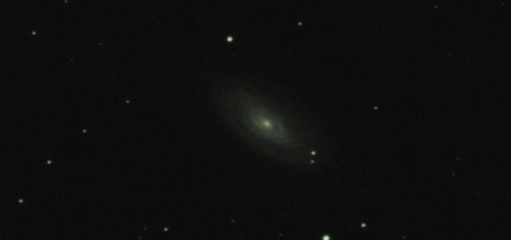
> 
 North is up.

Color: 73 minutes (73 * 60 seconds)

Shot with an ASI533 camera, 0.63 reducer and C9.25 SCT on an AVX equatorial mount, unguided.
Processed with Siril in natural color.

Raw stacks: [16-bit FITS](https://large.maurycyz.com/data/stacks/M88.fit), [16-bit TIFF](https://large.maurycyz.com/data/stacks/M88.tif)

## M3: A globular cluster [2025-04-05]

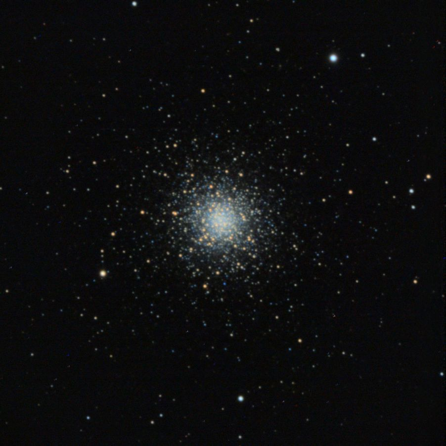
> 
 North is up.

Color: 1 minutes (6 * 10 seconds)

Shot with an ASI533 camera, 0.63 reducer and C9.25 SCT on an AVX equatorial mount, unguided.
Processed with Siril in natural color.

This one was really an EAA image, but looked cool enough for me to give it a proper stretch and upload it.

## NGC 4490 + NGC 4485 [2025-04-03]

[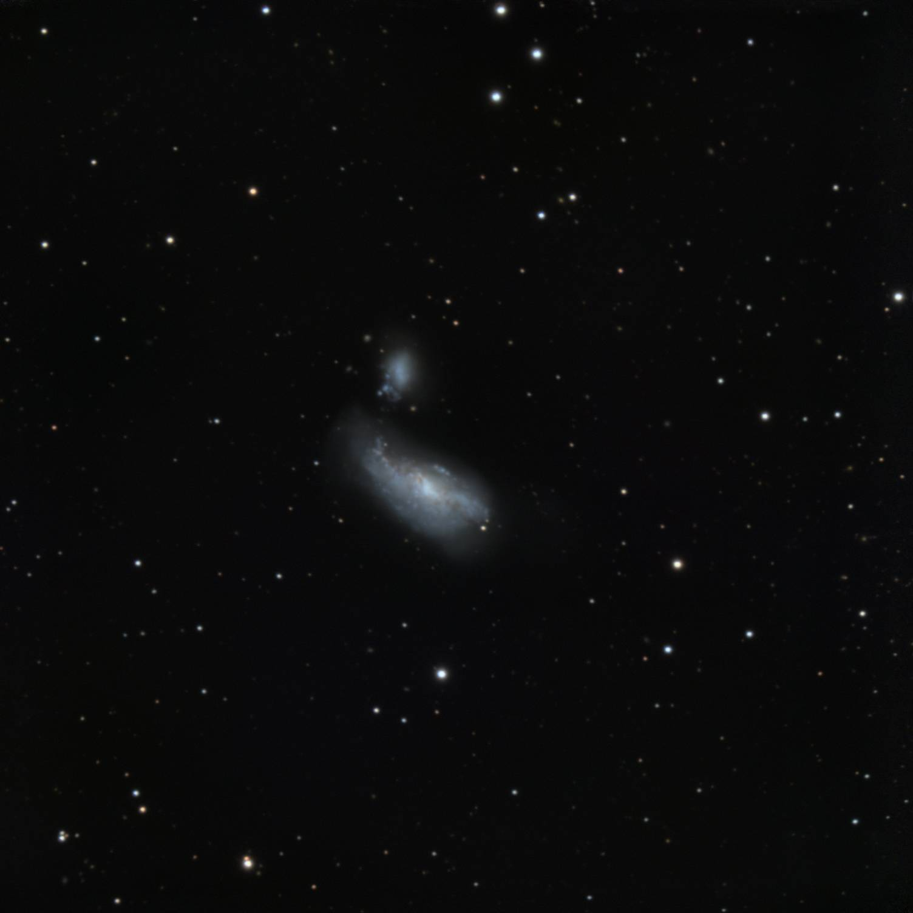](https://large.maurycyz.com/NGC4490.jpg)
> 
 North is up. Click for full resolution image.

Color: 80 minutes (160 * 30 seconds)

Shot with an ASI533 camera, 0.63 reducer and C9.25 SCT on an AVX equatorial mount, unguided.
Processed with Siril in natural color.

Raw stacks: [16-bit FITS](https://large.maurycyz.com/data/stacks/NGC4490.fit), [16-bit TIFF](https://large.maurycyz.com/data/stacks/NGC4490.tif)

## M51: Whirlpool galaxy [2025-03-29]

[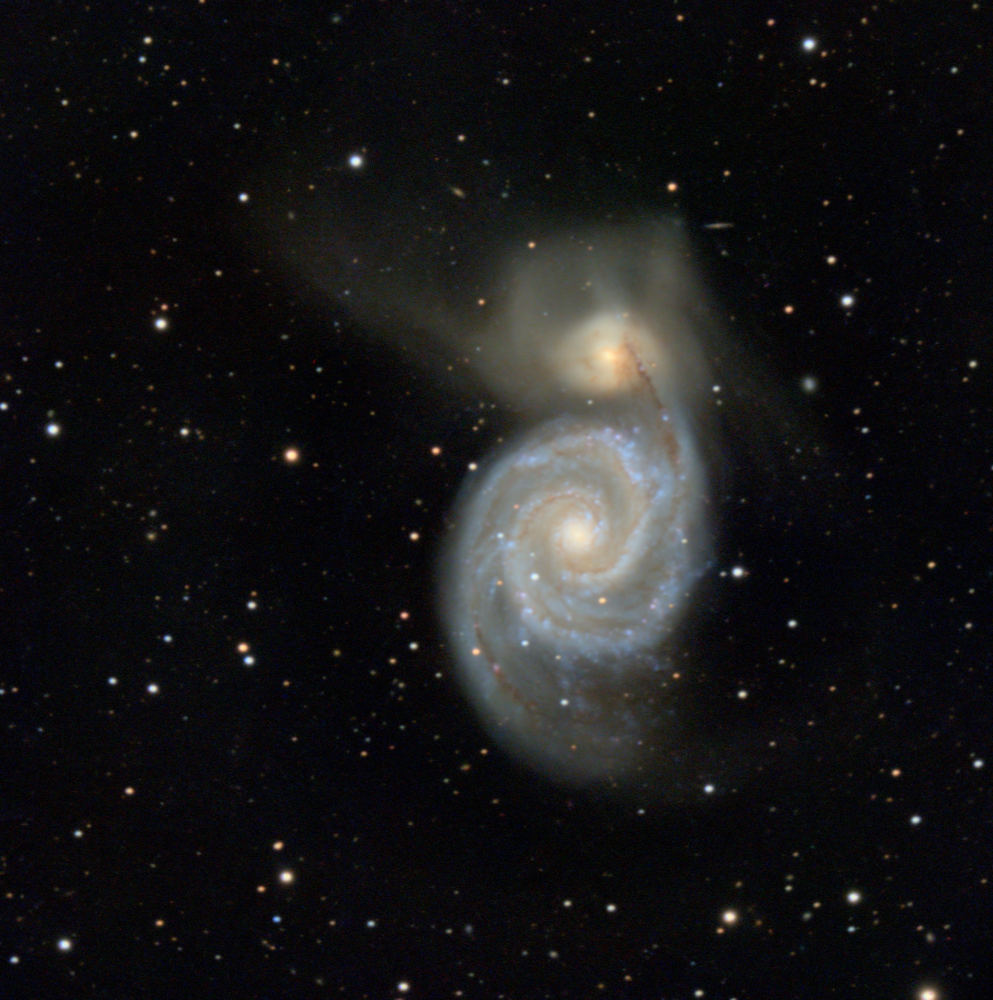](https://large.maurycyz.com/M51_1.jpg)
> 
 North is up. Click for full resolution image.

Color: 2 hours (114 * 60 seconds)

Shot with an ASI533 camera, 0.63 reducer and C9.25 SCT on an AVX equatorial mount, with an ASI120 + OAG for guiding.
Processed with Siril in natural color.

Raw stacks: [16-bit FITS](https://large.maurycyz.com/data/stacks/M51_1_stack.fit), [16-bit TIFF](https://large.maurycyz.com/data/stacks/M51_1_stack.tif)

## M81: Bode's galaxy [2025-03-27]

[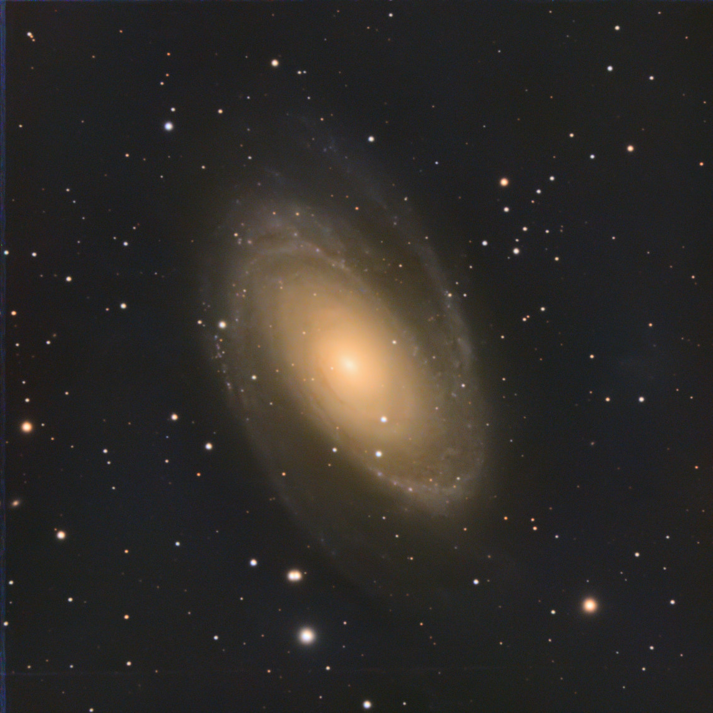](https://large.maurycyz.com/M81_1.jpg)
> 
 North is up. Click for full resolution image.

Color: 15 minutes (30 * 30 seconds)

Shot with an ASI533, 0.63 reducer and C9.25 SCT on an AVX equatorial mount, with an ASI120 + OAG.
Processed with Siril in natural color.

One thing that's quite cool are the extragalactic nebulae in the left arm (the pink "stars"):

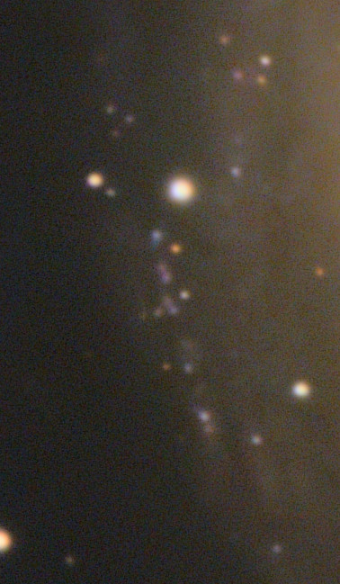

Raw stacks: [32-bit FITS](https://large.maurycyz.com/data/stacks/M81_1.fit), [32-bit TIFF](https://large.maurycyz.com/data/stacks/M81_1.tif)

## NGC3628: The hamburger galaxy [2025-03-26]

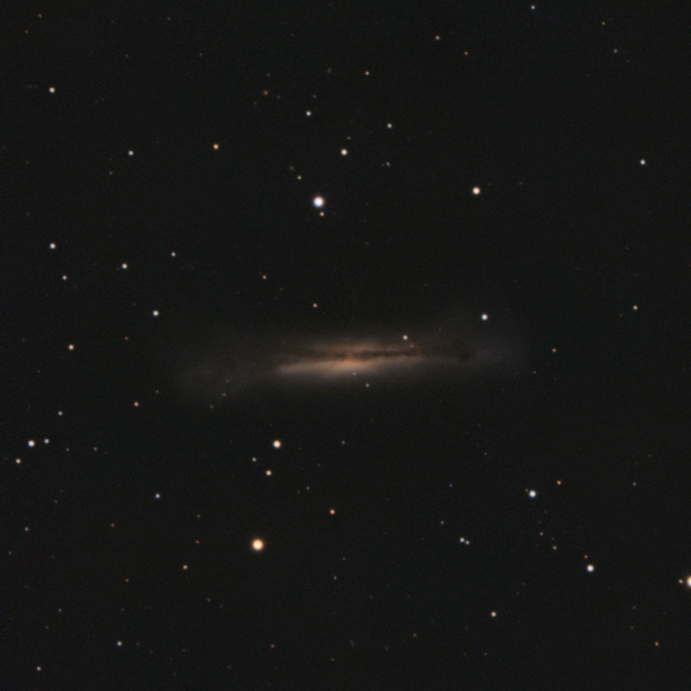
> 
 North is down. 

RGB Color: 41 minutes (246 * 10 seconds)

Shot with an ASI533, 0.63 reducer and C9.25 SCT on an AVX equatorial mount, unguided.
Processed with Siril in natural color.

Raw stacks: [32-bit FITS](https://large.maurycyz.com/data/stacks/NGC3628_1.fit), [32-bit TIFF](https://large.maurycyz.com/data/stacks/NGC3628_1.tif)

## NGC2903: A spiral galaxy [2025-03-19]

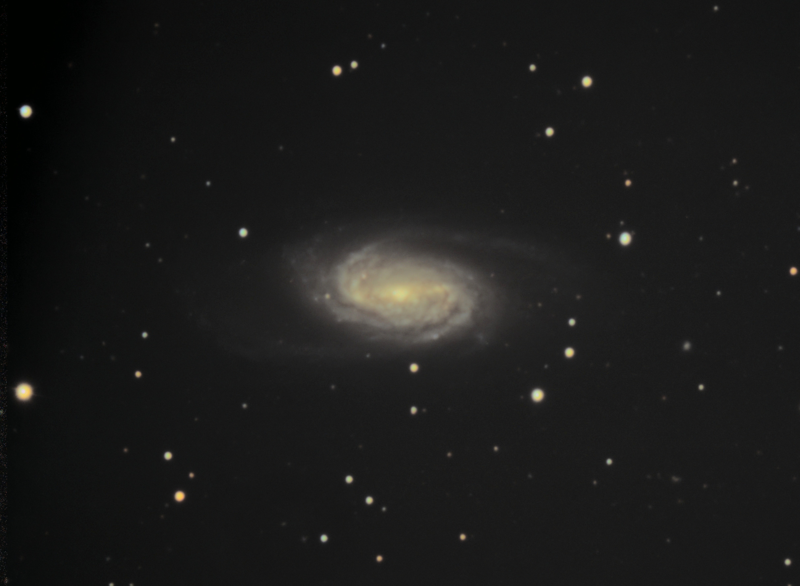
> 
 North is left. 

RGB Color: 70 minutes (140 * 30 seconds)

Due to clouds, only 30 minutes of exposure was used in the stack. (60x30 seconds)

Shot with an ASI533, 0.63 reducer and C9.25 SCT on an AVX equatorial mount, guided with an ASI120 mini.
Processed with Siril in natural color.

Raw stacks: [16-bit FITS](https://large.maurycyz.com/data/stacks/NGC2903_1.fit), [16-bit TIFF](https://large.maurycyz.com/data/stacks/NGC2903_1.tif)

## M1: Crab nebula [2025-03-06]

[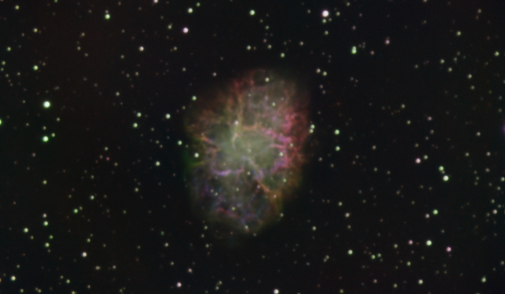](crab1_sharp.jpg)
> 
North is in the upper right. Click image for digitally sharpened version

Hydrogen + Oxygen : 30 minutes (82 * 20 seconds) 
Sulfur II + Oxygen : 33 minutes (99 * 20 seconds) 

Shot with an ASI533, Askar C1 & C2, 0.63 reducer and C9.25 SCT on an AVX equatorial mount.
Processed with Siril using an Hydrogen-Oxygen-Sulfur palette.

## Half moon [2025-03-05]

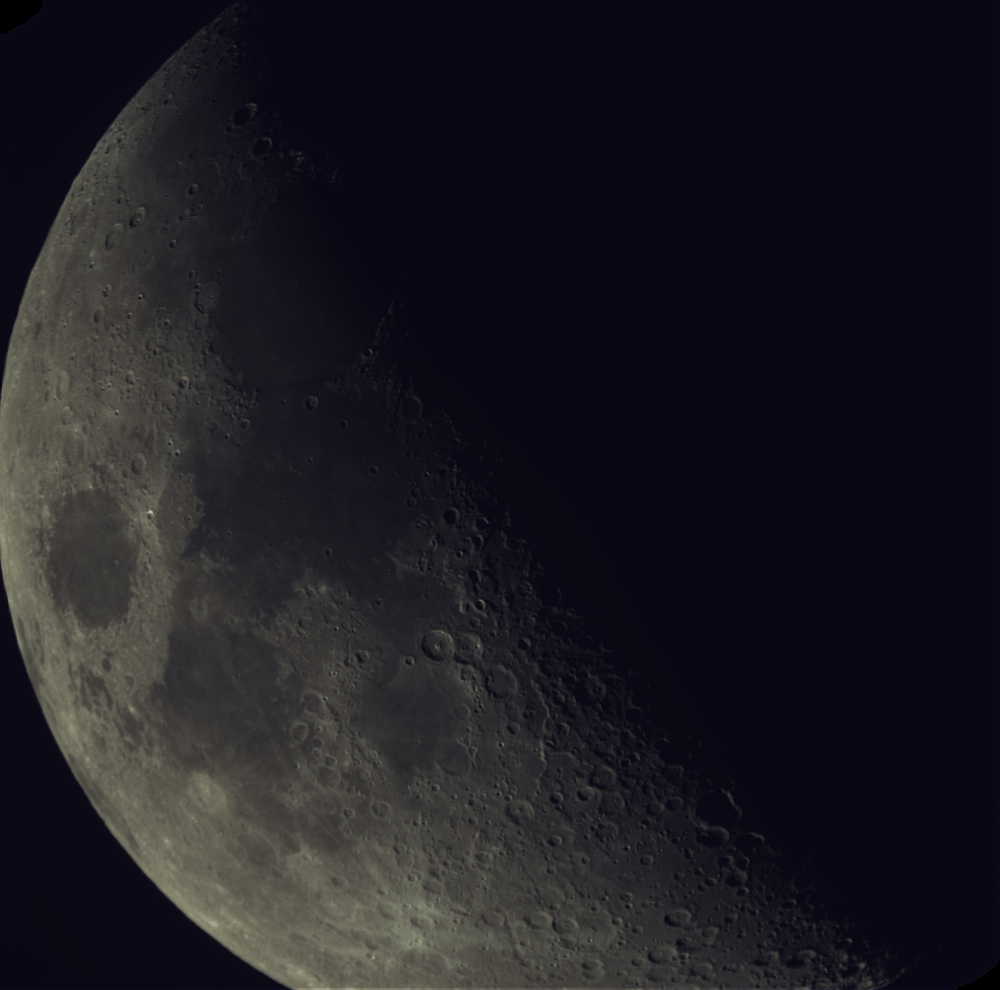
> 
The north pole is up.

10 frames * 10 ms captured.

Shot with an ASI533, 0.63 reducer and C9.25 SCT on an AVX equatorial mount.
Processed with Siril.

Really just a test image, but turned out quite cool.

## Jupiter (full focal length) [2025-03-05]

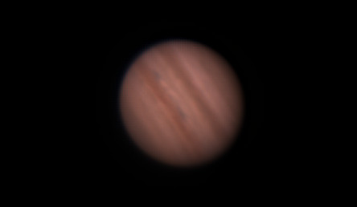
> 
The north pole is the upper-right.

23786 frames * 10 ms captured in 4 minutes at 100 fps.

Shot with an ASI533 and C9.25 SCT on an AVX equatorial mount.
Processed with AutoStakkert and Siril.

## M42: Orion nebula (narrowband) [2025-03-05]

> 
North is left.

Hydrogen-alpha + Oxygen III 191 * 10 seconds (31 minutes) 
Sulfur II + Oxygen III: 268 * 20 seconds (1.5 hours)

Shot with an ASI533, Askar C1 & C2, 0.63 reducer and C9.25 SCT on an AVX equatorial mount.
Processed with Siril using an Oxygen-Hydrogen-Sulfur palette.

## M42: Orion nebula [2025-02-19]

> 
North is left.

Total exposure: 6 minutes (36 x 10 seconds)

Shot with a ASI533, 0.63 reducer and C9.25 SCT on an equatorial mount.
Processed with Siril.

## B33 + IC434: Horsehead nebula [2025-02-12]

> 
North is left.

Total exposure: 8 minutes (50 x 10 seconds) (during full moon)

Shot with a ASI533, 0.63 reducer and C9.25 SCT on an equatorial mount.
Processed with Siril.

I had issues finding the Horsehead, and only ever had it in the corner of the frame.
Any part of the Horsehead was only included in around 15 frames, for around 2.5 minutes of effective exposure. 

## Earth's moon [2025-02-10]

> 
The north pole is down

Total exposure: 1 second (1000 x 1 ms)

Shot with a ASI533, 0.63 reducer and C9.25 SCT on an equatorial mount.
Processed with Siril.

## Jupiter [2025-02-10]

Total exposure: 1 second (100 x 10 ms)

Shot with a ASI533, 0.63 reducer (not a good idea here) and C9.25 SCT on an equatorial mount.
Processed with Siril.

## NGC2024: Flame nebula [2025-02-10]

> 
North is up.

Total exposure: 1.2 hours (870 x 5 seconds) (during full moon)

Shot with a ASI533, 0.63 reducer and C9.25 SCT on an equatorial mount.
Processed with Siril and GraXpert.

## M42: Orion nebula (with a telescope) [2025-01-28]

> 
North is down/right.

Total exposure: 100 seconds. (100 x 1 second)

Shot with a ASI533 and C9.25 SCT on an equatorial mount.
Processed in DeepSkyStacker and Siril.

## M42: Orion nebula (more data) [2025-01-26]

> 
North is left.

Total exposure: 1 hour, 12 minutes (240 x 13 seconds)

Shot with a Canon EOS M6 mark II, using the included lens (45 mm focal length), on an equatorial mount.
Processed in DeepSkyStacker and Siril.

The flame and Horsehead are in there if you squint.

## M42: Orion nebula (tracked) [2025-01-24]

> 
North is left/up.

Total exposure: 4 minutes (20 x 13 seconds)

Shot with a Canon EOS M6 mark II, using the included lens (45 mm focal length), on an equatorial mount.
Processed in DeepSkyStacker and Siril.

## M42: Orion nebula [2025-01-22]

> 
North is up.

Total exposure: 20 minutes

Shot with a Canon EOS M6 mark II, using the included lens (45 mm focal length), untracked.
Processed in DeepSkyStacker and Siril.
