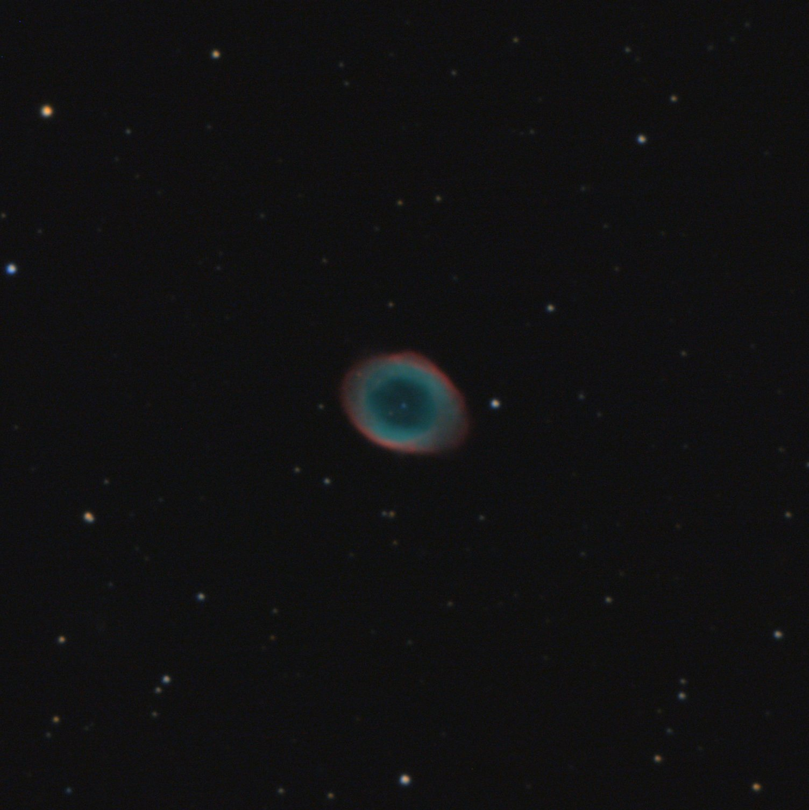
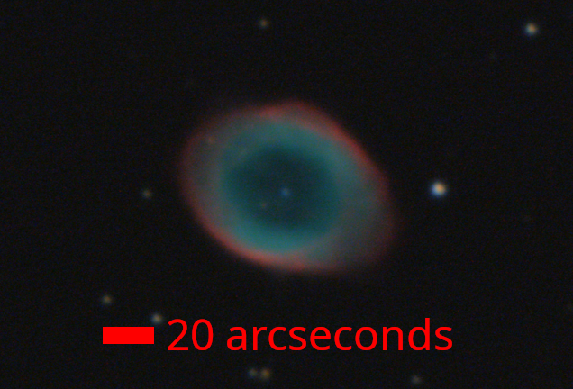

> 
Pixel scale: 0.35 arcseconds/pixel. FOV: 8.7 x 8.7 arcminutes.

- Exposure time: 5 minutes (57 * 5 seconds)
- Equipment: C9.25, ASI533 MC (IMX533 OSC), EQ6-R mount (unguided). 
- Drizzled 2x, and downsampled after processing. 

Sharpness isn't bad by my standards, stars have a FWHM of around 2.7 arcseconds:

> 
Cropped in version

