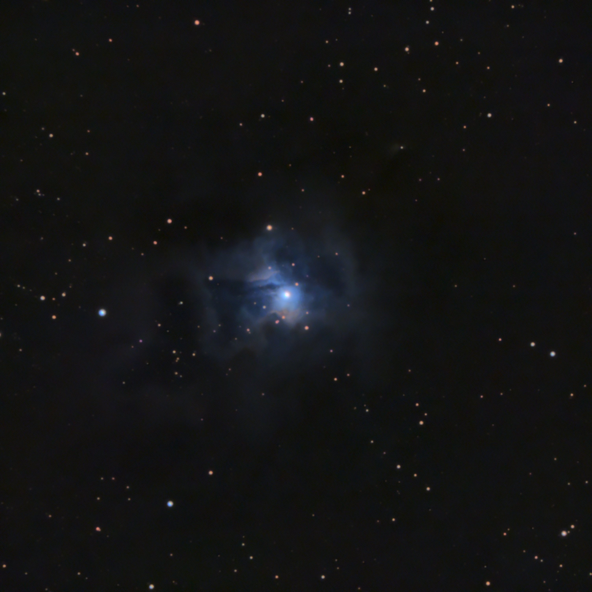

Color: 47 minutes (95 * 30 seconds)

Equipment: C9.25, 0.63 reducer, ASI533 MC (IMX533 OSC), EQ6-R mount (unguided). 

This is the first reflection nebula I've imaged. 
That bright blue star in the center is located right inside the nebula, and is illuminating the otherwise dark dust clouds.
