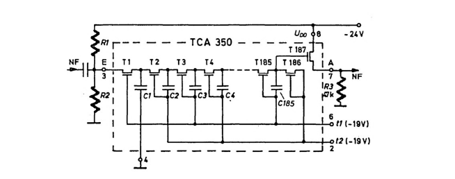
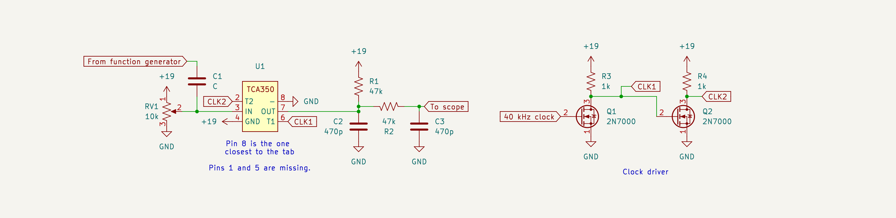
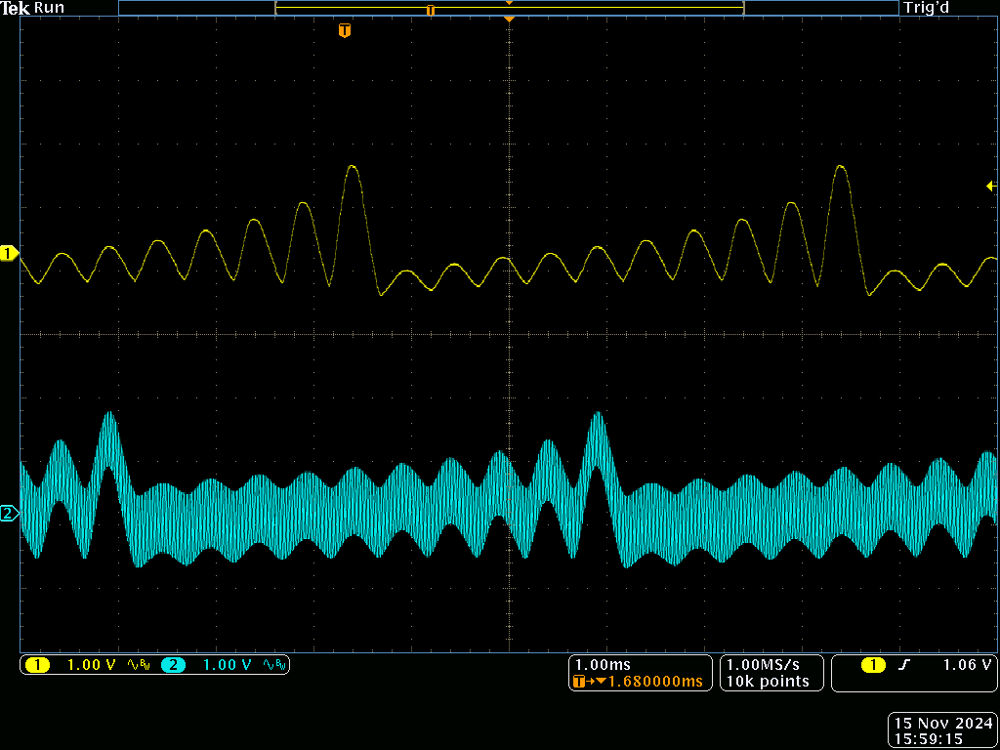
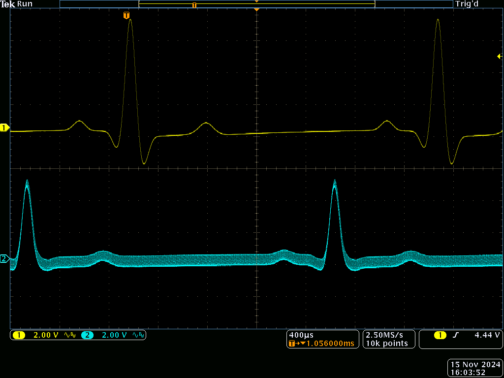
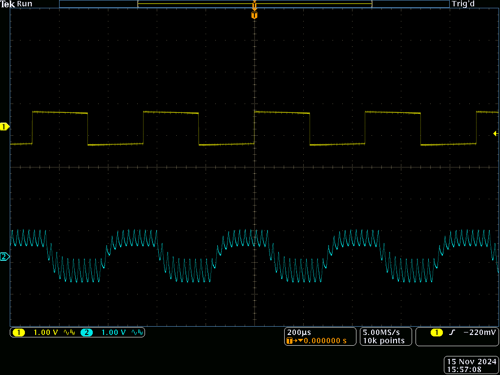
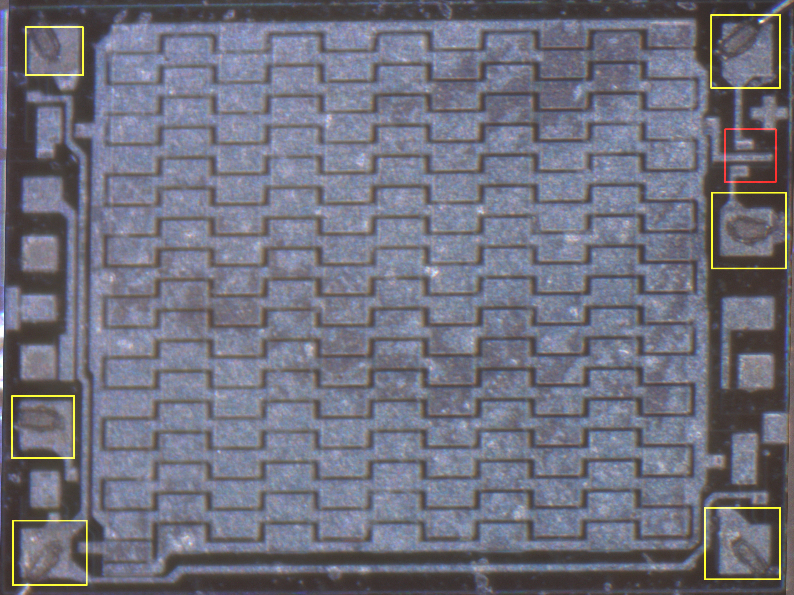
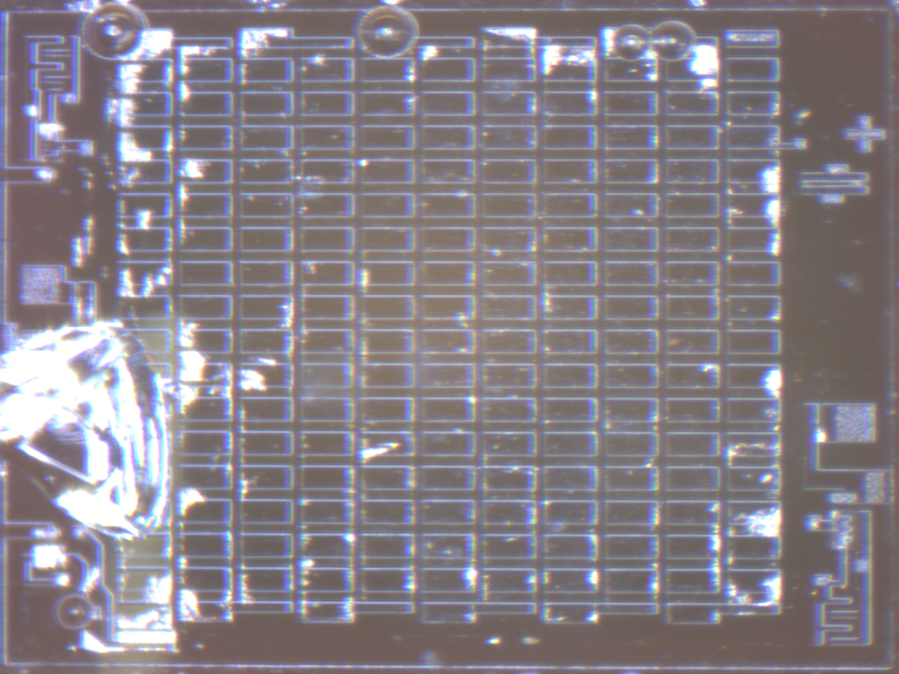
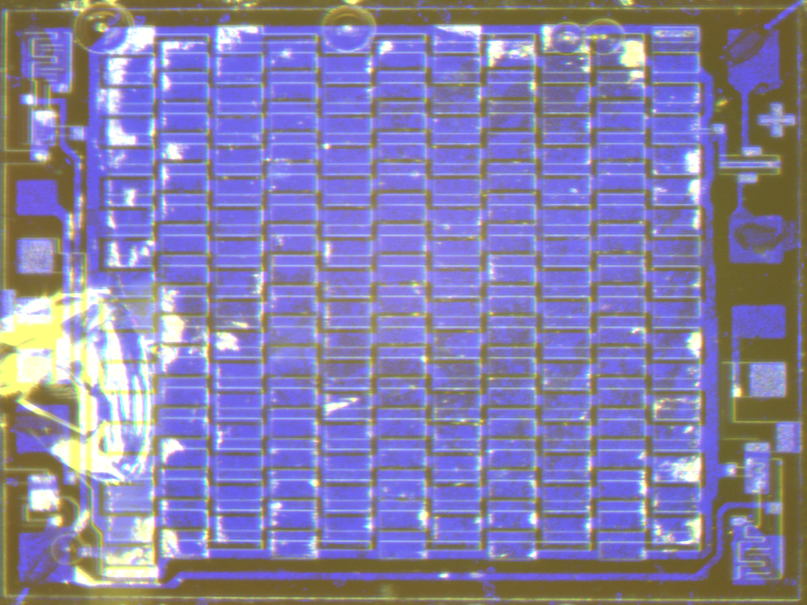
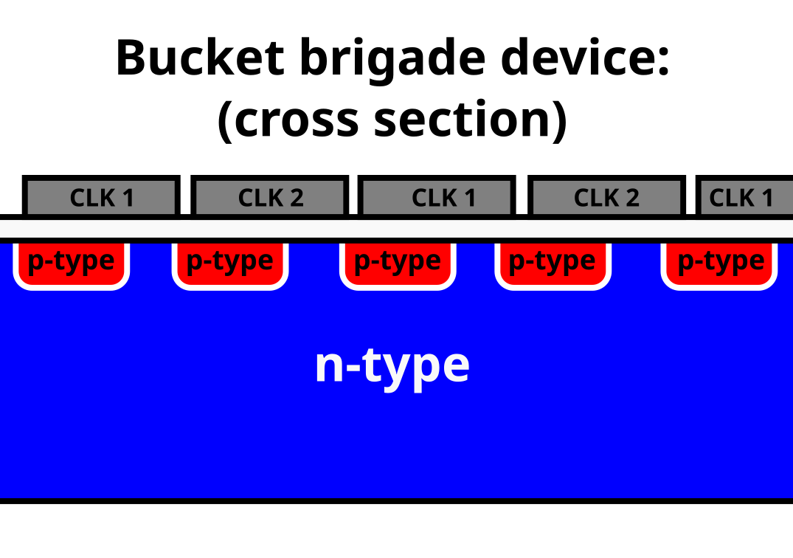
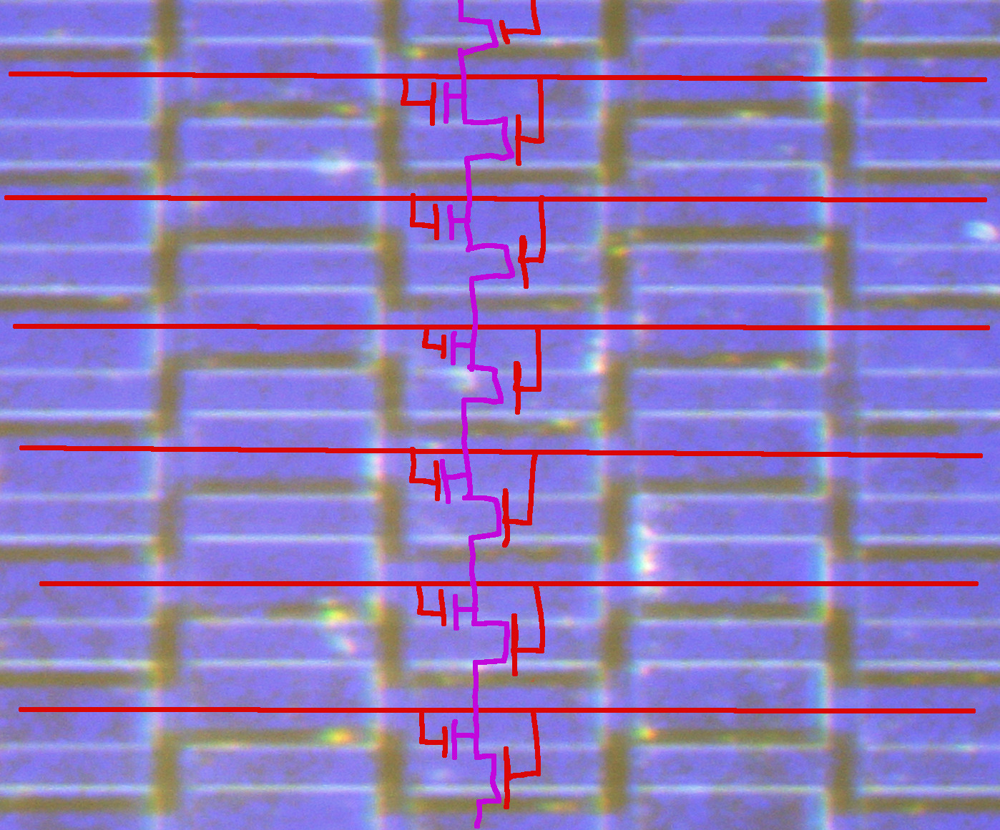

Nowadays, digitally delaying audio is easy, but historically we had to use devices like the TCA350, a fully analog delay line:

It works by charging a small capacitor to the input voltage, and then moving that charge through a chain of hundreds more before it exists the device:

The two clock signals consist of non-overlapping negative pulses, each making every other MOSFET momentarily conduct.
Additionally, each pulse changes the voltage (but not charge) on every other capacitor, which helps pull charge from one stage to the next, preventing the samples from smearing together.

I built up a simple circuit to test the chip:

The yellow trace is the input, and blue is the output:

Zooming in shows that the output has some nasty sampler kickout: 

Without the RC network on the output, those spikes would go all the way to the positive rail.

This happens because only every second capacitor holds a sample, with the other just being fully charged.
As a MOSFET turns on, the next capacitor fully changes the currently holding a sample, moving a charge deficit along the chain.
A voltage follower can only move current in one direction, but even so, a robust low pass filter is usually required.

I wanted to see how the device was built, so I opened one up and put it under a microscope:

This is the aluminum interconnect layer, which is used to wire up all the transistors on the chip into a function circuit.

The pads marked with yellow are connected to pins, which how the chip interacts with the outside world.
The ground pin, on the lower left, is directly connected to the bulk silicon, ensuring that the body diodes of the transistors never conduct, because -- in typical 1970s fashion -- the chip uses voltages below ground, not above it.

There is a single MOSFET transistor in the red box, with the gate coming in from the left, and the drain and source going off the chip.
This is T187 on the schematic, and is responsible for amplifying the output right before it leaves the chip.

The actual delay line (center) is almost completely covered in metal, so I etched it away with phosphoric acid:

The chip had a passivization layer on it, so I had to scratch the chip before the acid could do anything. 
While doing this, I accidentally broke off part of the chip, but it didn't have anything important on it.

To trace out the circuit, I overlaid the photos from before and after etching:

Blue: metal, yellow: silicon

Most of the chip is n-type silicon, some regions have been converted to p-type, which is visible in the photo.
The junctions between p-type and n-type junctions act as diodes, which will always be reverse biased becuase the substrate is connected to the highest voltage in the chip.
Most of the silicon is covered in silicon dioxide, basically glass, which insulates it from the metal wires running over it.
In these places, the p-type wells act as a separate conducting layer.

The oxide can also act a capacitor dielectric, and when between two wells, as a MOSFET's gate.
If the voltage on the input metal layer is lower then the substrate, it creates a temporary conducting channel between the wells, allowing charge to flow between the wells:

Today, these devices are completely obsolete -- but a spin-off, the CCD camera sensor, is still used today.
Instead of discrete transistors and capacitors like the TCA350, they directly move charge trapped in inversion channel using three sets of gate wires.

This requires an rather inconvenient 3 phase overlapping clock, but works amazingly well:
a good CCD can move charge between a million pixels without loosing a single electron.
