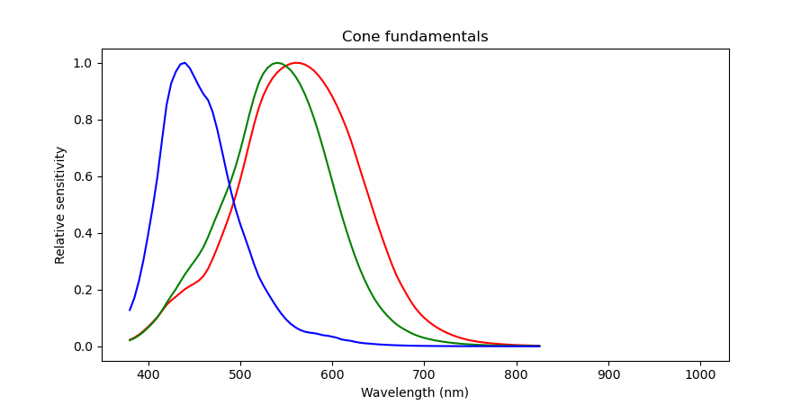
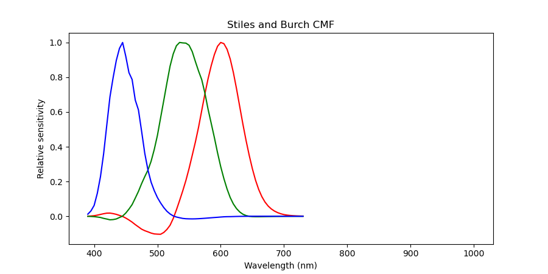
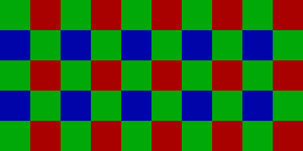
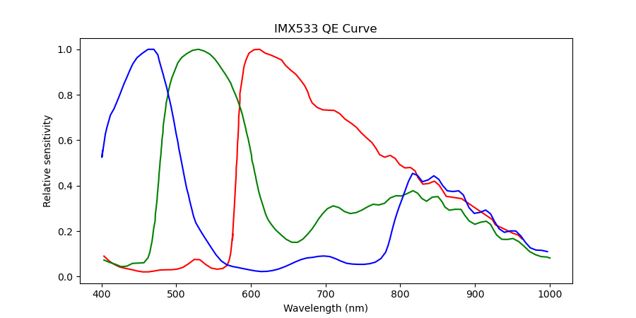
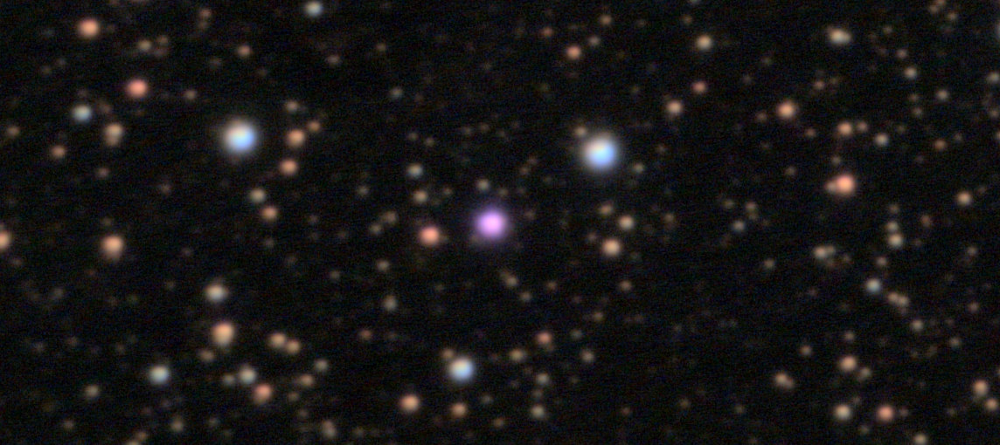
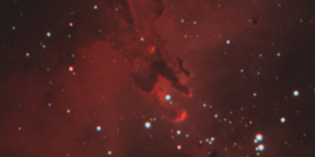
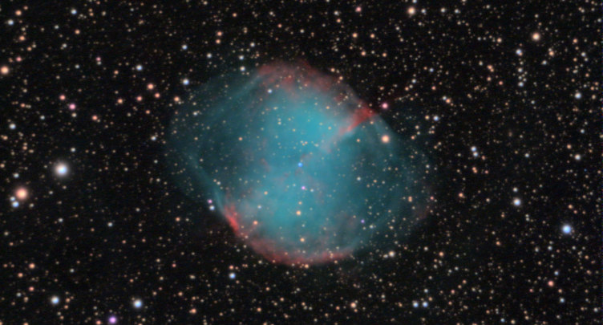
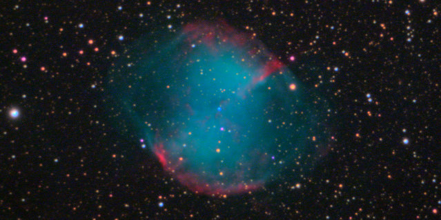
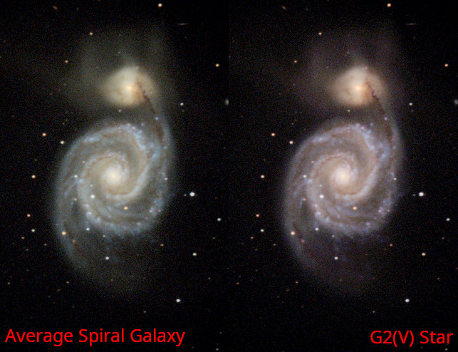

Color is the most disputed part of astrophotography. 
It seems like no two images have the same colors, and the internet is full of disputes over what colors are correct or natural. 

<!-- Meat -->

Human vision and perception are very complex.
This description is hugely simplified as to fit in a blog post.
If you want details, consult a textbook.

Roughly speaking, our eyes have four types of photoreceptors.
The most abundant, rods, provide a black-and-white view of the world: very detailed but with no color.
The others are cone cells, each type responds to a particular part of the visible spectrum:

> 
Left: All that you will ever see. Right: Infinite abyss of the IR.

The peaks of these wavelength ranges roughly correspond to the colors red, green, and blue.
Because there's a lot of overlap between the red and green cones, our brain subtracts some green from red, yielding this spectral response:

> 
Yes, this results in red having negative sensitivity @500 nm. 

The perceived color depends on the ratio between the signals from each type of cone, which corresponds to the ratio of red, green and blue light entering your eye.

<!-- Robots -->

The pixels in a camera produce a signal based on the brightness of incoming light, producing a monochrome image.
To make a color camera, we overlay a grid of alternating RGB filters over the pixel grid:

> 
Typical Bayer filter matrix

The camera's computer converts the brightness ratio between neighboring pixels into color.
The resulting color accuracy depends on how close the camera's filters are to the cones in the human eye. 

Here's what the spectral response of a typical camera sensor look like:

> 
 ohno 

<!-- IR -->

The most striking difference is what happens from 800-1000 nm:
To our eyes, these wavelengths are mostly invisible.
However, the camera sees them quite well, and because the organic dyes used as filters don't work in the infrared, they trigger all the color channels equally.
After white balancing (dimming the green and blue channels) these wavelengths become a pastel pink color:

> 
A Mira variable, spectral type M.

This red giant star has a relatively cold surface, and emits most of its light in the infrared causing it to show up as pink.
Our eyes don't see the IR at all, so the star appears a dim red.

There's no way to fix this problem in post. 
Sure, you could just change the pinks to dim reds, but that would also affect areas that are supposed to be pink.
The camera simply doesn't capture enough information to tell the difference between real pink and fake pink.

In this case, the real solution is easy: Just add a filter that prevents the infrared light from reaching the sensor
--- we won't always be so lucky.

# The trouble with plasma:

Ionized hydrogen emits multiple wavelengths of light, but mostly red H-alpha at 656 nm , and a bit of blue H-beta at 486 nm.
Our eyes aren't very good at seeing the deep red H-alpha, so the dimmer blue H-beta is able to compete, resulting a pink color. 

However, many cameras are very sensitive to H-alpha, so hydrogen shows up as red:

> 
This nebula formed from interstellar gas, so it's dominated by hydrogen.

Many other cameras, particularly those with aggressive UV-IR cut filters, underespond to H-a, resulting in dim and blueish nebula. 
Often people rip out those filters (astro-modification), but this usually results in the camera overresponding instead. 

# Hydrogen wasn't a fluke:

Ionized Oxygen has a bright emission line at 500.7 nm, creating all the greens and blues you see in nebulae. 

The problem is that this line is right on the edge between green and blue.
To my eyes, this wavelength looks like a greenish turquoise (sRGB #00FFBA),
but my camera's sensor sees it as cyan (sRGB #50E4FF):

> 
This nebula was formed by a dying red-giant star, so it's got lots of oxygen

There's no way to calibrate this out, because making blues greener would result in green stars, which would also be wrong...
and because the light is monochromatic, adding filters won't change the color, only the intensity.

Just to be sure, let's try applying my sensor's color calibration matrix to the image:

> 
Color "calibrated" version

Did that just... saturate everything?
It made the oxygen bluer, hydrogen redder and stars pinker.

A color matrix compensates for overlap between the sensor's color filters, which cause colors to look washed out. 
This can be fixed by bumping up the saturation, but if the colors are wrong, this makes them worse. 

# Space is space

Once you leave the familiar world of broadband light and pigments, of light bulbs and color charts, the premise of color calibration falls apart.
There's simply no way to covert the colors seen by a camera to the colors that would be seen by the eye.

Even something as simple as white balance is problematic.
In space, nothing is lit by a uniform light source or with a uniform brightness, and most objects emit light of their own. 
Most photographers use "daylight" white balance, but the objects we photograph are well outside of the sun's domain. 

In my images, I usually leave the colors as seen by my camera's filters and set the white balance based on the average spiral galaxy. 
That way, at least the white point is somewhat objective:

> 
Comparing different white balance references. The sun is a G2(V) star.

