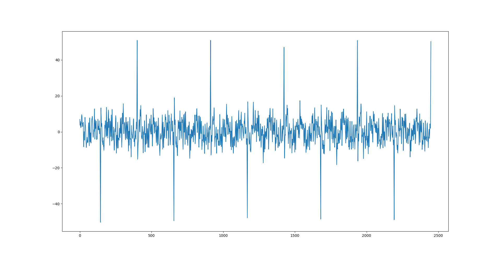
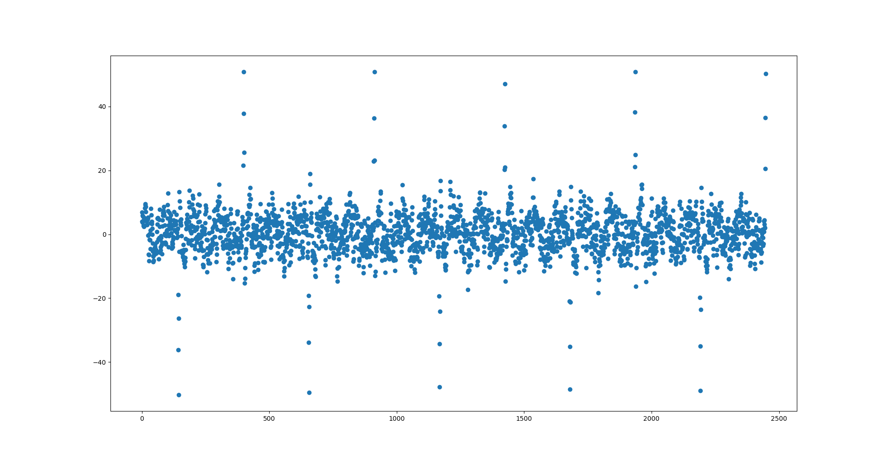

There are a lot of cases where multiple devices have to communicate simultaneously over a single radio channel, or wire.
Examples include mobile networks, 2 way radios, satellite communications and local area networking.

The simplest solution is to have the devices take turns, also known as TDMA (Time Division Multiple Access), but this requires precise synchronization.

Another is using a different carrier frequency for the device, effectively splitting the channel into many subchannels. (Frequency Division Multiple Access)
This works, but limits the bandwidth available to each device to the total bandwidth divided by the total number of devices that can ever connect.
With radio and moving stations, like satellites, this also creates the problem of large Doppler shifts ruining the channel spacing.

<!--
Cellular networks face an intresting problem: Avoiding interference between potentialy thousands of devices.
Becuase of the shere number of devices that can connect to a signle base station (cell tower), assigning a fixed, dedicated frequency to each phone is imractical.
Assigning each phone a seperate time to transmit, works, but requires all phones to be keeped precicly syncronized.[^0]
-->


A particularly clever solution is CDMA (Code Division Multiple Access), which requires no synchronization, and is used by 2G, 3G, 2.4 GHz WiFi, GPS and more. [^0].

CDMA assigns each device a unique, typically pseudo random bit sequence, called a spreading code.
To keep the math simple, instead of using 1 and 0, I will be using 1 and -1.

Each bit of the message is encoded by multiplying it with every bit of the spreading code (This is really just XOR, but multiplication makes symmetrical to the decoder):

```py
spreading_code = [-1, -1,  1,  1, -1, -1,  1, -1]

def transmit_cdma_bit(bit):
	for code_bit in spreading_code:
		transmit_bit(code_bit * bit)

transmit_cdma_bit(-1) # Transmits:  1,  1, -1, -1,  1,  1, -1  1 
transmit_cdma_bit(1)  # Transmits: -1, -1,  1,  1, -1, -1,  1 -1 
		
```

Decoding just requires multiplying each bit of the received signal with the corresponding bit of the spreading code, and summing the result (divided by the code length in this case to normalize it):

```py
def decode_cdma_bit(signal):
	correlation = 0
	for i in range(0, len(signal)):
		correlation = correlation + (signal[i] * spreading_code[i])
	return correlation / len(spreading_code) 

decode_cdma_bit([-1,  1, -1, -1,  1,  1, -1,  1]) # Returns  1
decode_cdma_bit([ 1, -1,  1,  1, -1, -1,  1, -1]) # Returns -1
```

This is effectively looking for correlation between the spreading code and the signal.
Importantly, if the the spreading code used to decode is different then the one that was used to encode the message, the result of decoding will be near zero, because there is almost no correlation between two random sequences.
This means that if multiple signals are combined (added) together, for example because they were transmitted simultaneously, *both* messages can be recovered.
In addition, any noise can be rejected, because it too is not correlated to the spreading code.

CDMA handles overloading gracefully, with error rates slowly increasing as more devices are added, or signals get weaker.
If the error rate is too much to handle, the spreading code length can be increased, giving slower but more reliable transmission.

## Clock recovery:

One complication is that in the receiver and transmitter need have exactly synchronized spreading codes to successfully communicate.
Fortunately the timing of the spreading code can be recovered from from the received signal;
Just by trying every possible spot in the signal the spreading code could start.
There will only be a correlation if the spreading code is correctly aligned, allowing misaligned attempts to be discarded:[^1]

```py
def decode_cdma(signal, spreading_code, threshold):
	recovered = []
	for start in range(len(signal) - len(spreading_code) + 1):
		sum = 0
		for i in range(0, len(signal)):
			sum = sum + (signal[i + start] * spreading_code[i])
		correlation = sum / len(spreading_code)
		# This is actually a really bad method because it does not take the relative timing into account.
		# Should be fine for showing the principal of CDMA.
		if abs(correlation) > threshold:
			recovered.append(correlation)
	return recovered
```

Here is a graph of the decoded values over the starting time when decoding a signal (just a simple 101010... pattern) with added noise:



The spikes are at the exact time when the spreading code is exactly with the the signal.

## Practical considerations:

To insure the signal can be successfully recovered, it has to be sampled at at least [twice the frequency](https://en.wikipedia.org/wiki/Nyquist%E2%80%93Shannon_sampling_theorem) of the of the spreading code.
This can be done by simply picking a spreading code where every bit is repeated at least 2 times, like `[1  1  1  -1 -1 -1  1  1  1 -1 -1 -1]`.
This has the side effect of smearing out the peaks in correlation, which can be seen on this chart of correlation over time:



This does require a more complex method of decoding, which takes the relative timing of bits into account;
Bits will always be separated by the length of the spreading code, and if they are not, they should be ignored.

The example code here uses the same spreading code for every bit, but this is not always the case.
Frequently, the spreading code is much longer, often taking days or even years to repeat. (LFSRs are a popular way to generate a pseudo random spreading code, each station starts at a different point in the sequence)
In addition to secrecy (with a non repeating code, CDMA is equivalent to a one time pad) this prevents interference if another station incidentally picks a correlated spreading code.

In the case where a repeating spreading code is used, picking codes that are orthogonal to each other, like `[1,  1, -1, -1]` and `[1, -1,  1, -1]` is ideal. 
Autocorrelating codes, ones that correlate with a shifted version of themselves, like the second one are also problematic because they make the the code timing ambiguous.

[^0]: 
	CDMA has a few disadvantages that make other methods better if the synchronization requirements can be meet, primarily inefficient use of bandwidth with few users.
	For example, ODFMA, a variant of the frequency division method, dynamical reallocates frequencies between devices as they are needed.	
	This is commonly used in cases where a base station is available, like newer WiFi and cellular protocols.
	This does however require a radio capable of transmitting simultaneously on multiple arbitrary frequencies, which has become practical with direct conversion SDRs.

[^1]:	
	Ideally, something like a PLL would be used instead of a brute force search, it would lead to less errors by taking into account the expected timing between bits, and would not require fine tuning.
