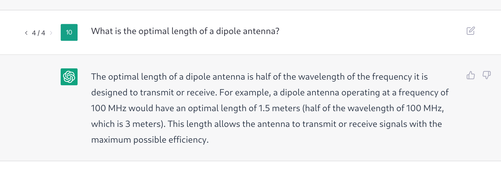
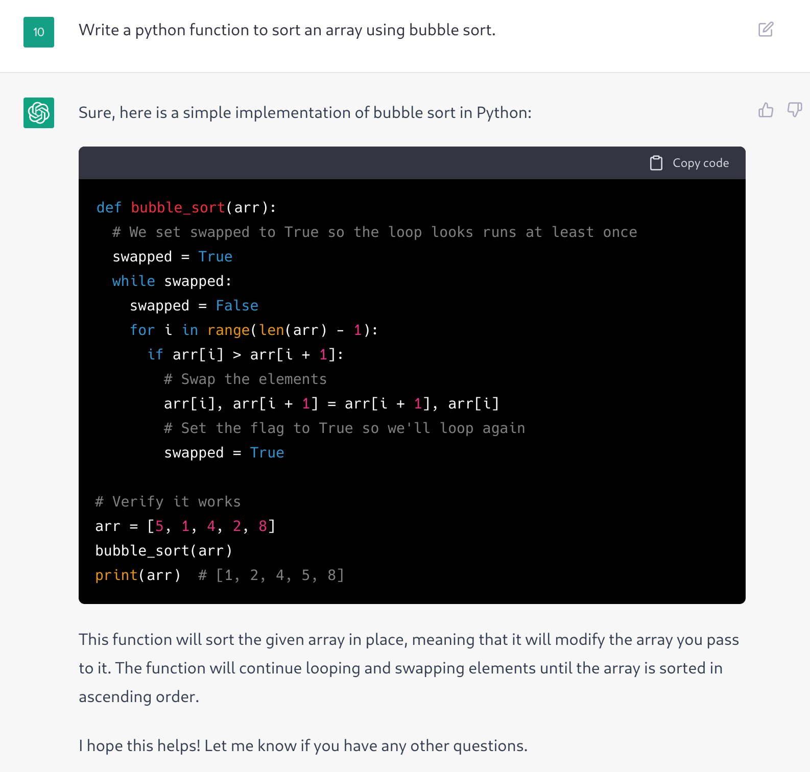
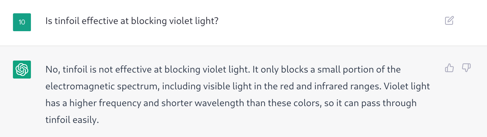
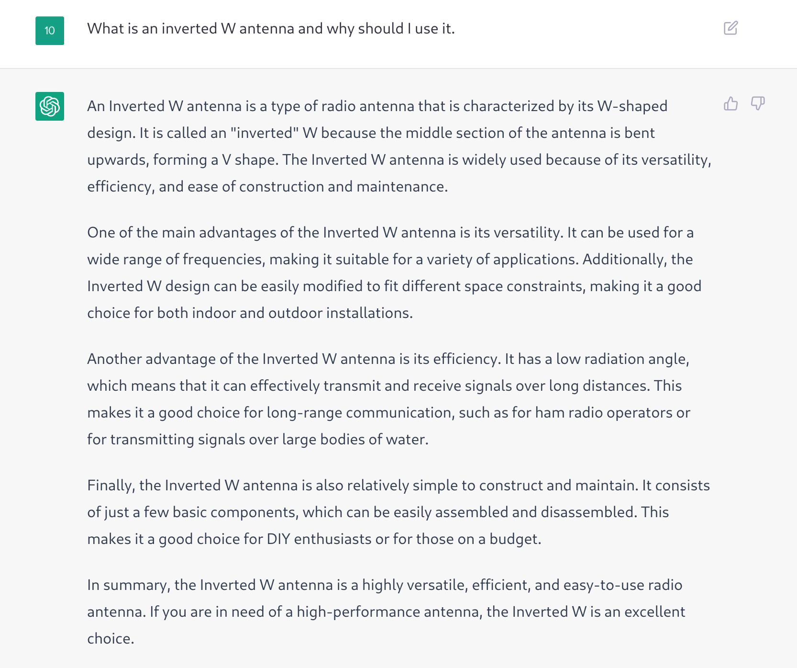
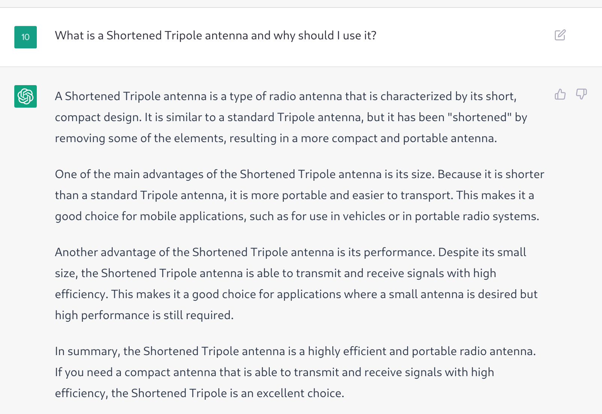

[ChatGPT](https://chat.openai.com/chat) is a free preview of OpenAI's large language model, capable of answering questions, writing short programs or essays, and poetry.
The model is set up as chatbot, and displays a remarkable ability to hold conversations or answer technical questions.



It can even write short programs based on a description of the desired function:



This has lead to speculation that similarly AI's might replace human programmers and writers. 
However, ChatGPT knowledge is replaced by vivid confabulation when it is faced with a question that has not been discussed on the internet:



Where as a human would be able to derive or experimentally determine the answer easily (checking if foil is transparent), ChatGPT confidently provides an incorrect answer.

This also apply to writing programs. The AI works fine when asked to do a common programming task (sort an array, Fizz Buzz, make a web request...), but as soon as at is confronted with a novel task, it completely fails.


I spent a good half hour trying to get ChatGPT to write a parser for part of the puzzle input of [Advent of Code 2022 day 5](https://adventofcode.com/2022/day/5).
The format consists of ASCII art of stacked crates, each labeled with letters.

```
    [D]    
[N] [C]    
[Z] [M] [P]
 1   2   3 
```

A human programmer could do this in 20minuets, but the AI struggled to get anywhere, even after 20 attempts of tweaking the prompt. (I have manually reformatted this as the AI messed up the formatting):

```python
#input: string representing the the crates
#output: 2d array storing the labels of the crates

def parse_crate_drawing(drawing):
    #split the input string into a list of strings, each representing a line of the drawing
    lines = drawing.split('\n')

    #remove any empty strings from the list
    lines = [line for line in lines if line]

    #get the maximum length of the lines
    max_length = max([len(line) for line in lines])

    #pad the lines with spaces to make them all the same length
    lines = [line.ljust(max_length, ' ') for line in lines]

    #create a 2d array to store the crate labels
    crates = [['' for i in range(max_length)] for j in range(len(lines))]

    #iterate over the lines and add the crate labels to the 2d array
    for i in range(len(lines)):
        for j in range(max_length):
            #if the current character is a letter, add it to the array
            if lines[i][j].isalpha():
                crates[i][j] = lines[i][j]
    #return the 2d array of crate labels
    return crates

drawing = """
    [D]
[N] [C]
[Z] [M] [P]
"""

print(parse_crates_drawing(drawing)) # should print [['D'], ['N', 'C'], ['Z', 'M', 'P']]

# Human here, this actualy prints [['D', None, None], [None, None, None], [None, None, None], [None, None, None], [None, None, None], [None, None, None], [None, None, None], [None, None, None], [None, None, None], [None, None, None], [None, None, None]]
```

Despite the AI being confident in this code, it completely fails at the task.
You could argue that version of the prompt AI sees is preprocessed and it does not see the colunm based layout, but even then, the code fails to acomplish the stated (by the AI, in a comment) goal.
However a human programmer can easily complete the task [Minor spoilers]:


```python
def parse(input):
    # Remove padding charaters
    raw = []
    for (col, line) in enumerate(input.split("\n")):
        line = line[1::4]
        raw.append(list(line))
    # Transpose data into the right format
    arr = []
    for col in range(len(raw[0])):
        colbuf = []
        for row in range(len(raw) - 2):
            label = raw[row][col]
            if label != ' ':
                colbuf.append(raw[row][col])
        arr.append(colbuf)
    return arr

drawing = '    [D]    \n[N] [C]    \n[Z] [M] [P]\n 1   2   3 \n'
print(parse(drawing)) # This *does* print [['N', 'Z'], ['D', 'C', 'M'], ['P']]
```

Every line of code by the AI makes since on it's own but together they don't accomplish the goal.
It's almost like the AI is pattern matching on GitHub and Stack Overflow, witch yields solutions only if the problem has already be solved.


In the current state, these programs wont (or should not) replace writers and programmers, but keep in mind that almost every claim that "Computers will never be able to do X" has been proven false:
[Play chess](https://stockfishchess.org/), Compose Music, Identify objects in images, [Play Go](https://en.wikipedia.org/wiki/AlphaGo), Write Paragraphs, Write poems, [Paint](https://github.com/CompVis/stable-diffusion)...

Here is ChatGPT on a *ficitonal* antenna design:  

