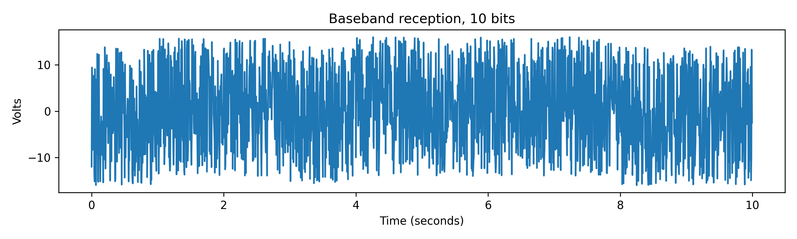

<!-- What is error correction --->
This article is not about any particular method of error correction, but about the general and rather simple principle that underlies all of them.
The goal of error correction is to convey information as reliably as possible over a noisy communication channel using fixed power and time.

<!-- Coding --->

To make this more concrete, I will try to send a 10 bit message over a (simulated) pair of wires.
The simplest scheme is to send 1 bit per second, a one as 1 volt, and a zero as -1 volts.

With this scheme, the message 0110111100, looks like this:

<!-- Noise --->

For the sake of the demonstration, I added a large amount, 10 VRMS, of noise (for a wire, radio noise can often be this bad or much worse):

Notice the scale change.

<!-- Recovery --->

With the added noise, the data looks completely unrecognizable.
But while the plot shows 100 Hz of bandwidth, because the signal only changes once per second, the receiver can average one second of data, canceling out most of the noise:

The message can be recovering by comparing the averaged voltage to 0, >0 volts is a 1, <0 volts is a 0:

In this case, the averaging worked well enough that the original message can be fully recovered, but this doesn't always happen.
To estimate the reliability, I ran the simulation 10,000 times.
Out of those 10,000 messages, only 59% were fully recovered, the other 41% had one or more errors.

<!-- Random coding --->

# A Crazy Idea

Let's replace the 10 bit message with a 100 bit coded message.
This 100 bit "codeword" came from a large table or "codebook" of 100 bit coded words for each possible 10 bit message.
To avoid confusion, I will refer to the bits of the codeword as a symbols, and bits of the original 10 bit message as a bits.

This is what the codeword for 0110111100 looks like:

This is that same codeword with the same level of noise as in the last example:

The received signal is averaged to recover each symbol of codeword, except this time over a 1/10th of a second:

The averaging was far less effective then the with 1 second per symbol, because there is less time for the noise to cancel out.
After thresholding, it looks like this:

The recovery did not work nearly as well as last time, in fact 30 symbols, a third of the codeword are wrong here.
However, the original message can still be recovered by finding the closest codeword in the codebook to the received data (least amount of different symbols).
Running the simulation 10,000 times with this scheme reveals that 77% of messages are received correctly and only 23% are damaged, half the error rate from before!
<!-- How? --->
It seems weird that sending more symbols, *increasing* bandwidth and *reducing* the signal-to-noise ratio would improve reliability.
Symbol errors *do* happen 10 times more often becuase of the shorter time given to each symbol.
However, the amount of errors required to change the message has gone up by more then 10 times.
In my particular codebook, codewords are separated by a minimum of 32 bits, so in the *worst* case 16 errors are needed to change the message, as opposed to just 1.
With some luck, messages with more errors can be successfully decoded, like in the example.

This works is the huge number of possible codewords;
There are 1,267,650,600,228,229,401,496,703,205,376 (2^100, ~10^31) possible codewords, but only 1,024 of those correspond to messages.
Because valid codewords are so sparse, not only can the decoder cut through the extra noise, but still outperforms the uncoded version.
In fact, as the number of symbols and number of bits per codeword grows, the [redundancy continues to outpace the noise, approaching 100% accuracy.](https://en.wikipedia.org/wiki/Noisy-channel_coding_theorem)

<!-- Fuzzy decoding? --->

Without changing the codebook, it is still possible to further improve the result, by changing how a signal is matched to the codeword.
Instead of thresholding the signal to symbols and finding the codeword with the smallest amount of different symbols (Hamming distance), the receiver can directly compare the received signal with a codeword to find the closest one:

Codeword 444 wins, which in binary is 0110111100, the original message!

Doing this improves the success rate to an impressive 95%, with just 5% having errors.
It also makes it clear why the symbol error rate does *not* matter, because the decoder is not even looking at symbols, but trying to match entire codewords.
The symbol rate and bandwidth can and should be as high as possible to keep the codewords maximally far apart.

The simplest way to send a message longer then 10 bits is to send multiple codewords.
With a 5% error rate, you could expect on average 5 incorrect block for every 100 blocks sent.
A better method is to make the codewords longer, and encode more information in each one.
Because the effectiveness grows with the size of the codewords and codebook, this results in much reliable transmission.

# The codebook

The codebook I used was randomly generated, with a constraint that each new codeword must be at least 32 bits apart from existing ones.
A purely random codebook will probably work fine, but would be possible to get particularly bad (close together) pairs of codewords with small symbol counts.
I did this to demonstrate that there is absolutely nothing special about the codewords themselves that allows error correction to work, just that valid ones are far apart.
In fact, random codebooks are optimal with a large enough codeword size, but highly impractical.

Real error correction schemes don't use random "codebooks", because they become impossible to store as the message gets longer. 
Another problem with random codebooks is that the only way to decode a signal is to compare it to every possible codeword by brute force, which is very slow.
Practical methods instead use some (rather complex) function that turns a message into a code, designed in such a way that the receiver can quickly find the closest valid 'codeword'.
