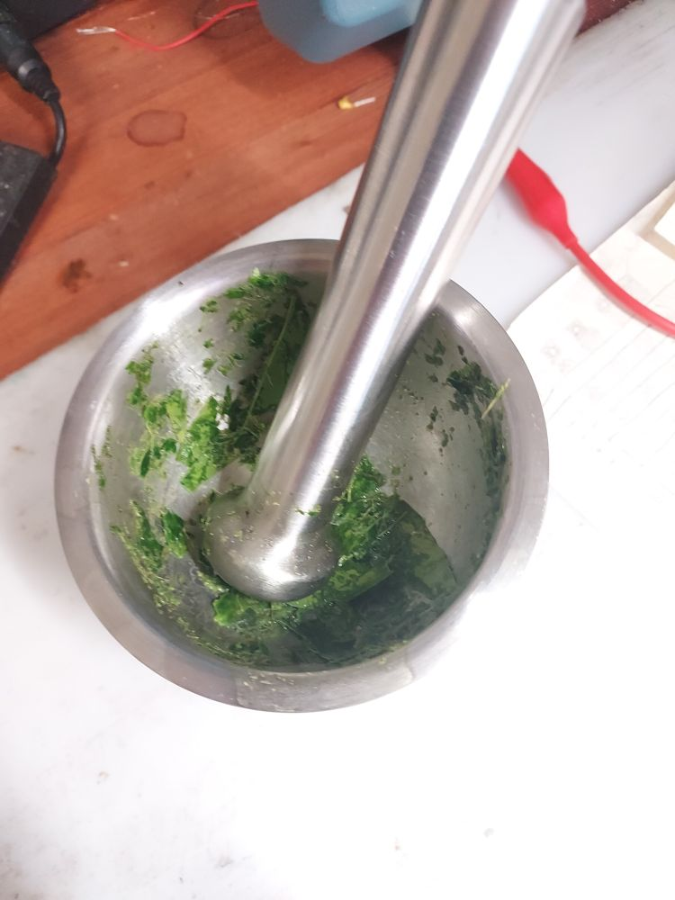
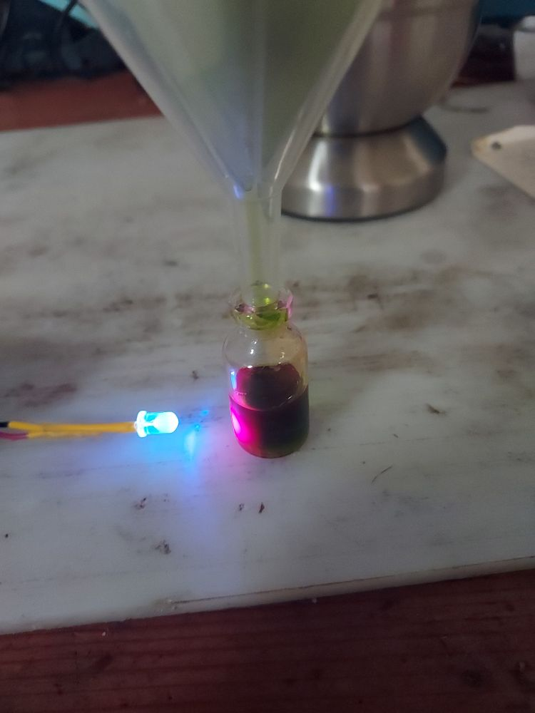

[Chlorophyll](https://en.wikipedia.org/wiki/Chlorophyll), the green pigment in plants, [strongly florescent under UV light](https://en.wikipedia.org/wiki/Chlorophyll_fluorescence).

This effect is not visible under normal conditions while the chlorophyll is in the leaf, but can easily be seen in an extract.

# Reagents

- A suitable solvent: Isopropyl alcohol (rubbing alcohol which is 40% water wont work well.), Ethyl alcohol, Acetone. (I used Isopropyl)
- Plant leaves (any green leaf should work)

# Tools

- Mortar and pestle
- Clear container
- Funnel and filter paper (optional)
- Source of UV light.

# Procedure

1. Crush the leaves until they lose structural integrity

2. Add solvent and stir
3. Filter the (now dark green) solution  to remove leaf chunks. (optional, but makes the glow more viable)
4. Shine UV light on solution to observe glow. Interestingly, the glow is not visible trough the liquid as the red light produced is absorbed by the green chlorophyll.

The solution is not light-fast and discolors in just a few hours in direct sunlight, so keep it in the dark if you want keep it.

# Hazards

Unless you use a particularly toxic or irritating plant, the solvent is the most dangerous part. Small quantities of Acetone/IPA/Ethanol can be poured down a sink followed by some water.

