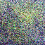
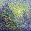

[Stable Diffusion](https://github.com/CompVis/stable-diffusion) is a newish (Dec 20, 2021) image generation model.
It can generate quickly generate highly detailed images with a concise text prompt:

Prompt: "A photograph of an astronaut riding a horse":

It does this while being much faster and smaller than OpenAI's DALL-E.
Better yet, it it open source, meaning you can not only run it on your own hardware with out restrictions (It even performs decently on a CPU!) and look inside to see how it works.

What the code does not provide however, is a concise explanation of how it works.

# Diffusion

Stable diffusion is based on a diffusion architecture, this means training a deep neural network to covert a noisy image into a less noisy one.

This is often done by training the network to predict a noise image that was added to the original, the created prediction can them be subtracted from the original image.
This allows a variable degree of denoising by scaling the noise prediction.

The way you use a denoiser to generate images is simply by creating a fully random noise image, and repeated denoising it (stable diffusion requires 10 to 20 iterations to produce decent images).
The strength of the denoising is almost always reduced over time to allow the image to settle, this is done by an algorithm known as the Noise Scheduler.

The structure of the denoising network (unet) in stable diffusion is a series of ResNet based down samplers (networks reducing resolution), followed by up samplers (networks increasing resolution).
There are additional "skip connections" between networks, that bypass part of the network (connecting up samplers/down samplers at the same resolution) to avoid losing information.

Stable diffusion allows fine tuning by inserting a much smaller "hypernetwork" with similar structure to unet, to mimic a certain style without retraining the main unet.

# Latent Diffusion

On it's own, such a Diffusion model is very slow to train and run, because images have a lot of pixels. The solution is to use an Autoencoder and train the denoiser on the latent space.
An Autoencoder is two networks trained together. one the encoder, down samples the image into a much smaller one, the latent space.
The second one up samples the image back into the original size.
The networks are trained so that the input of the encoder and the output of the decoder is nearly identical.
This allows it the diffusion model to run at a much lower resolution and still produce high resolution results.

Stable diffusion use a auto encoder (vae) that makes the image 1/8 as big, reducing the pixel count by a factor of 64! 
A typical 512 * 512 image is 262144 pixels, but the latent space is 64 * 64, just 4096 pixels.

The auto encoder is capable of converting between these two images (Yes, that *tiny* one becomes the large one):

Impressive right? The autoencoder has limits, likely causes most of the issues rendering small object like hands and letters. Hands are small but require accurate rendering (amount, angles, sizes of fingers...) and early version of stable diffusion lacked very many images of hands. More generally fine details in the background usually don't make much sense, but they look rightish if you don't look closely.
Text is also rendered poorly, as there is not enough pixels in the latent space to encode the text.
(Google's imagen works around this by using multiple diffusion and up scaling layers, each given the prompt)

# Text Embedding

One complication of unet (the latent space denoiser) is that it also takes the prompt as an input, allowing the generation to be guided towards a given image. 
But you cant just shove text into unet and expect it to work. The text must first be converted into a constant size vector (list of numbers) that encodes it's meaning.
To save on training, Stable diffusion uses the Text Encoder from OpenAI's CLIP, a model trying to relate images and captions.
Typically this is run *twice*, once on the prompt and once on an empty string to allow running ``unet`` without providing a prompt. 
This is how ``guidence_scale`` is implemented, allowing the amount of guidance (how closely the output follows the prompt) to be controlled.

CLIP further limits stable diffusion, as it does not understand object composition or prepositions.

"A red cube on top of a blue sphere":

# Classifier Free Guidance

Simply passing the text embedding into unet doesn't tend to generate satisfactory results as the images are not strongly related to the prompt.
To increase the relation of the generated image to the prompt a proccess called classifier free guidance is used.
To do this text embedding are generated for both the prompt (conditioned embedding), and an empty string (unconditioned embedding).
Then unet is invoked with both imbeddings, producing 2 separate noise predictions. By finding the difference in the two predictions, you can isolate the effect of the prompt.
The difference can then be scaled by the ``guidance_scale`` parameter (usually around 6 to 8) and added into the unconditioned noise prediction (the one with the empty prompt).
This emphasizes the differences between a generic image and the prompt.

# The txt2img algorithm

1. The first step is the use the CLIP TextEncoder and TextTokenizer to convert the prompt into 59136 element vector, the ``text_embeddings``. An empty prompt is also processed to provide ``uncond_embeddings``.

2. Now the initial latent space image will have to be created, this is simply a fully random image 8 times smaller on each axis than desired generated image's size.

3. The popular K-LMS scheduler require the latent space to be multiplied by a certain value before generation, do that here.

4. Time for the diffusion loop, repeat this for the desired diffusion step count:

    5. If the K-LMS scheduler was used, the latents must be scaled before passing into unet, do that here.

    6. Feed the latent space image into unet to generate the noise predictions, one passing the text_embeddings to create the guided "``text_noise_pred``" and  one with the ``uncond_embeddings`` to create ``uncond_noise_pred`` .
    
    7. Combine the noise predictions using the guidance scale to get an overall noise prediction: ``noise_pred = uncond_noise_pred + guidance_scale * (text_noise_pred - uncond_noise_pred)``

    8. Pass these to the scheduler to update the latent space image. In the case of K-LMS is simply does ``latents = latents - noise_pred * sigma``

9. decode the final image with the vae decoder.

# What this looks like:

To visualize the diffusion proccess, I have run the latents though the vae decoder at every step. The small image is the latent space image itself (This was done with K-LMS so the latents must be scaled before decoding)

Step 0, initial latent image, decoded image:

Step 1:

Step 2:

Step 3:

Step 4:

Step 5:

Step 6:

Step 7:

Step 8:

Step 9:

Step 10:

Note how the latent image is still very noisy, this hints that more steps (less aggressive sigma falloff) might give a better result, but some of the noise requires an impractical amount of steps to remove.

UPDATE 2023-01-12: add classifier free guidance section
