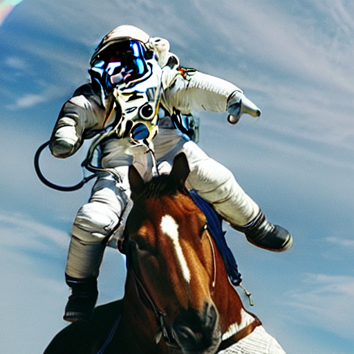

[If you have not read the last post, I would highly recommend you read it first.](../how_does_stable_diffusion_work/)

Full disclose, I will be using pre-trained models from the internet for unet, CLIP TextEncoder, and vae.

# Environment

A cuda comparable (read NVIDIA) GPU will perform best, but a reasonably modern CPU with more than 8 GB of ram should work fine, as long as you are prepared to wait.

Here are all the python libraries I used, these can be installed with pip.

```
diffusers==0.11.1
numpy==1.23.5
Pillow==9.4.0
torch==1.13.1
tqdm==4.64.1
transformers==4.25.1
```

These are all of the imports required

```py
import diffusers
from transformers import CLIPTextModel, CLIPTokenizer
from diffusers import AutoencoderKL, UNet2DConditionModel, LMSDiscreteScheduler
import torch
import tqdm
import numpy as np
from PIL import Image
```

# Getting the model

Because training stable diffusion is a lot of work, let's use a pretrained one:

```py
# The autoencoder for working with latent space
vae = AutoencoderKL.from_pretrained("CompVis/stable-diffusion-v1-4", subfolder="vae")

# The text encoder and tokenizer from CLIP
tokenizer = CLIPTokenizer.from_pretrained("openai/clip-vit-large-patch14")
text_encoder = CLIPTextModel.from_pretrained("openai/clip-vit-large-patch14")

# The unet model for diffusions.
# This consists of an encoder that downsamples the latent space, and then reverses the process.
# The model contains short cut connections to avoid loss of detail, and uses cross attention to include the text embeddigns
unet = UNet2DConditionModel.from_pretrained("CompVis/stable-diffusion-v1-4", subfolder="unet")
```

This will download ~4GB of data (to ``.cache/huggingface`` on linux) on the first run, but this will be cached.
Importing CLIP will generate a very verbose warning as ``openai/clip-vit-large-patch14`` includes a lot more than just the text encoder.

We have to decide if a GPU or CPU should be used, GPU offers best performance in most situations.

```py
torch_device = "cuda" if torch.cuda.is_available() else "cpu"
vae.to(torch_device)
text_encoder.to(torch_device)
unet.to(torch_device)
```

# Setting up the scheduler

The scheduler is responsible for combining the noise prediction with the latent space to perform denoising

```py
scheduler = LMSDiscreteScheduler(beta_start=0.00085, beta_end=0.012, beta_schedule="scaled_linear", num_train_timesteps=1000)
```

The math behind the K-LMS scheduler is quite simple, and you can see what all the functions do at [the diffuses library GitHub repo](https://github.com/huggingface/diffusers/blob/main/src/diffusers/schedulers/scheduling_lms_discrete.py).

# Setting the image parameters

Before we can start diffusing, we have to set some parameters for the generation

```py
# Most of the models run on batches, passing multiple prompts will provide multiple images.
prompt = ["a photograph of an astronaut riding a horse"]

# 512*512 is a resonable balance of resolution and time to generate
height = 512                        
width = 512                         

# How many steps to denoise for
num_inference_steps = 20       

# Guidence scale, controls the degree of guidence for the diffuser, higher values more closely follow the prompt, but are less creative
guidance_scale = 8

# Create an RNG for generating the noise image, using a different value to get a different image
# Using the same value allows for reproducable results, allowing adjustment of the prompt.
rng = torch.manual_seed(42)

# How many images to generate
batch_size = len(prompt)
```

# Generating the text embedding

Feed the prompt to CLIP's text encoder to generate embedding.

```py
text_input = tokenizer(prompt, padding="max_length", max_length=tokenizer.model_max_length, truncation=True, return_tensors="pt")

with torch.no_grad():
  text_embeddings = text_encoder(text_input.input_ids.to(torch_device))[0]

```
Generate a prompt for classifier free guidance (denoising without a prompt aka unconditioned prediction), they should be the same length as the prompt:

```py
max_length = text_input.input_ids.shape[-1]

uncond_input = tokenizer(
    [""] * batch_size, padding="max_length", max_length=max_length, return_tensors="pt"
)
with torch.no_grad():
  uncond_embeddings = text_encoder(uncond_input.input_ids.to(torch_device))[0] 
```

Because we want to run unet on both prompt, concatenate the embedding to take full advantage of parallelism

```
text_embeddings = torch.cat([uncond_embeddings, text_embeddings])
```

# Generate the initial latent space image

One image is needed for every prompt and they should be 8 times smaller to generate the desired size when decoded back to pixel space by vae.

```
latents = torch.randn(
  (batch_size, unet.in_channels, height // 8, width // 8),
  generator=rng,
)
latents = latents.to(torch_device)
```

# Diffusion

First, tell the scheduler to compute the sigma values:

```py
# Tell the schedualer to compute the sigma values
scheduler.set_timesteps(num_inference_steps)
```

K-LMS requires the latents to be scaled before generation:

```py
# Scale the latents before diffusion, K-LMS specific
latents = latents * scheduler.init_noise_sigma
```

Now time for the diffusion loop!

```py
# For each denoising step...
for (i, sigma) in tqdm.tqdm(enumerate(scheduler.timesteps)):
    # Expand the latents so that each latent image gets run both with the prompt and the uncond_embeddings
    latent_model_input = torch.cat([latents] * 2)

    # The latents are scalled, make sure to undo this before feeding into unet.
    latent_model_input = scheduler.scale_model_input(latent_model_input, sigma)

    # Use unet to generate the noise prediction
    with torch.no_grad():
        noise_pred = unet(latent_model_input, sigma, encoder_hidden_states=text_embeddings).sample

    # Seperate the conditioned and unconditioned predictions
    noise_pred_uncond, noise_pred_text = noise_pred.chunk(2)

    # Scale the diffences between conditioned and unconditioned prediction by the guidence scale
    noise_pred = noise_pred_uncond + guidance_scale * (noise_pred_text - noise_pred_uncond)

    # Finaly, use the schedualer to merge the prediction into the latent space
    latents = scheduler.step(noise_pred, sigma, latents).prev_sample
```

# Decoding an image

The latents used for training unet were scaled by a factor of ``0.18215``.

```
latents = 1/0.18215 * latents
```

Now use vae to covert the latent image into a full sized generated image

```
# Run vae to decode image
with torch.no_grad():
  image = vae.decode(latents).sample
```

Scale the image to be from 0 to 255 instead of -1 to 1.

```
image = (image / 2 + 0.5).clamp(0, 1)
image = image.detach().cpu().permute(0, 2, 3, 1).numpy()
images = (image * 255).round().astype("uint8")
```

Finally use PIL to save the image

```
pil_images = [Image.fromarray(image) for image in images]
pil_images[0].save("out.png")
```

# Done
After running the code, it will create an image ``out.png`` that should look something like this:



You can mess around with the seed value to get different images
