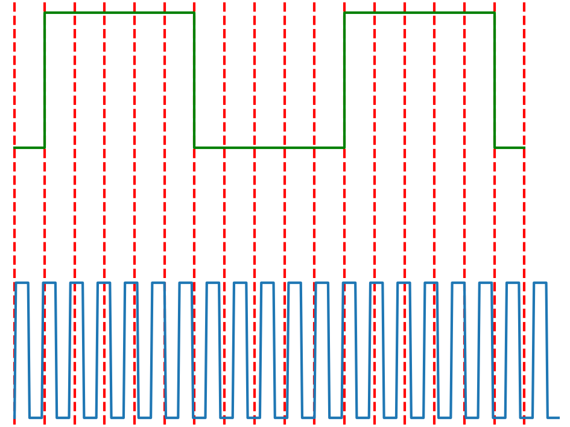
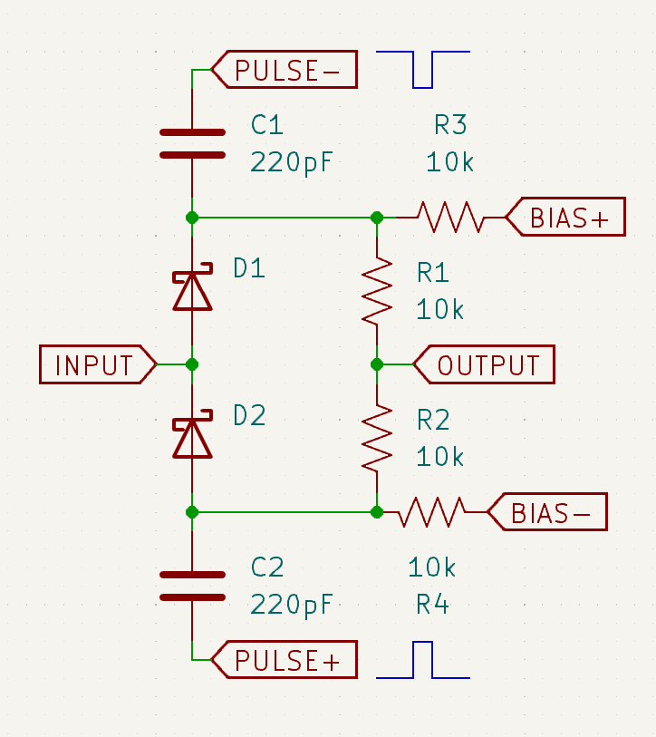
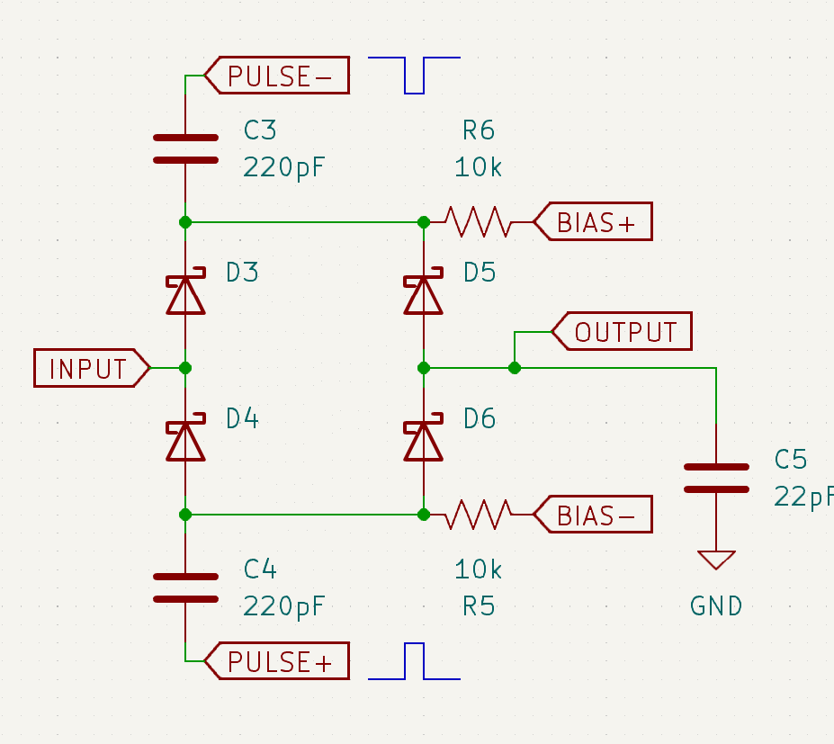
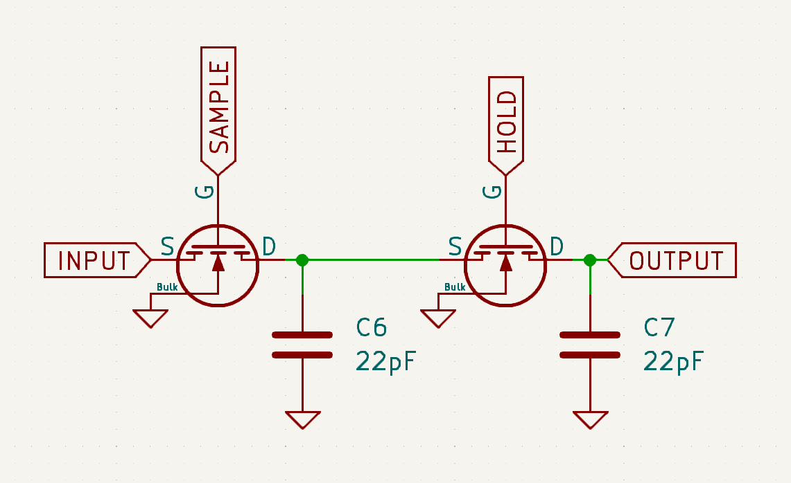
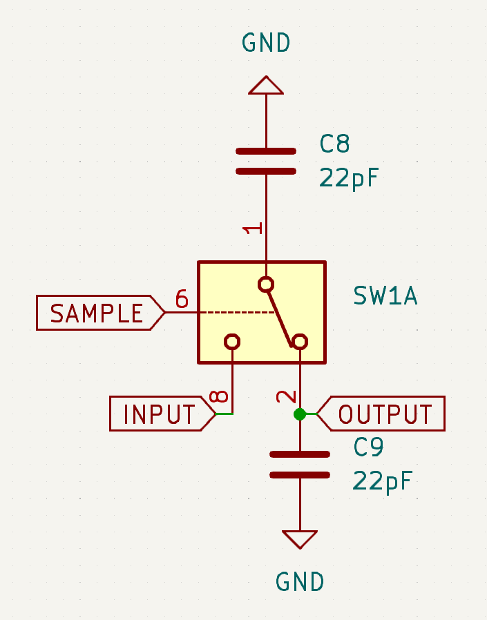

Mixers are the classic way to convert a signal to a lower frequency so it can be processed or measured easier.
But mixing only works on narrowband signals, ones that are very nearly a sine wave.

Sampling can slow down any repeating signal, including square waves and narrow pulses.
The trick is to measure the voltage at a slightly lower frequency then the signal's repetition rate, and hold that voltage until the next measurement.
Because each sample is taken at a slightly later time in the waveform, the resulting signal is a slowed down copy of the original.
The repetition rate is equal to the difference of the original's and the sampling frequency, and should be hundreds of times less then the sample rate to accurately copy the waveform.

Blue: Original waveform. Orange: Samples. Green: Reconstructed waveform.

The oldest sampling circuits use diodes as switches.
Schottky diodes can function as very fast switches, with most able to operate in the gigahertz range.

 
Most of the time, the diodes are reversed biased, blocking the signal. 
When a sample pulse arrives, it briefly forward biases the diodes, charging the capacitors to the input signal voltage plus/minus the threshold voltage.
These 2 voltages are then added together with a resistor divider to get the final voltage.

The symmetrical configuration helps with kick-out, the sample signal leaking back into the input of the sampler.
This only works with a symmetrical sampling pulse, so a common mode choke on the pulse input can significantly improve kick-out.
 

This more complex sampler that charges a capacitor to the sampled voltage, isolating the sample pulses from the output as well as the input.

MOSFET transistors can be used, and have the advantage that a short sample pulse is not required:

Samples as SAMPLE goes high-low and HOLD low-high.

One problem of this configuration is that the output can only change 50% of the way to the input, but this is not a problem for measuring periodic signals.

Small, low gate capacitance MOSFETs with a bulk connection are hard to find, but analog switch ICs are easy, most even have a built in inverter.
Switch IC's can (read datasheet!) complementary pairs of PMOS and NMOS transistors, which minimizes the sampler kick-out.

In addition to slowing down signals, samplers are commonly used in ADC's to avoid the voltage changing during a conversion, and for this averaging the sample with the last one is a problem.
The solution is to add a transistor to discharge the output capacitor (and the intermediate one to avoid kick-out).
This helps even with a single stage because a short pulse might not be enough to fully charge the capacitor from a weak input.
