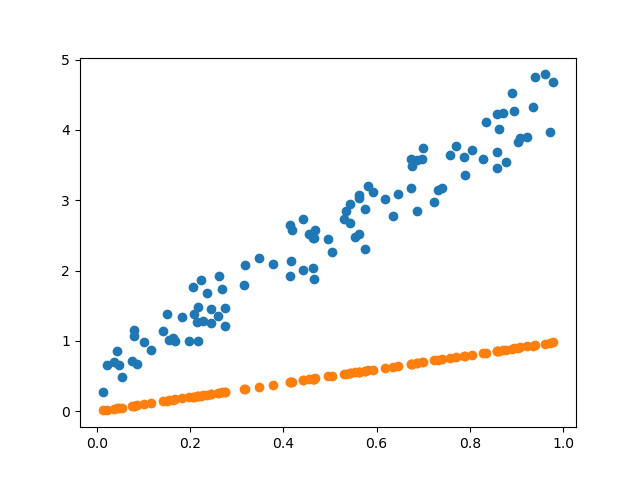

Machine learning (ML) and Artificial intelligence (AI) are some of the most common buzzwords on the internet right now.
Almost every day some new company promises seemingly impossible feats of automation using ML, AI and deep learning, and they sometimes deliver.
But before diving deeper, we need to define AI and ML.

# AI vs ML

You will often here AI and ML used interchangeably, but they actually mean quite different things.

AI is the very general field of using computer to make intelligent decisions.
An example of AI (but not ML) is the Min-Max algorithm, often used for playing games. Min-Max can be trivially applied to tic tac toe, and with some work, even more complex games like chess.

But what if you don't know what algorithm to use, or even exactly what it should do (on a technical level)?
For example, what if you want to make a program that can sort images into cat pictures and non-cat pictures?
A human intrinsically knows if a picture is of a cat or not, but how can we transfer this information to a computer?
How would you explain, mathematically, what a cat is?

|A cat|Not a cat, but Why?|
|-|-|
|[](https://commons.wikimedia.org/wiki/File:Gustav_chocolate.jpg)|[](https://commons.wikimedia.org/wiki/File:Cessna_172S_Skyhawk_%E2%80%98G-JMKE%E2%80%99_(45077563364).jpg)

Machine learning is the process by which a computer can take examples and create an algorithm to solve the problem.
In this case, the examples (training data) would be a *lot* of photographs, each labeled with `cat` or `not cat`.

# Towards a practical algorithm

ML is still very general, so I will focus on one way to achieve it: Artificial neural networks and Deep learning.
Deep learning is still rather complex, so I will start with an even simpler case: linear regression using gradient decent.

Here is a function to generate 100 random mock data points approximating a line:

```python
from numpy import random
import numpy as np

random_points = random.rand(2, 100)
data = random_points

data[1] = data[0] * 4 + data[1] + 1
```


The goal is to create a function that approximates this data, using the X position of a point to predict the Y position.
Assuming the data is linear (which it is, if you disregard noise), we can model it with the well known equation `y = ax + b`.
Lets implement this now:


```python
# The parameters are bundled together in a numpy array
init_params = np.array([1, 0])

def model(x, params):
    return params[0] * x + params[1]
```

A quick plot shows that this functions predictions are quite terrible:

```py
prediction = []
for x in data[0]:
    prediction.append(model(x, init_params))

matplotlib.pyplot.scatter(data[0],prediction)
matplotlib.pyplot.savefig("init.png")
```


Blue is the mock data, orange is the predictions


To make it better to determine the best values for `a` and `b` (the parameters array).
This can be done using [Gradient descent](https://en.wikipedia.org/wiki/Gradient_descent), which requires two additional things:

- A measure of how *wrong* the model is on a given data point
- And the derivative of the function over the parameters for any point (Don't worry, this is not hard)

Lets start with a error function, which calculates how wrong a given prediction is (Negative wrongness simply means that the prediction is above the real value):

```python
def error(x, y, params):
    return model(x, params) - y
```

Now we need to take the derivative of the model, this is simply how much a change in a parameter will effect the result:

```python
def diriv(x, params):
    """
    params is unused for now

    With y = ax + b, a change in b will always cause an identical change in y, making the diriverative 1
    For a, a change's effect is determined by the value of x.
    """
    return np.array([x,1])
```

The gradient in gradient decent refers to the derivative of the error for a given (x,y) pair, this is quite easy to compute:

```python
def grad(x, y, params):
    return diriv(x, params) * error(x, y, params)
```

All gradient decent does is to nudge the parameters in the direction indicated by the function.
One minor wrinkle is that these functions only work on a single point, but we have to optimize the function for the entire dataset.
The simplest (but not best) way to do this is by averaging the gradients computed for every single point.

```python
def avg_grad(dataset, params):
    """
    Computes the parameter gradents for the entire dataset
    """
    grads = [grad(dataset[0][i], dataset[1][i], params) for i in range(len(dataset[0]))]
    return np.mean(grads, axis=0)
```

Now we can actually start optimizing the parameters, the negative in front of `avg_grad` is because we want to reduce the error, not increase it.

```python
params = init_params

learn_rate = 0.5
steps = 50
for _ in range(steps):
    params = params + learn_rate * -avg_grad(data, params)
```

Quickly plotting the result, we can see that with the optimized parameters, the model closely approximates the dataset.


Blue: Dataset, Orange: Model predictions untrained, Green: Model prediction after training.

[I made a visualization of this proccess.](video.mp4)

[The entire code can be found here](ml1.py)
