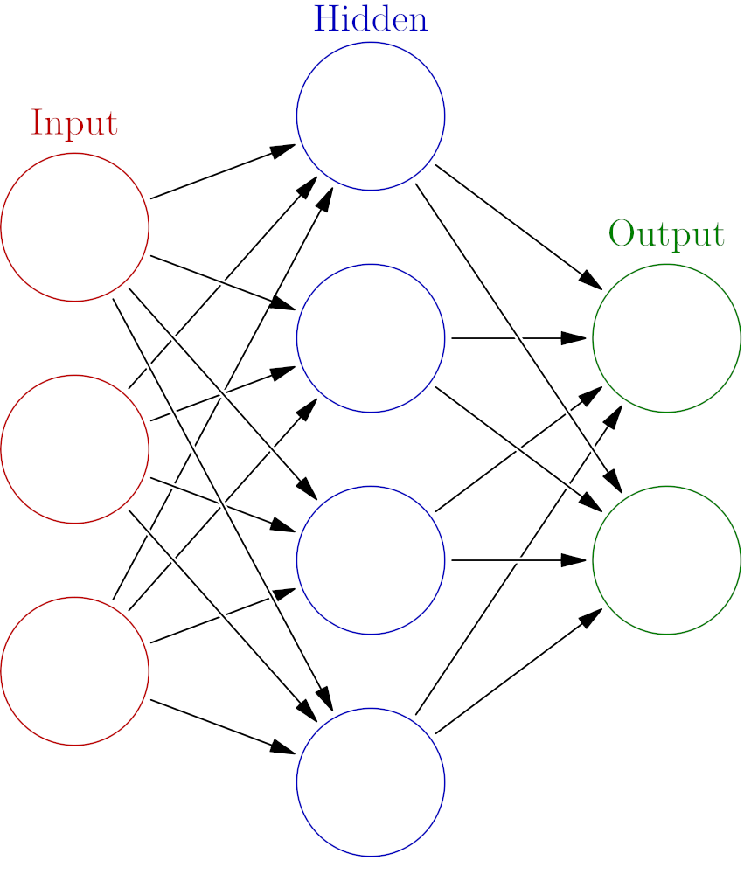
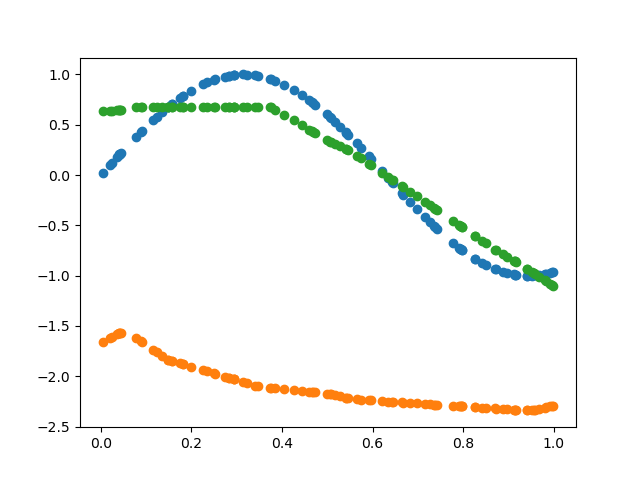

[Machine learning using a linear regression model is very simple, but rather underwhelming, as the results are always linear functions.](../ml1)
Deep learning allows much more complex models to be created, without adding too much more complexity.

This is done by creating a stack of layers, Each one with a series of neurons linearly determined from connected outputs on the previous layer.
Each connection has a weight, a coefficient controlling the strength and direction of the connection, and each neuron has a bias value controlling the "default" value for the neuron.
The first layer's inputs are just the input to the model, and the outputs of the last are the outputs of the model.
Together, these allow the network to model almost arbitrarily complex relationships.

<!--
[](https://en.wikipedia.org/wiki/File:Colored_neural_network.svg)
In this diagram, each circle (except the ones on the left, those are inputs to the network) represents a output of a layer, and the arrows represent connections.
Each output is connected to every output on the previose layer, this is known as densly connected.
-->

This makes computing the derivative non trivial, but it can be done by repeatedly using the [Chain Rule](https://en.wikipedia.org/wiki/Chain_rule).
In simple language, the chain rule states that the derivative of two functions applied to each other is the product of the product of the function's derivatives.
Mathematically, \\(h(x) = g(f(x))\\) then \\(h\prime(x) = g\prime(f(x)) * f\prime(x)\\)

These rules allow the derivatives to be computed, but this is still a error prone and time consuming process.
It would be very nice to have python do this for us, fortunately this is quite easy if we define a custom number type, that tracks how a value was computed.

```py
# Start Of File
import random
import numpy as np
import tqdm
import matplotlib.pyplot

class Value:
    """
    stores a single value and its gradient, allowing automatic differentaion using backpropigation
    """
    def __init__(self, value,  _prev=()):
        self.value = value
        self.grad = 0
        self._prev = set(_prev)
        self._backward = lambda: None
        
```

Now we can start defining operations.

```py
class Value:
    # -- snip --
    def __add__(self, other):
        # Ensure other is a value.
        other = other if isinstance(other, Value) else Value(other)
        out = Value(self.value + other.value, (self, other))
```

To avoid duplicated work, we will compute the derivatives starting at the last value, [going backwards](https://en.wikipedia.org/wiki/Backpropagation).
The derivatives for addition are trivial, just the gradient of the output, which will already have been computed.
But we cant do the computation yet, we have to wait until computing the gradients, so let's just put the code into a lambda. 

```py
class Value:
    # -- snip --
    def __add__(self, other):
        # -- snip --
        def _backward():
            self.grad += out.grad
            other.grad += out.grad
        out._backward = _backward
        return out
```

Multiplication is much the same, just with a different computation and derivative computation.

```py
class Value:
    # -- snip --
    def __mul__(self, other):
        other = other if isinstance(other, Value) else Value(other)
        out = Value(self.value * other.value, (self, other))

        def _backward():
            self.grad += other.value * out.grad
            other.grad += self.value * out.grad
        out._backward = _backward
        return out
```

To compute gradients, we need to generate a list of nodes, in an order so that no value's ``_backward`` function is called before its gradients are computed.
Recursively walking the computation graph, adding the higher level nodes first, and then reversing the ordering is the easiest way to do this.

```py
class Value:
    # -- snip --
    def backwards(self):
        order = []
        visited = set()
        def build_order(v):
            if v not in visited:
                visited.add(v)
                for child in v._prev:
                    build_order(child)
                order.append(v)
        build_order(self)

        self.grad = 1
        for v in order[::-1]:
            v._backward()
```

That's it, a working auto differentiation engine, in 44 lines of python!
A few usefully additions are to add a `__repr__` function for helpful printing, and aliases for derived operations.
The two interesting things here are the `__pow__` function which raises the value to a constant power and the `relu` function, which simply returns 0 if the value is below 0 and the value otherwise,

```py
class Value:
    # -- snip --

    def __pow__(self, other):
        assert isinstance(other, (int, float)), "Computing gradients for powers is not supported"
        out = Value(self.value**other, (self,))

        def _backward():
            self.grad += (other * self.value**(other-1)) * out.grad
        out._backward = _backward

        return out

    def relu(self):
        out = Value(0 if self.value < 0 else self.value, (self,))

        def _backward():
            self.grad += (out.value > 0) * out.grad
        out._backward = _backward

        return out

    def __repr__(self):
        return f"Value(value={self.value}, grad={self.grad})"

    def __neg__(self): # -self
        return self * -1

    def __radd__(self, other): 
        return self + other

    def __sub__(self, other): 
        return self + (-other)

    def __rsub__(self, other):
        return other + (-self)

    def __rmul__(self, other):
        return self * other

    def __truediv__(self, other):
        return self * other**-1

    def __rtruediv__(self, other):
        return other * self**-1
```
# The actual neural network

First, lets define an class as a base for all the models and parts of a model.

```py
class Module:
    def zero_grad(self):
        for p in self.parameters():
            p.grad = 0

    def parameters(self):
        return []
```

Each neuron has a random set of starting weights, one for each input, and a single bias value.
You might have noticed that simply combining linear functions wont yield non-linear results.
The solution is to add a non-linear function, the activation function, after each neuron.
This simplest one is the ReLU activation function, with returns the input if it is greater than zero and 0 if it is less than zero.
However, we cant use ReLU on the output neurons if we want the network to be able to output negative numbers, so I added a flag to disable it.


```py
class ReluNeuron(Module):
    def __init__(self, inputsize, lin=False):
        self.size = inputsize
        self.lin = lin
        self.params = [Value(random.uniform(-1, 1)) for _ in range(inputsize + 1)]
        self.params[0] = Value(0)

    def predict(self, X):
        v = sum([p * x for (p, x) in zip(self.params[1:],X)]) + self.params[0]
        if self.lin:
            return v
        else:
            return v.relu()

    def parameters(self):
        return self.params

    def __repr__(self):
        if self.lin:
            return f"LinNeuron({self.size})"
        else:
            return f"ReluNeuron({self.size})"
```

Now we can implement a densely connected layer, where each Neuron has a connection to *every* neuron before it.

```py
class DenseLayer(Module):
    def __init__(self, inputsize, outputsize, lin=False):
        self.neurons = [ReluNeuron(inputsize, lin=lin) for _ in range(outputsize)]

    def parameters(self):
        for n in self.neurons:
            for p in n.parameters():
                yield p

    def predict(self, x):
        return [n.predict(x) for n in self.neurons]

    def __repr__(self):
        return f"Layer(n={self.neurons})"
```

Finally, we can chain together many layers together to form the final model

```py
class DeepModel(Module):
    def __init__(self, parts):
        self.parts = parts

    def parameters(self):
        for l in self.parts:
            for p in l.parameters():
                yield p

    def predict(self,X):
        result = X
        for part in self.parts:
            result = part.predict(result)
        return result

    def __repr__(self):
        return str(self.parts)
```

Lets get some mock data for the model, something nonlinear that the last model would not work on.

```py
data = np.random.rand(2, 100)
data[0] += 1
data[1] = np.sin(data[0] * 5)
```

Now create the model object.

```py
model = DeepModel([
    DenseLayer(1, 16),
    DenseLayer(16, 16),
    DenseLayer(16, 16),
    DenseLayer(16, 1, lin=True)
])
```

The final thing before training is a loss function, this is the Mean Squared Error (MSE) Loss.

```py
def loss(Ypred, Y):
    """
    MSE loss
    """
    losses = [ (pred - y)**2 for pred, y in zip(Ypred, Y) ]
    return sum(losses)/len(losses)
```

Now training, the automatic gradient code makes this super easy:

```py
print(f"Training {len(list(model.parameters()))} parameters")
steps = 200
for i in tqdm.tqdm(range(steps)):
    Ypred = [model.predict([x])[0] for x in data[0] ]
    currentloss = loss(Ypred, data[1])

    model.zero_grad()
    currentloss.backwards()

    learning_rate = 1.0 - 0.9*i/steps
    learning_rate *= 0.1
    print(currentloss.value)

    for param in model.parameters():
        param.value -= param.grad * learning_rate
```

The learning rate must be quite low because if the bias value becomes strongly negative, it will never be activated by any training dataset,   becoming useless as its gradients will always be zero and thenceforth will never be updated. This is known as "Dying ReLU".
Let's also plot the resulting predictions to see how the model did:

```py
prediction = [model.predict([d])[0].value for d in data[0]]
matplotlib.pyplot.scatter(data[0],prediction)
matplotlib.pyplot.savefig("final.png")
```


- Blue: Mock data
- Orange: Untrained model
- Green: Trained model

Not perfect, but a lot better than a straight line.


