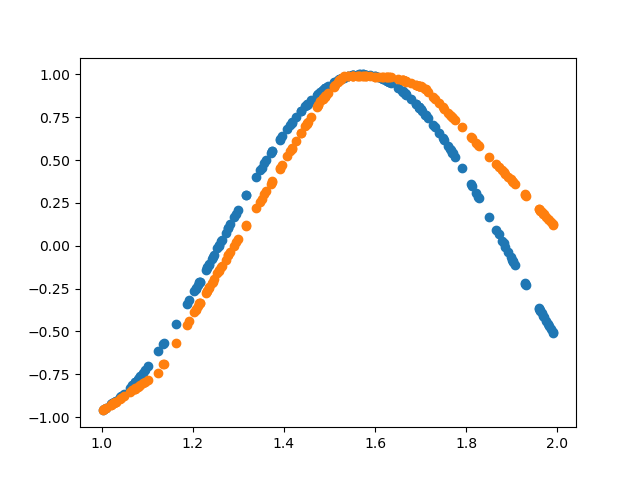
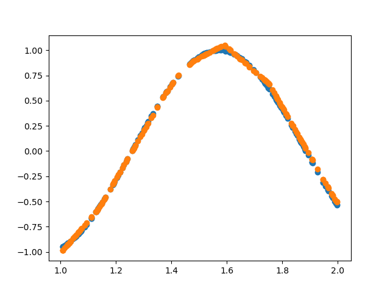

The last post's automatic differentiation engine was nice, but very slow, even by python standards.
Even without this, python is quite a slow language, and usefully neural networks can get very big.
The library `pytorch` provides a highly optimized (in C) and highly generic library of common tasks for ML.


Installing it is very easy. (I would recommend using your system package manager on linux)

```sh
pip install torch
```

Because iteration in python is slow, torch provides vector ("tensors") types, that allow working with many values at a time, similar to numpy `ndarray`s.

```py
import torch
tensor = torch.tensor([[1,2], [3,4]])
```

To test it out, let's see how to reimplement the last posts network with pytorch.
Torch provides prebuilt primitives for constructing deep networks, so this step is easy:

```py
from torch import nn

model = nn.Sequential(
    nn.Linear(1, 16),
    nn.ReLU(),
    nn.Linear(16, 16),
    nn.ReLU(),
    nn.Linear(16, 1),
)
```

We can use numpy to generate some mock data, but we need to covert it to pytorch tensors before using it.

```py
import numpy as np

data = np.random.rand(2, 200)
data[0] += 1
data[1] = np.sin(data[0] * 5)

x = torch.from_numpy(data[0]).reshape(200,1).to(torch.float)
y = torch.from_numpy(data[1]).reshape(200,1).to(torch.float)
```

Torch has prebuilt loss functions and optimizes (SGD is not quite the same as vanilla gradient decent, it is modified to not get stuck on local minimums as much). 

```py
loss_fn = nn.MSELoss()
optimizer = torch.optim.SGD(model.parameters(), lr=1e-1)
```

Pytorch makes the training loop trivial, we can run it for a lot of steps due to torch being fast. (Even with more steps this was 50x faster than the old implementation)

```py
steps = 500
for i in tqdm.tqdm(range(steps)):
    pred = model(x)
    loss = loss_fn(pred, y)

    optimizer.zero_grad()
    loss.backward()
    optimizer.step()

print(loss)
```

Some work is required here because matplotlib does not support torch tensors.

```py
import matplotlib.pyplot

prediction = model(x)
matplotlib.pyplot.scatter(data[0],data[1])
matplotlib.pyplot.scatter(data[0],prediction.detach().numpy())
matplotlib.pyplot.savefig("final.png")
```

With 500 steps:


With 5000 steps, only 1s to train :)


- Blue: training data
- Orange: predictions

[You can get the code here](ml3.py)
