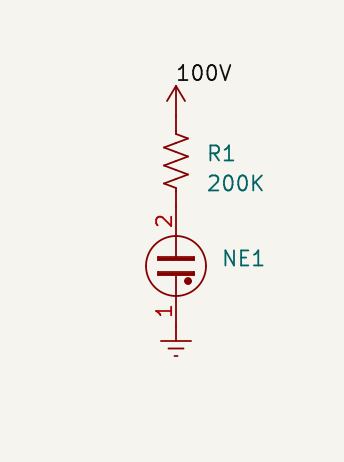
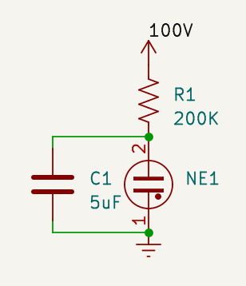
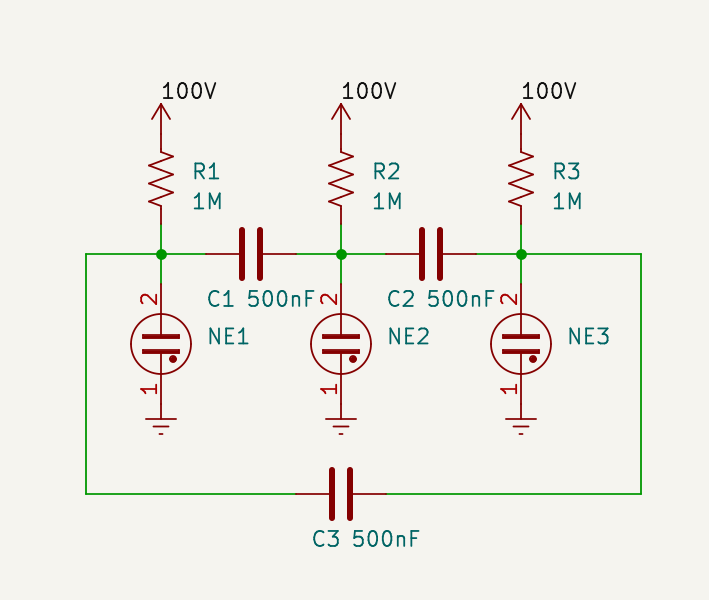
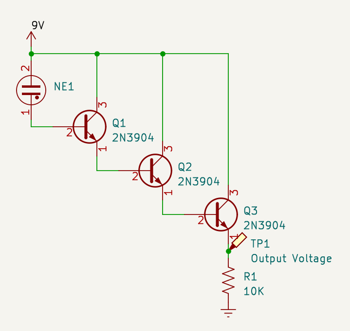

Neon lamps, small gas discharge tubes used as indicator lights, have fairly interesting electrical properties.
Until a certain voltage is reached, the striking voltage (around 90 V for most), the lamp conducts nearly no current.
Once the striking voltage is reached, the gas inside the lamp ionizes, allowing current to flow much easier.
Current flows so easily, that if maintained at the striking voltage, the lamp would ark over and quickly overheat.
Neon indicator lamps require driver circuitry to avoid this, and for small, low power, indicator lamps, this can be as simple as a resistor.

The resistor limits the current trough the bulb, reducing voltage once the neon ionizes and begins conducting.
This is what you will find in most mains powered equipment for powering neon bulbs, running directly off of 110-240V AC with just a resistor.

This circuit (if running of DC) can be trivially made to oscillate by adding a capacitor, producing a blinking light.
This works because neon lamps exhibit hysteresis, they will stay lit at a much lower voltage (often around 50 V) than it takes to light them.

Other, more complex configurations can be made, such as a sequential flasher: (you may have to find several lamps with similar striking voltages, as they are not made to a very high tolerance):

Even more complex configurations like counters, latches, and entire calculators have been made using neon lamps as the active components.

Another interesting effect with neons (and somewhat annoying to people trying to make complex logic circuits from them) is the "dark effect".
When a neon is in the dark, it will have a higher striking voltage than when it is in a brightly light environment.
If you get the voltage right, you can get a neon to light up, by pointing a light at it!

A far less documented effect that light has on neon bulbs, is that it can make them slightly conductive (less than a billionth of an amp at 9V) at very low voltages, below 10 volts.
This current is difficult to measure directly but a simple amplifier, constructed out of 3 2N3904 transistors:

The more light hits the neon, the more current will flow trough R1, the higher the voltage will be at TP1.

This setup is very sensitive to EMI, build it as small as possible, and set your scope to average voltage (often called high-res).
You can also connect an current analog meter in series with R1. (the current is around  400µA, so try to use a meter with a range of around 1mA)
If you do not have an analog meter, you can also connect a 200nF capacitor in series with R1.

One interesting thing with neons is that it takes some time (500ms or so) to stop conducting after the light is removed.

Neons don't make particularly good light sensors, with super low singal levels and poor response time, but they can detect light, even when run at a very low voltage.
