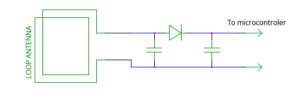
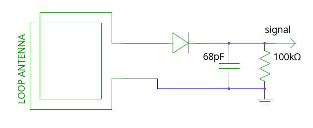

NFC smart cards are commonly used for a wide variety of applications including contactless payments, building access control, and 2 factor authentication.
These smart cards have no power source, yet are capable of bidirectional communication, storing data, and performing cryptographic operations.
In each of these cards is a circuit straight out of the 1900s: The crystal radio.

Most of the card is taken up by a flat coil, which can often be seen if the card is held up to a bright light.
Another component you can easily see this way is a capacitor, it looks like a large (usually square) opaque region.
The capacitor is placed in parallel with the coil, forming a parallel tuned circuit (resonant at 13.56 MHz), similar to a crystal radio.

A NFC card reader contains a similar (but usually larger) coil through which AC at 13.56 MHz is passed.
When the card is placed nearby to the reader, the coil is magnetically coupled the coil in the reader, and this creates voltage in tuned circuit.
This AC voltage is then rectified by a diode and used to power the microcontroler on the card.

Once the card is powered up, the reader and card can communicate using ASK.
Basically, the reader momentary removes or reduces transmitted power, and the card can respond by changing it's power consumption.
The card, of course, needs a capacitor to store energy to keep the microcontroler running when the reader's transmit coil is turned off.
The modulation depths used for this can ether be 100% (fully removing power) or 10% (slightly reducing power, used at lower data rates).

This communication is super easy to sniff using a trivial circuit:
(Some cards use BPSK which is a harder to detect, but most use ASK and will work with this circuit.)

I used an antenna consisting of 5 turns of solid core wire roughly in the shape of a typical NFC smart card.
After connecting the output of the circuit to an oscilloscope, and placing the antenna between the reader (a phone) and the card (A MIFARE DESfire based transit card running with 100% modulation depth), the signals from the reader were easily visible on the scope.
The card's signals were visible as smaller dips (but still over 25% of the voltage) on the output.

