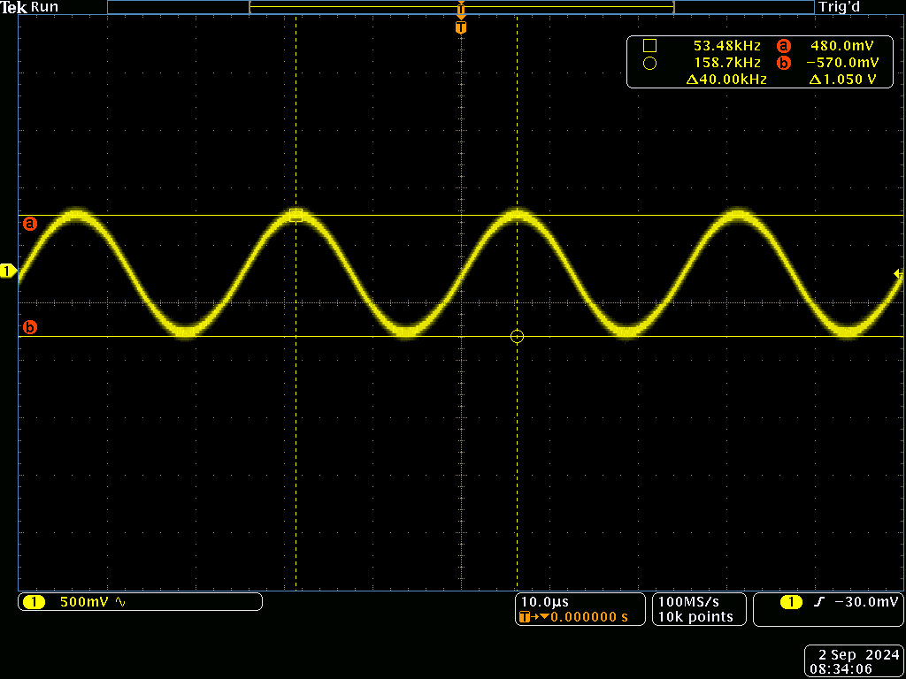
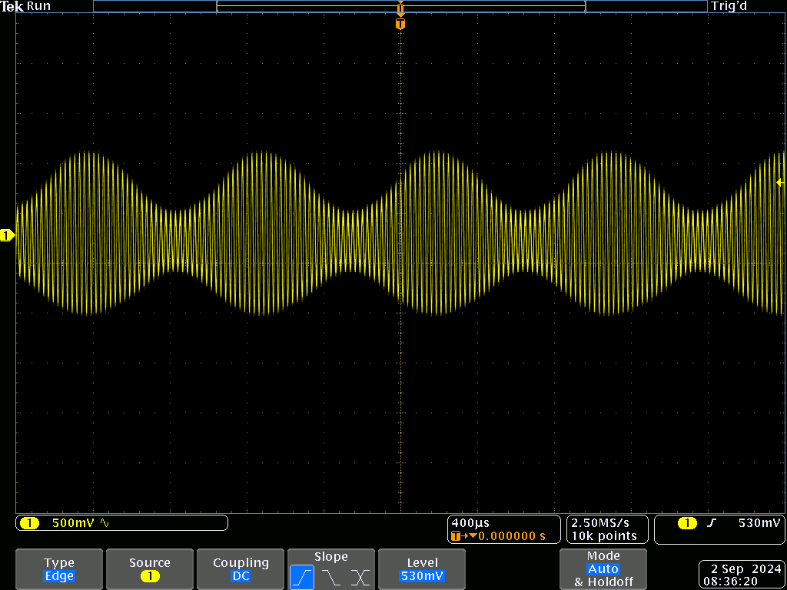
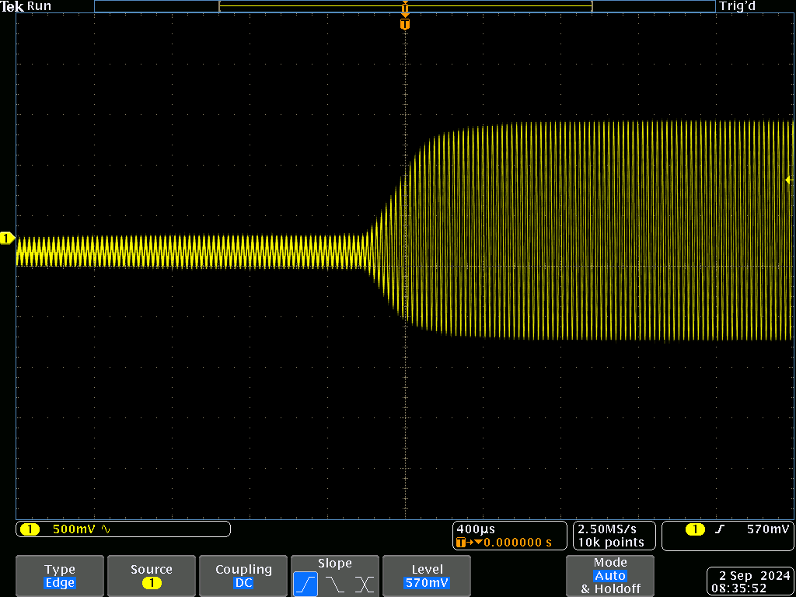

Sound normally behaves linearly, a tone at one frequency won't create or effect one at another.
But this isn't the case if the sound is loud enough.

As a quick experiment, I took an ultrasonic distance sensor, and connected a function generator directly to the sensor's transducer.
I also connected another transducer to my oscilloscope as an ultrasound detector.

This is the received signal after giving the transmitter 40 kHz at 20 volts:

The sound is clearly there, but was also completely inaudible;
40 kHz is well above the range of human hearing.
Next, I introduced some amplitude modulation at 1 kHz:

The ultrasound was still way out of the range of human hearing, but a 1 kHz tone was clearly audible.
Interestingly, it sounded like it was coming from the wall the transducer was pointed at.

To confirm this sound was not caused by the transducer itself, I pointed the the ultrasound beam out though an open door.
This almost completely eliminated the sound, but it returned once the door was closed.
The effect was even better with a 100 Hz square wave modulation, going from complete silence to loud buzzing.

So just how does ultrasound create sound at a 400 times lower frequency?

Sound is a pressure wave and changing the pressure of a gas also changes it's temperature.
This temperature variation results in a small change in the local speed-of-sound.
Borrowing some terms from electronics, this nonlinearity mixes the modulated signal down to baseband.

This is a very roundabout way to make sound, but the result is far more directional then could be achieved directly.
Even my small ~1.5 cm transducer has pronounced directivity, unlike a conventional speaker of comparable size.

The main downside is limited bandwidth, lower frequencies take more ultrasound to produce, and the higher frequencies are limited by transducer bandwidth.
This is my function generators best attempt at modulating a square wave (this looks worse then it actually is, because the sound is being measured by a second, bandwidth limited transducer):

A workaround could be to amplify and overmodulate higher frequencies, or to simply use a higher frequency transducer, with a correspondingly higher bandwidth.

Another effect I noticed is that the transducers blow air, and I was able to blow out a candle.
There are probably some cool (pun intended) for a completely silent fan with no moving parts.
