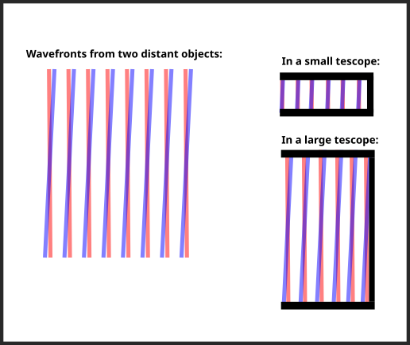
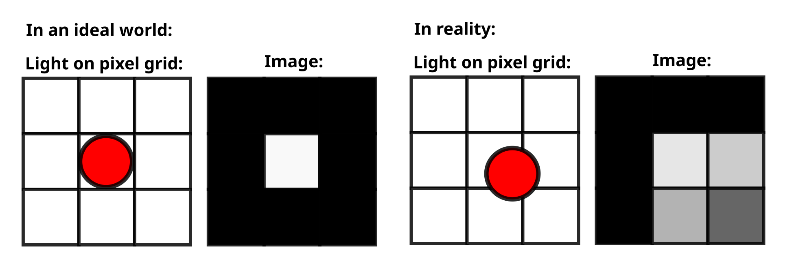
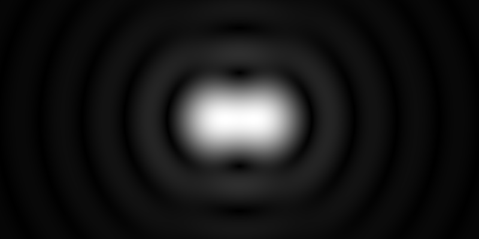
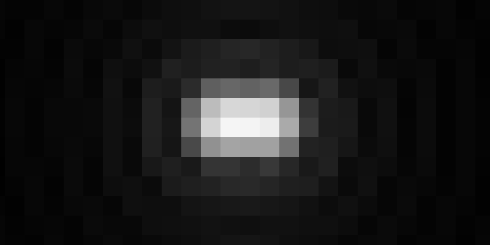

The resolution of a telescope is fundamentally limited by it's the aperture, or the area (or diameter of) that it's able to gather light over:

> 
 (very) Not to scale

In the small telescope, the wavefronts from two close objects merge together and cannon be separated.
A larger telescope can see more of the wavefront, allowing it to distinguish the two objects.

Mathematically, the minimum angular separation for two objects to be resolved is:

$$ \text{Resolution}_{(radians)} = \frac{1.22 \times \text{Wavelength}}{\text{Aperture}} $$

At the wavelength of peak sensitivity for most cameras (~460 nm), this formula becomes the standard Dawes' resolution limit:

<!--
$$ Resolution_{(radians)} = \frac{1.22 \times 460 nm}{Aperture} $$
$$ Resolution_{(radians)} = \frac{561 nm}{Aperture} $$
-->

$$ Resolution\_{(arcsec)} = \frac{116}{\text{Aperture} \_{(mm)}} $$
> 
 ... after conversion to astronomy friendly units that is. 

Fully capturing an image requires a sample density of at least twice the optical resolution.
Any less then that risks losing detail to poor alignment between the pixel grid and the object:

> 
 The universe has no obligation to respect your pixel grid 

Let's aim for 2.5 times the optical resolution just to be on the safe side of things:

$$ \text{Ideal Sampling}\_{(arcsec/pixel)} = \frac{\text{Resolution}}{2.5} = \frac{116}{\text{Aperture}_{(mm)}} \times \frac{1}{2.5} $$

The actual sampling given by an sensor depends on the the pixel size and focal length of the telescope:

$$ \text{Real Sampling}\_{(arcsec/pixel)} = 206.265  \times \frac{\text{Pixel Size}\_{(\mu m)}}{\text{Focal Length}_{(mm)}} $$

Combining those two formulas, and doing a bunch of algebra gives this formula for the ideal focal ratio to match a given camera:

$$ 4.445 \times \text{Pixel Size}_{(\mu m)} = \text{Focal Ratio} $$

... and here are the results for a few common pixel sizes used for astronomy:

|Pixel size|Ideal focal ratio|
|-|-|
|2.9 μm|12.9|
|3.76 μm (IMX533 et al)&nbsp;&nbsp;&nbsp;&nbsp;|16.7|
|5.8 μm |25.8|

Hu. 
That's very different the f/4 to f/6 people normally use.

## This can't be right, can it?

This is what two stars separated by the Dawes' limit look like though a telescope:

Here's they looks like sampled at 1 times the Dawes' limit, which is the usual recommendation for deep sky imaging:

Hu. That just looks like a single star.

Here's what sampling at 2.5 times the Dawes' limit looks like: 

It's now clearly not a single point of light, although it's still impossible to tell exactly what it is.
 (Double star, small galaxy, UFO... your pick)

While very few amateurs do deep sky imaging above f/10 or so, a lot of professional observatories do:

Hubble uses f/24, James Webb is at f/20.2, and it's not just the ones in space: Keck usually uses f/15, and Gemini uses anywhere from f/6 to f/32.

> Side note: All of these use rather large pixel sizes, but also regularly image down in the infrared, at much longer wavelengths.
> James Webb's [NIRCam](https://jwst-docs.stsci.edu/jwst-near-infrared-camera/nircam-instrumentation/nircam-detector-overview) has a pixel size of 18 um, but operates at wavelengths of 600 to 5000 nm.
>
> In the middle of that range, at 2000 nm, the focal length for 2.5x Dawes' is... f/18.4 -- within 10% of what JWST actually uses.

Sure, longer focal lengths result in a dimmer image, but with modern camera sensor's sub-electron read noise, this really doesn't matter.
Because of how noise adds together, once other sources of noise exceed three times the read noise, it'll account for less then 5% of the overall noise in the image:
 
$$ \text{Noise Total} = \sqrt{(\text{Source 1})^2 + (\text{Source 2})^2 + ...} $$
$$ \text{Noise Total} = \sqrt{(1)^2 + (\frac{1}{3})^2} = 1.054 $$
$$ = 5.4\\%\text{ above source 1 alone} $$

The largest source of noise in most images is shot noise, caused by the random nature of light absorption. 
Under typical skys (Bortle 4/5ish), with typical sensors (like the color IMX533), read noise should be insignificant with exposures above 20 seconds at f/10, 50 seconds at f/15, and 1.5 minutes at f/20. 

Because the object is also dimmer, it will still take longer to reach the same signal-to-noise ratio (SNR), but modern denoisers are very good, and if all else fails you can always just downsample the image back down to a faster f-ratio.

## A reality check:

So far, I've been  ignoring a very important factor: Atmospheric seeing, or the distortions caused by the atmosphere.

... but, are they really that important?

For small telescopes, under 100mm in aperture, like the small refactors commonly used for deep sky imaging, it's entirely possible for the seeing to be below your Dawes' limit:

The common Redcat 51 has a Dawes' limit of 2.3 arcseconds, and should be largely unaffected except in particularly bad seeing. 

On the other hand, a large 8-inch Schmidt-Cassegrain will have a Dawes' limit of 0.57 arcseconds, which is enough to be affected by seeing. 
If the atmosphere spreads out light into a disk 2 arcseconds wide, then imaging at 1x Dawes' per pixel would be close to ideal sampling.

Another important factor is that color camera's have approximately half the resolution you'd expect:
Every pixel only sees a single color channel, so processing software has to interpolate between pixels to find the true color.

This means that to sample at 2 times your optical resolution (seeing or Dawes'), you actually need something like 3-4 times it.
So even a large telescope will benefit from "oversampling" if you're using a color camera.

So if you're having issues getting all those tiny galaxies at this time of year, perhaps try taking off that focal reducer, using a smaller pixel camera or even adding a Barlow lens (if your scope can reach focus with one).
If nothing else, it'll give all those AI sharpening programs something to work with.

<!--
$$ \frac{116 mm}{\text{Aperture}\_{(mm)}} \times \frac{1}{2.5} = 206.265  \times \frac{\text{Pixel Size}\_{(\mu m)}}{\text{Focal Length}\_{(mm)}} $$

$$ \frac{116 mm \times \text{Focal Length}}{\text{Aperture}\_{(mm)}} \times \frac{1}{2.5} = 206.265  \times \text{Pixel Size}\_{(\mu m)} $$

$$ \frac{116 mm \times \text{Focal Length}}{\text{Aperture}\_{(mm)} \times 206.265} \times \frac{1}{2.5} = \text{Pixel Size}\_{(\mu m)} $$

$$ \frac{116 mm \times \text{Focal Length}}{\text{Aperture}\_{(mm)} \times 206.265} \times \frac{1}{2.5} = \text{Pixel Size}\_{(\mu m)} $$

$$ \frac{116 mm \times \text{Focal Length}}{\text{Aperture}\_{(mm)} \times 206.265 \times{2.5}} = \text{Pixel Size}\_{(\mu m)} $$

$$ \frac{116 mm \times \text{Focal Ratio}}{206.265 \times{2.5}} = \text{Pixel Size}\_{(\mu m)} $$

$$ \frac{116 mm \times \text{Focal Ratio}}{206.265 \times{2.5} \times \text{Pixel Size}} = \frac{1}{\text{Focal Ratio}}$$

$$ \frac{206.265 \times{2.5} \times \text{Pixel Size}_{(um)}}{116} = \text{Focal Ratio}$$
-->
