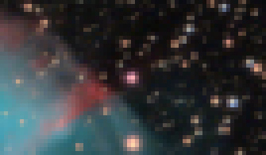
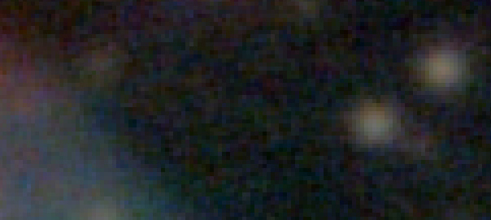
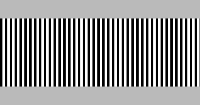

For an image to look as sharp as real life, it needs to have a resolution higher then that of the human eye: usually around 1 arcminute, or 1/60th of a degree. 

$$ \text{Linear resolution} = \frac{\text{Distance}}{\text{1 radian}} \times 1 \text{ arcminutes} $$

$$ \text{Linear resolution }(\text{inches}) = \text{Distance (m)} \times 0.0115  $$

$$ \text{Features / Inch } = \frac{87}{\text{Distance (m)}}  $$

For an image to look good at 1 meter, around an arms-length, it needs a feature size of 1/87th of an inch.
A poster that's going to be viewed from 2 meters can get away with half that, 1/43th of an inch.
Something that's going to be examined up close, say 50 cm, needs a resolution of 1/172th of an inch. 

Importantly, the actual resolution of the image is often different from the size of the pixels.
If an image looks pixelated when you zoom in, a good rule is to print with a pixels-per-inch of twice the desired resolution:

> 
Undersampled image. Small features (stars) take up 2 pixels.

|Viewing distance|PPI|
|-|-|
|4 meters|43 pixels/inch|
|2 meters|87 pixels/inch|
|1 meter|170 pixels/inch|
|50 cm|350 pixels/inch|
|25 cm|700 pixels/inch|

However, if you zoom in and the image looks blurry:

> 
Oversampled image. The smallest features still have a lot of pixels.

... measure the size of a sharp edge, double it and use that as the conversion factor. 

Looks like the edges are around 5 pixels, so we have to multiply the desired resolution by 10 to get pixels/inch.
If it's got to look good hanging on a wall (~1 meter), it needs a resolution of 1/87th of an inch:

$$ 87 \text{ Inch}^{-1} \times 10 \text{ Pixels} = 870 \text{ PPI} $$

The whole image is 3000x3000 pixels: 

$$ \frac{3000\text{ Pixels}}{870\text{ PPI}} = 3.4 \text{ Inches}$$

There's an easy way to test this, just display [the image](/astro/m27/) on a screen and zoom in/out until it's 3.4 inches on both sizes.
From closer then 1 meter, some blurriness is visible, but from further some detail is lost. 

If this image was printed at the often recommended 300 PPI (10x10 inches), it would be quite blurry.
Rules like that worked a lot better back when the expensive part of digital cameras was the digital part:
Not just the sensor, but the storage, computing power and network bandwidth need to handle big image files.

Nowadays, It's often the optics are the expensive part, so it makes sense to try and get the most out of them using a very fine pixel grid --- 
resulting in a image with a PPI that's very different from resolution. 

# How well can you actually see?

If your printing something for your own use, you might want to check the resolution of your eyes:

Zoom into this image so that the width of each vertical line is 1 mm or the whole image is 3.2 inches wide.
Next, walk away until the lines blend into a solid color, and measure the distance between your eyes and the screen:

$$ \text{Angular Resolution} = \frac{11\text{ arcminutes}}{\text{Distance (feet)}} $$

$$ \text{Angular Resolution} = \frac{3.4\text{ arcminutes}}{\text{Distance (meters)}} $$

If you get a result close to 1 arcminute, you can use my math as is.
Otherwise, you'll have to divide my PPI/resolution numbers by your eye's angular resolution.
