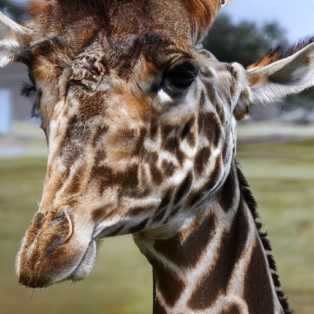
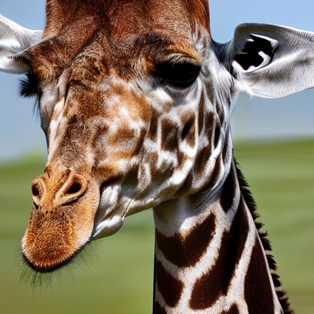
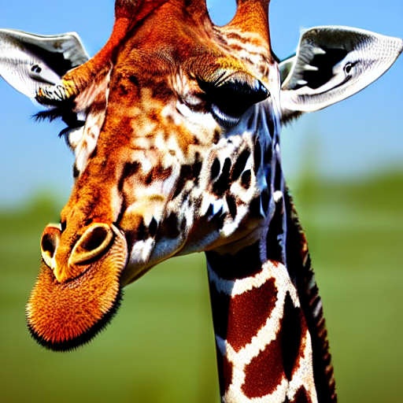

The guidance scale parameter controls how strongly the generation process is guided towards the prompt.
A value of 0 is equivalent to no guidance, and the image is completely unrelated to the prompt (it can however, still be an interesting image).
Increasing the guidance scale increases how closely the image resembles the prompt, but reduces consistency and tends to lead to an overstaturated and oversharpened image.

The noise predictor (unet) excepts a prompt, and it will generate images similar to that prompt (this is known as conditioning).
However, this not enough to produce high quality, relevant images (see the images generated with a guidance scale of 1).
To provide more related images, an method known as [classifier-free guidance](https://arxiv.org/abs/2207.12598) can be used.
This is done by running the noise predictor twice, once with the prompt (yielding the conditioned prediction), and once on no prompt (unconditioned prediction).
Then the unconditioned embedding is subtracted from the conditioned one, the difference is multiplied by the guidance scale and added back to the unconditioned prediction yielding the final noise prediction.
This has the effect of pushing the prediction (and therefore generated image) away from a generic image, and towards the prompt.

Prompt: `a photorealistic, professional high quality photograph of a giraffe.`, Scheduler: KLMS

|Guidance Scale|0|0.5|1|1.5|2|2.5|3|3.5|4|4.5|5|5.5|6|6.5|7|7.5|8|
|--------------|-|---|-|---|-|---|-|---|-|---|-|---|-|---|-|---|-|
|Generated Image||||||||||||||||||

All other parameters, such as seed are constant between these images.
For this prompt, the optimum value seems to be around 4-6.

If you constantly get images that are not related to the prompt, or ignore aspects of it, try increasing the guidance. If you constantly get overstaturated colors (or brightly colored blobs instead of faces) try reducing the guidance scale.
There are lots of things that can be done with classifier free guidance, one possibility is to use a different guidance scale for large and small scale features.
This can be done by high pass or low pass the predictions before running guidance, or by simply switching prompts or guidance scales during generation (Large scale features are settled earlier in the diffusion). 

Prompt 1: `A photograph of a giraffe`
Prompt 2: `A photograph of a dragon`

|Number of steps with first prompt|1|2|3|4|5|6|7|8|9|10|11|12|13|14|15|16|17|18|19|20|
|---------------------------------|-|-|-|-|-|-|-|-|-|--|--|--|--|--|--|--|--|--|--|--|
|Generated Image||||||||||||||||||||||

Result: A giraffe shaped dragon around 2 to 5 steps

