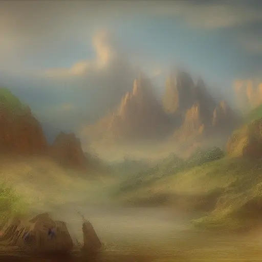

TLDR: The step count has very litle effect on image content, and increasing it has rapidly deminishing returns over 20 steps.

A lot of people run stable diffusion with very high step counts, like 100 or 200, but is this neccicary to produce good images?
No. Here a a bunch of images generated with stable diffusion (K-LMS scheduler), with the same seed and prompt, with different step counts:

|Prompt| 5 steps|10 steps|20 steps|40 steps|80 steps|160 steps|
|-|--------|--------|--------|--------|--------|---------|
|A fantasy landscape.|||||||

Personaly, I cant tell the difference between the 40, 80 and 160 step images, and 20 steps looks quite similar.
However, in the time it takes to generate a single 160 step images, you could generate *8* 20 step images!
Futher more, the generated image is stable for a varieng stepcount, meaning that you can test prompts and seeds at a low step count, and then increase it without fundementatly chainging the content of the image.

More important to the generated quality and content is the seed value, guidance scale, and the prompt.
Try to only change one parameter at once, this allows you to isolate a particlular factor.
If you are exploring seeds, keep the prompt, guidance scale and step count constant.
If you are changing the guidance scale, keep the promt, seed, and step count contant.
If you are changing the prompt, keep the guidance scale, seed, and step count contant.

This is the same prompt, just with a different seed:

|Prompt| 5 steps|10 steps|20 steps|40 steps|80 steps|160 steps|
|-|-|-|-|-|-|-|
|A fantasy landscape.|||||||

Once again, we see very litle differences after 20 steps.

