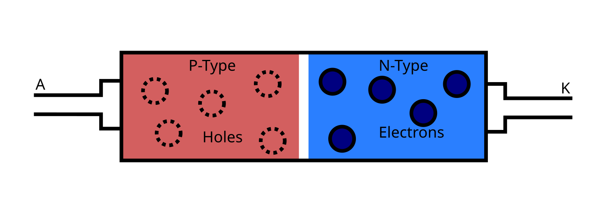
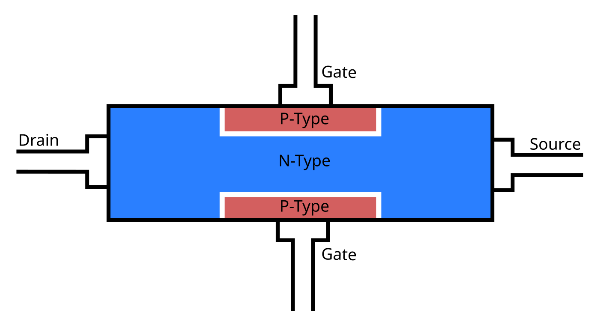
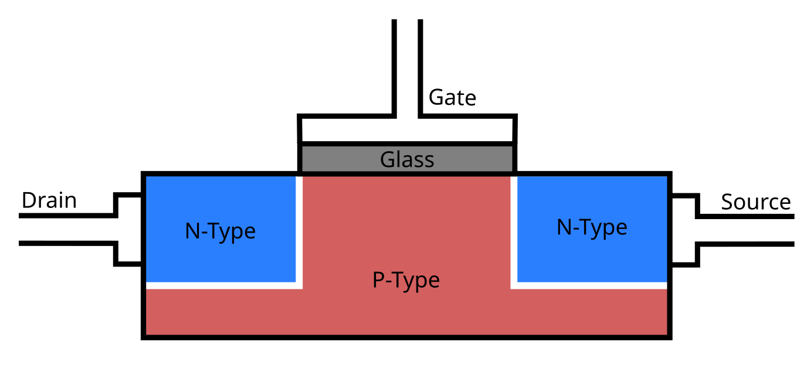
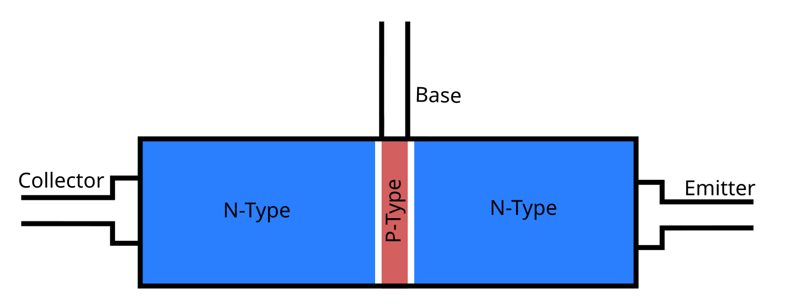

In an atom, most electrons sit deep inside, but some, the valence electrons (up to 18) are on the outermost shell and able to interact with the world.
These are the electrons that form bonds with other atoms, interact with light and do other intresting things.
However, in most materials, these electrons are still bound to their respective atoms and molecules.
While it is possible to get these electrons moving, this requires so much force it often destroys the material (and starts a fire).

However, in metals, electrons can freely move between atoms, acting like a gas, although they are still bound to the metal itself by the positive charge of the nuclei.
If an extra electron is added to one part of an metal, because electrons repel each other, all the other electrons quickly move aside to make space.
This results in a ripple moving in the electron "gas" at the speed of light.
Unlike electrons, the electromagnetic forces pushing them are not bound to the conductor, a negatively charged object can push electrons away without touching the conductor.
Similarly, an excess of electrons in one wire can repel electrons in another nearby wire.

Pressure equalization of the electron "gas" is really what electricity is.
The actual speed of electrons in a wire is rather slow, often just a few millimeters per hour (or less), but these ripples travel at the speed of light.
Voltage is simply the difference in pressure of the "gas" pushing the electrons along, and current is the rate at which electrons are moving in a conductor.

# Semiconductors

Semiconductors normally behave as insulators, with electrons bound to their atoms.
However, unlike insulators, with a relatively small amount of force, an electron can be knocked into a higher energy state, setting it free.
This leaves a gap, allowing electrons from nearby atoms to easily jump over.
As a result, these gaps or electron holes behave like a positively charged particles, drifting towards negative charge.
If a free electron encounters a hole, it can fall into it, recombining, returning the semiconductor to an insulating state.

Semiconductors can be dopped by adding a small amount of impurities with a different number of valence electrons.
In n-type semiconductors, the impurities create free electrons even with no applied energy.
In p-type semiconductors, the impurities instead create holes.
Despite the names, they do not have a intrinsic charge, every electron still has a matching proton.
Additionaly, the free electrons and holes are able to migrate outside of the dopped region.

Both types of dopped semiconductors are normaly conductive, because they contain free charge carriers.
Interestingly, if n-type and p-type semiconductors touch, some of the electrons from the n-type will fall into the p-type, creating a thin depletion layer:

A schematic of a diode, showing free electrons and holes. (not to scale)

Because the depletion layer has no free charges, it prevents current flow[^leak].
When a voltage is applied negative to the p-type and a positive to the n-type (reverse bias), the charges are pulled further from junction, expanding the depletion layer.
If instead positive is applied to the p-type and negative to the n-type (forward bias), it pushes holes and electrons into the depletion layer, allowing current to flow.
At the metal-semiconductor junction, electrons are added or removed from the semiconductor, creating new free electrons and holes to replace carriers lost to recombination.
As a result, the diode only conducts current in one direction[^diodedrop].

<!--
There is a bit of a subtlety here, depending on the metal and level of dopping, the metal-semiconductor junction can form it's own depletion layer.
This layer can itself act as a diode, making the device unusable.
The typical solution is to heavily dope the semiconductor near the junction, which can sometimes be done with the conductive metal itself.
-->

# Transistors

The fact that the depletion layer grows thicker the further the diode is reverse biased allows for a simple transistor:

A n-channel JFET (Junction Field Effect Transistor)

The more negative the voltage on the gate, the thicker the depletion layer and the thinner the channel between the drain and source becomes.
At some point, anywhere from -3 to -11 volts depending on the channel's thickness, the channel fully disappears, preventing conduction.
Becuase the gate pulls essentially no current, a JFET allows a very weak signal to control a large current.

A JFET can also be built using a p-type channel and n-type gate, where current is cut off when the gate goes positive.
This is somewhat rarer because it provides slightly worse performance becuase holes are less mobile then electrons.

In a MOSFET transistor, the drain and source are separated by N-P-N junctions, because one junction will always be reversed biased, it would normaly nevery conduct:

A n-channel MOSFET (Metal Oxide Semiconductor Field Effect Transistor)

The trick is the very thin layer of insulating glass between the gate and the rest of the transistor.
When a positive voltage is applied to the gate, it pushes away the holes in the p-type region and attracts electrons from the n-type wells on either side.
This forms a temporary electron rich channel that allows current flow between the source and drain.
The MOSFET design has the advantage that it is remarkably easy to fabricate on an IC, making it by far the most popular transistor design.

Just like the JFET, p-channel MOSFETs switching on with negative gate voltages can be constructed, at a slight efficiency penalty.

The final common transistor design is the bipolar junction transistor, which operates in a totally different manner:

The BJT is also based on a N-P-N junction, but this time the middle p-type layer is very thin.
If the base-emitter junction is forward biased, electrons from the emitter will move into the base, but because the base is so thin, they can easily get pulled into the collector before recombining in the base.
This makes the BJT a current-controlled transistor, not a voltage controlled one like a JFET or MOSFET.
However, the base-emitter junction is a diode, so some voltage is also required.

The complementary BJT to the NPN is the PNP, which conducts emitter to collector when current flows from the emitter the base.

While these idealized diagrams show transistors as symmetrical, the often are not.
For JFETs and BJTs, the two sides are often different sizes or differently dopped, so the transistor will work backwards, but not nearly as well.
For MOSFETs, the bulk of the semiconductor should be held at the lowest possible voltage (for n-channel, for p-channel, highest possible) to avoid unintended conduction and keep the channel forming consistent.
In discrete MOSFETs, this is often the drain pin, forming a diode between drain and source, which leads to unintended conduction if connected backwards.

[^leak]:
	In in ideal world. In practice, some carriers will be present in the depletion layer as a result of thermal agitaion knocking and light knocking electrons free, allowing a small amount of current.
	Additonaly, a large enough voltage can strip electrons from their atoms, allowing a large amount of current to flow in the reverse direction.

[^diodedrop]: A sigificant (typicaly .7 volts) voltage is required to get a diode conducting because as electrons and holes leave the region they originated in, they create a charge that repels further carriers entering the depletion layer.
