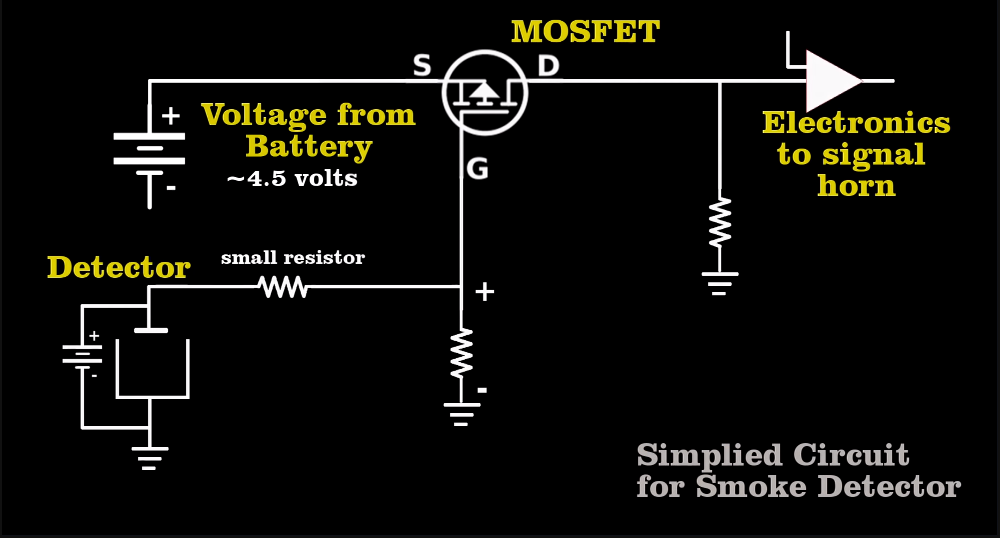

Most descriptions of smoke detector describe them as using an ion chamber, with a strong alpha source inside.
The alpha radiation ionizes the air inside the chamber, letting a current flow, which the detector measures.
When smoke enters through vents in chamber, it blocks the alpha particles, reducing the current and activating the alarm.
A video on [the Wikipedia article](https://en.wikipedia.org/wiki/Smoke_detector) even gives a rough schematic[^wrong]:

Single frame from video by Bill Hammack.

Real smoke detectors use an ion chamber, but do not measure the ionization current of just around 10 picoamps directly.
That requires an exotic and expensive multi-gigaohm resistor, and even then would be difficult to do accurately and repeatably.
Real smoke detectors instead use a simple two ion chamber circuit, where one chamber is exposed to the air and the other is sealed as a reference:

The two chambers form a voltage divider, a relative change in ionization current will change the output voltage.
Normally an ion chamber behaves as a current source, but at low voltages many of the ions recombine before they are collected, causing the chamber to behave like a very large resistor.
To avoid loading down the divider, the output needs to be buffered with an electrometer JFET or low capacitance MOSFET.

In practice, the two chambers are combined into a single assembly:

The alpha source and mounting plate are connected to one side of the supply, and the shielding can to the other.
This forms two ion chambers, the lower one is the "sealed" reference, and the upper is the sensing chamber, exposed to smoke by slots cut in the can.
Because the reference chamber only has a single opening, it takes a long time for smoke to enter it, even without being totally sealed.

The high impedance buffer is placed directly underneath the chamber, with the input pin bent upwards to make contact with the sensing electrode, to prevent any leakage through the circuit board.
One of the detectors I examined had a coating of wax for further isolation, and another had a driven guard ring.
Both detectors had a simple comparitor to trigger the alarm whenever the sensing electrode's voltage dropped below 5 volts.

The test switch works by connecting the shield can to ground, preventing current from flowing and triggering the alarm[^test]:

This is the most complete test possible without actually starting a fire next to the detector.

Of course, simplified diagrams can be useful, most people are only interested in the basic principle, but it is a bit annoying that the majority of sources are wrong, with no mention of it.
Some even give an explanation that is more complex than reality.
Is adding a little footnote really that hard?

[^wrong]: This schematic also has another error, the bias supply in in series with the ion chamber instead of in parallel. This seems like a mistake made while drawing it.

[^test]: One detector I probed used a zener diode to limit how low the shield can would be pulled down, to create a more realistic test.
