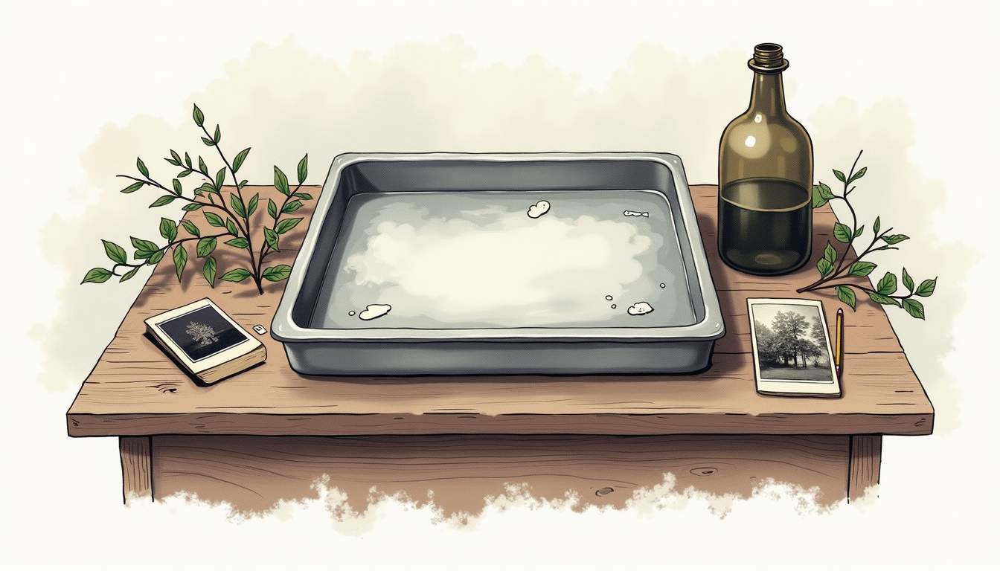
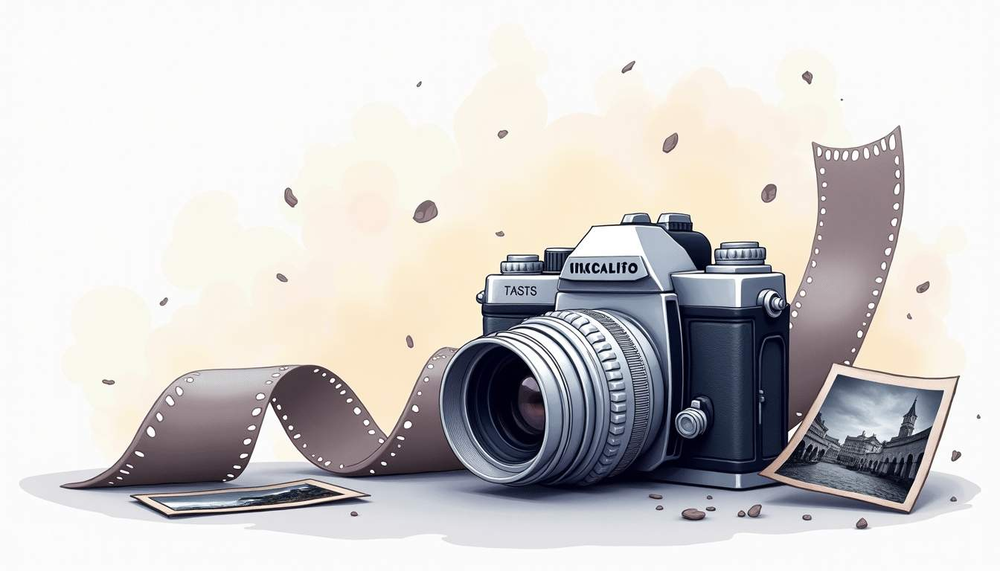
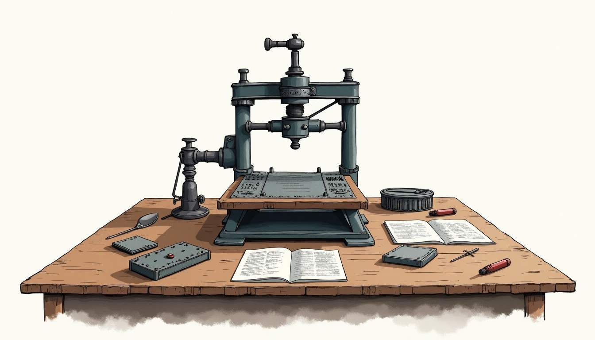

Fully LLM generated content is increasingly common on the internet.
It's not just random people copying from ChatGPT, there even companies offering fully automated AI-content-as-a-service:
Just send them a list of URLs to copy and they'll send you an "article shaped object".

To get a look at what the output looks like, 
I ran one of these tools on recent [blog post of mine](/projects/take_a_photo/):

<a href="#skip">(Skip to practical advice)</a>

 

<h1 style="color: red">LLM generated text:</h1>

<h1 id="1">Let's take a photo: (Maurycy's blog)</h1>

Maurycy's blog explores the tactile, chemical, and optical pleasures of traditional photography alongside practical advice for contemporary makers. This post focuses on silver-based photographic methods, iron and cyanotype alternatives, and the craft of contact printing, finishing with a look at camera choices and user techniques that help transform an idea into a tangible print. Whether the reader is a newcomer curious about historical processes or a seasoned printer seeking a refresher, the aim is to present clear, engaging explanations that encourage experimentation and thoughtful practice.

...

The tool reused my page's title, which include the name of my site.
This might seem like it would never happen in real life, but remember that are fully automated, churning out thousands of pages with no oversight.

If you see a title like that anywhere except a blog by someone named "Maurycy", it's stolen.

Interestingly, it manages to use almost a hundred words to say nothing. 
The only real content here is "The post is about silver and iron based photography methods, contact printing and cameras".
The rest is filler and a pointless sales pitch.

...
<h2 id="2">Silver Photography Techniques</h2>

Silver photography rests on light-sensitive silver halide crystals suspended in gelatin on paper or film. When exposed to light, these crystals form a latent image that becomes visible through chemical development. The technique covers a wide range of practices, from darkroom enlargements to alternative processes that still rely on silver chemistry. Working with silver requires attention to exposure, development timing, agitation, and fixing; each variable shapes the final print's tonal range, contrast, and archival stability.

Darkroom practitioners often describe silver processes as a dialogue between intention and serendipity. Choices like developer formula, dilution, and temperature control act like conversational turns that influence highlight rendition and shadow detail. Moreover, paper selection — fiber-based versus resin-coated, warm-toned versus neutral — plays a decisive role in how silver gelatin prints render texture and depth. Mastery comes from experimenting with exposure tests and keeping detailed process notes.

...

Both paragraphs are very general:
They don't talk about any specific film or paper, or how a particular photo was taken, but about photography in general.
This isn't universal, but is the default for most LLMs.

Again, it's mostly filler, like they took a one sentence overview and stretched it out.
The second paragraph is entirely fluff:
It lists a bunch of factors that could affect the end result, but has no practical advice.

...
<h2 id="3">Overview of Silver Processes</h2>

There are two primary ways silver is used in traditional photography: silver gelatin prints (paper) and silver halide-based film. In silver gelatin printing, paper coated with a silver halide emulsion is exposed either in contact with a negative or via an enlarger. Development converts the exposed silver halide to metallic silver, producing a visible image. Fixing removes unexposed silver halide to prevent further darkening, while stopping and washing steps stabilize the print. Each chemical bath and rinse contributes to archival permanence and aesthetic quality.

...

Finally, something!
Ok, it doesn't tell us what the chemicals are, or how they work, or how to use them, but it does give us something to google...
although it couldn't stop itself from throwing in some fluff at the end.

...
 
 

 
...

Ooo, an AI generated image. 
This isn't universal, some plagiarism machines grab images from the original or elsewhere on the internet, but it is quite common.

Apart from being fake, the image is just wrong.
Photographic chemistry is almost always done in the dark and never in metal containers.
That being said, factual errors are hard to spot unless you already know a lot about the topic.

What's not hard to notice is the weird placement.
Considering that it's not showing anything in particular, it would make much more sense to have it at the top of the section instead of in the middle --- a place where I'd expect a technical diagram or photo of the result. 

...

Film photography follows a similar chemistry but inside a flexible film base. Negative films capture the inverse of the scene’s light values; those negatives can then be used for contact printing or enlargement. Sheet film, roll film, and various professional formats give different grain structures and tonal behaviors, making each format suitable for specific visual goals. Cross-processing and alternative developers offer creative deviations that yield unpredictable, often striking results.

...

It would make sense to put the bit about the image being negative at the start of the section. 
It's doesn't only apply to film, and the whole processed is designed around it.

... and again, there's more useless fluff.
There's no mention of when you'd want to use different types or sizes of film, just that you might for some "specific goals".

...
<h2 id="4">Advantages of Silver Photography</h2>

Silver-based images are renowned for their tonal richness and longevity. Properly processed and fixed silver prints can survive for many decades without significant degradation, a reason museums and archives still value silver materials. The metallic silver particles that form the image provide a depth and three-dimensional quality unmatched by many purely digital or ink-based reproduction methods. Fine gradation between highlights and shadows makes silver prints especially compelling for black-and-white work.

 
 
...

This is another AI generated image (look at the camera's logo and the right edge of the film), which has nothing to do what was just talked about. 
It would make sense to show examples of negatives or prints: a drawing of a camera adds nothing to the article.

The paragraph itself is flowery and just plain wrong: 
Let's just say there a reason why chemical photography is left to hobbyists who enjoy the process more then the end result.

...

Beyond archival qualities, silver processes offer tactile pleasures and a direct connection to craft. Darkroom practice encourages a slower, more mindful approach: mixing chemistry, timing development, making contact sheets, and choosing paper textures. This intentional pace often results in prints that carry subtle marks of the maker's hand — slight variations in toning, paper handling, or dodging and burning — which contribute to the work’s uniqueness and character.

...

More fluff.

In general, LLMs tend to spew praise:
You'll hardly ever see a fake article saying bad things, even though arguing is a favorite pastime on the internet.

...
<h2 id="5">Iron and Cyanotype Methods</h2>
Iron processes like cyanotype and other ferric-based techniques present an accessible, low-toxicity alternative to silver. Cyanotype employs a light-sensitive mixture of ferric ammonium citrate and potassium ferricyanide which, after exposure to UV light, reduces to an insoluble blue pigment called Prussian blue. The simplicity of cyanotype chemistry makes it ideal for teaching, outdoor workshops, and creative applications such as printing on fabric, wood, or handmade paper. Despite its signature blue color, cyanotype invites plenty of experimentation through toning and layering.

...

This is the single most specific paragraph of the article, naming two actual chemicals...
bit then it goes on to more fluff and names two processes that are never mentioned again:

...

Other iron-based methods include Van Dyke brown and kallitype, which use ferric chemistry combined with different development and toning steps to produce sepia or brown images with varied textures. Kallitype, in particular, can mimic silver prints closely if processed and toned correctly, offering a cost-effective route to warm, detailed prints. Each iron process has its own set of advantages — affordability, distinctive color palette, and relative simplicity — balanced against considerations of permanence and post-processing needs.

...

Will these two different methods be described in any detail, or will see any example photos?
Nope:

...
<h2 id="6">Fundamentals of Iron Printing</h2>
At the heart of iron printing is a light-sensitive ferric compound that undergoes photoreduction to ferrous iron under UV exposure. This chemical change is what allows further reactions during development or when combined with metal salts, producing visible images. Key steps include coating a suitable substrate evenly, allowing it to dry in controlled conditions, exposing it to a UV source with a negative or contact object, and washing to remove unreacted chemicals. Proper washing is crucial to minimize residual reactivity and improve longevity.

...

It starts by just restating the last section, almost as if it was intended to sand alone instead of being part of an article.
The rest is just a list of "Key steps", except it's not the key steps, it's a list of all the steps (but without any details).

...
 
 

 
...

For an article on photography, it doesn't have very many photos.

...

Coating technique and environmental factors like humidity and temperature influence results significantly. Using a glass rod or brush to lay down an even, consistent coat is essential for smooth tonality and avoidable streaks. Additionally, filtration of sensitizer solutions and working under subdued light lessen contamination. Post-exposure treatments, such as toning with tea, tannic acid, or chemical toners, expand the tonal range and can increase resistance to fading when chosen wisely.

...

Again, this has no specifics.
How exactly do I tone a cyanotype print?
and what does the result look like?
and what chemicals should I use?

...
<h2 id="7">Key Benefits of Cyanotype</h2>
Cyanotype stands out for its simplicity and immediacy. Its low toxicity and inexpensive materials make it accessible for educational settings and community arts programs. The characteristic cyan-blue image is instantly recognizable and can be manipulated through exposure time, negative density, and toning to produce a surprising variety of hues from pale turquoise to deep navy. Because it relies on ultraviolet light, cyanotype is particularly suited to sunlight exposures for contact prints or photograms, where objects are arranged directly atop the coated surface.

Additionally, cyanotype adapts well to non-standard substrates. Fabric printing, paper collage, and mixed-media pieces benefit from the process's ability to adhere to textured or absorbent surfaces. This versatility encourages cross-disciplinary projects where photography blends with textile arts, bookmaking, and printmaking. Cyanotype also offers a forgiving learning curve: slight variations in technique often yield fascinating, serendipitous results rather than outright failure.

...

Almost all of this was said before, and while this section is longer, it adds no further details:
It's a useless section that any human writer would delete outright.

... or would unless they are trying to stuff in keywords for search engines, in which case it's still garbage, just human generated garbage ---
written to maximize ad revenue instead of helping the reader.

...
<h2 id="8">Contact Printing Essentials</h2>
Contact printing is the most direct way to turn a negative into a print: the negative lies directly against the photosensitive surface and is exposed to light, producing a print the same size as the negative. This method preserves the negative's sharpness because no enlarger optics intervene, making it ideal for large-format photographers who value exquisite detail and tonality. Contact printing emphasizes discipline in negative preparation — contrast control, dust removal, and consistent exposure — since those factors translate directly into the print.

The technique also fosters an appreciation for scale and composition. When the negative and print share dimensions, decisions about framing and cropping must be made at capture rather than in the enlargement stage. This encourages thoughtful camera use and more intentional image-making. For artists who enjoy the craft of making multiples, contact printing is efficient: once exposure time and development recipe are established, producing consistent editions becomes a matter of procedural repetition and careful material handling.

...

More flowery gushing -- even claiming some of the problems are advantages -- padding out two sentences of substance into two paragraphs.

...
<h2 id="9">What is Contact Printing?</h2>
In practice, contact printing requires a vacuum frame or weighted glass to ensure close contact between negative and paper, an accurately timed exposure, and a development process tailored to the chosen paper type. Fiber-based papers typically require longer washing and more delicate handling; resin-coated papers are quicker to process and dry faster but may not offer the same depth of tonality. The exposure source can be a calibrated LED unit, a sodium vapor enlarger bulb, or sunlight, each imparting different practical considerations around evenness and timing.

...

Wait, isn't this section the same as the last one?

... the equipment it recommends is reasonable, but there are no actual procedures or examples.

...

Negative format dictates the working process. Large-format sheet negatives yield exquisite detail and low apparent grain when contact printed, while medium format can produce excellent 2.25" x 2.25" or 6x6 contact prints prized for their immediacy. For those working with smaller negatives, digital enlargements onto transparencies allow the contact printing approach to be used with any digital image, bridging analog technique with digital capture when a traditional darkroom aesthetic is desired.

<h2 id="10">Materials Needed for Contact Printing</h2>
Essential materials for contact printing include a set of graded negatives, photosensitive paper matched to the intended aesthetic, a vacuum contact frame or glass and weights, an accurate exposure light source, and the requisite chemical baths: developer, stop bath, fixer, and washing trays. Quality tongs, lint-free gloves, and a safe, organized workspace help maintain print cleanliness and personal safety. For fiber-based papers, a gentle print washer or a running water setup is beneficial to ensure thorough removal of residual chemicals.

...

Apart from the factual errors, the whole second paragraph is repeating the "What is Contact Printing?" section, but still contains no actually useful information.

...

Supplementary items like densitometers, step wedges, and safelight setups can streamline the workflow. A step wedge helps determine proper exposure and developer times, while a densitometer provides objective measurements of negative density to predict tonal outcomes more reliably. Additionally, a plan for drying and flattening — between blotters or in a print dryer — preserves print quality and prevents unwanted distortions or cockling, which is especially important with humid environments.

...

Is this thing trying to sell me stuff?
It's just listing off a bunch of equipment with nothing about when and how to use it, or if you even need it in the first place.

...
<h2 id="11">Camera Use in Photography</h2>
Cameras are tools for translating a three-dimensional scene into a two-dimensional image, and understanding their core functions — aperture, shutter speed, focus, and ISO — is essential regardless of whether the output will be silver prints, iron-based images, or digital files. Aperture controls depth of field and influences sharpness; shutter speed freezes or conveys motion; ISO determines the film or sensor's sensitivity to light. Balancing these variables allows control over exposure and the expressive qualities of a photograph.

...

Yet again, there are no specifics.
A real article would at describe the results of using the wrong settings and how to adjust them.
A good one would have example photos.

...

Compositional principles remain central to making compelling images. Elements such as leading lines, contrast, negative space, and subject placement help form a coherent visual statement. Attention to light — its direction, color, and quality — determines mood and texture. A camera does not replace observational skills; rather, it captures what the eye and mind have learned to see and prioritize. Mastery comes from consistent practice, purposeful study, and a willingness to analyze both successful and unsuccessful images.

...

I get that describing composition is hard, but it could at least do more then listing a some things that affecting it. 
Here's a real article with explanations and [fantastic examples](https://lcamtuf.coredump.cx/photo_basics/).

...
<h2 id="12">Types of Cameras for Photography</h2>
Cameras come in many formats: large-format view cameras, medium-format systems, 35mm SLRs and rangefinders, compact point-and-shoots, and modern mirrorless digital models. Large-format cameras offer movements like tilt and shift for perspective control and produce sheet negatives ideal for contact printing. Medium-format cameras balance image quality and portability, delivering greater negative area and tonal nuance than typical 35mm formats. 35mm systems are versatile and historically significant, favored for documentary and street work due to their compactness and lens availability.

...

Ok, but how much detail can expect from each size of film or sensor?
There's also no criticism here, nothing about what each camera is bad at.

Both of these would be very important to know before buying one.

...

Digital cameras have democratized high-quality capture but do not preclude the use of traditional printing techniques; many photographers shoot digitally and then produce analog silver prints from digital negatives or transparencies. Choice of camera depends on desired aesthetic, working conditions, and workflow preferences. Film continues to be cherished for its grain structure and tonal behavior, while digital excels at convenience, immediate feedback, and integration with modern production pipelines.

...

More fluff. 

...
<h2 id="13">Techniques for Effective Camera Use</h2>
Effective camera use blends technical proficiency with intentional decision-making. Pre-visualizing the final print helps determine the appropriate aperture, shutter speed, and film or ISO choice at the moment of capture. Bracketing exposures — taking multiple frames at different exposure values — provides insurance against unpredictable lighting and offers material for selecting the most expressive negative. For landscape and still-life work, using a tripod and a cable release reduces vibration and improves sharpness, particularly important when creating contact prints that reward micro-detail.

Finally, a thoughtful approach to maintenance and workflow pays dividends. Keeping lenses clean, checking light seals, and handling film with care prevent avoidable artifacts on negatives. Cataloging exposures and keeping process notes for development and printing ensures reproducibility and helps refine technique over time. Photography, at its best, combines disciplined process with creative curiosity, whether the goal is a silver gelatin masterpiece, a deep-blue cyanotype, or a hybrid work that bridges several traditions.

[end of text]

Wait, that's it!?

With all the talk on the importance of technique, I'd expect some descriptions of proper technique, or at least pictures of the result.

... actually, there is very little large scale structure beyond a paragraph or two. 
Sections are thrown together no regard for the flow of the article, often repeating or omitting important information.

The overall selection of topics is very weird becuase they were lifted from the [original article](/projects/take_a_photo/), but are missing everything needed for it make sense:

My article starts by describing two simple light sensitive reactions, using silver and iron (III) salts. 
It then shows how they can be used to record the shadows of objects and copy film/transparencies negatives, and ends with the construction of a simple camera to take photos with nothing but a lens, paper and bottles of chemicals. 

The LLM missed the whole DIY photography aspect, and the result is a jumble of topics instead of a cohesive article.

In short, look for: 

- Text lacking any specific details. Real text will give examples, examples of what can go wrong, examples of results, etc.
- Articles that are repetitive and rambling. Real text will build on what was said previously instead of repeating it. 
- ... and where the whole thing will feel like an introduction and never really gets anywhere.
- Pointless flowery and very positive wording. A paragraph reads like a sentence that was stretched out using filler written by a PR team.
- Listing factors instead of effects. For example, it might list "aperture, focus, ISO..." instead of "Aperture, which controls how much light enters the camera..."
- Encyclopedic tone: There will be nothing about what the author did, what they like and don't like... It's like a Wikipedia article instead of a blog post.
- AI generated or irrelevant images.

If you see one or two of these, it could still be a human written work, but if you see most or all of them, it's almost certainly fake. 
