You have probably seen smooth animations made with stable diffusion like this: https://www.youtube.com/watch?v=Bo3VZCjDhGI
But how was it done?

The answer is very simple, by running multiple prompts on the same image, the noise predictions can be combined to create an intermediate image. Changing the relative weights of the prompts, but keeping the initial latents (seed value) the same, a series of intermediate images can be created.

Starting prompt: "A fantasy landscape" end prompt: "A sprawling cityscape", seed: 42

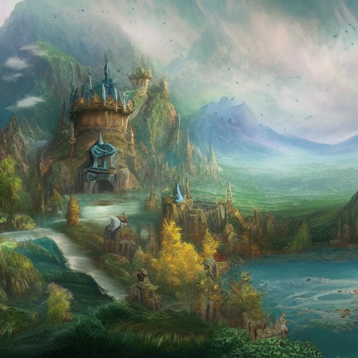

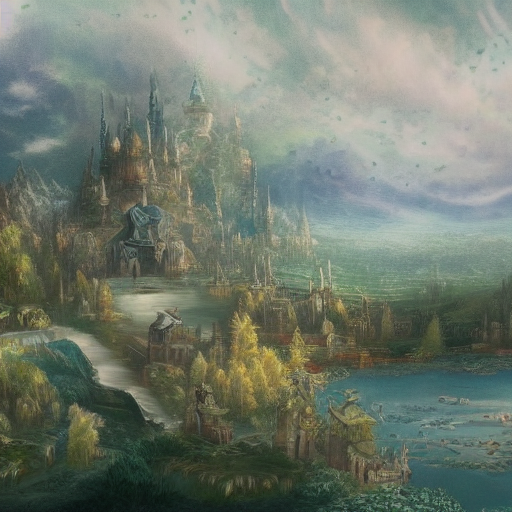

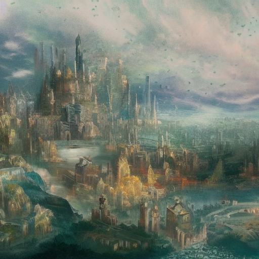

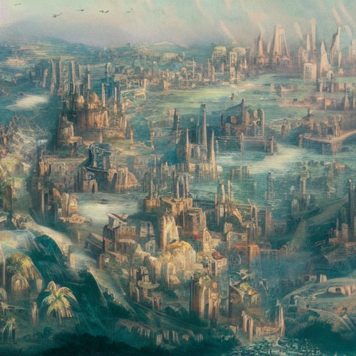

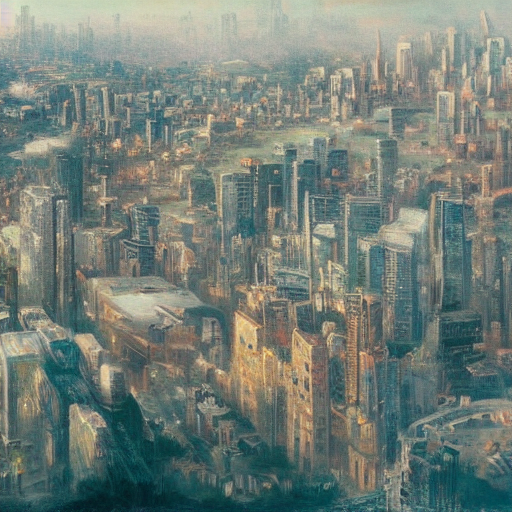

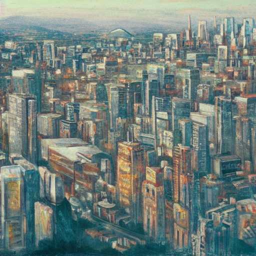

# Implementation

<!-- TODO Check code -->

I am not going to explain all of the code, as most of it is unchanged or slightly rearranged from the [last post](../implementing_stable_diffusion).

```py
import diffusers
from transformers import CLIPTextModel, CLIPTokenizer
from diffusers import AutoencoderKL, UNet2DConditionModel, LMSDiscreteScheduler, PNDMScheduler
from torch import autocast
import torch
from diffusers import StableDiffusionPipeline, LMSDiscreteScheduler, DPMSolverMultistepScheduler
import numpy as np
import time
import tqdm
from PIL import Image
```

```py
# Autoencoder for converting images to latent space and latent space to images
# This makes the images 8 times smaller, turining (3, 512, 512) into (3, 64, 64)
# This is what makes Stable diffusion (and other latent diffusion models) so efficent.
vae = AutoencoderKL.from_pretrained("CompVis/stable-diffusion-v1-4", subfolder="vae")

# Load the tokenizer and text encoder to tokenize and encode the text.
tokenizer = CLIPTokenizer.from_pretrained("openai/clip-vit-large-patch14")
text_encoder = CLIPTextModel.from_pretrained("openai/clip-vit-large-patch14")

# the UNet model for generating the latents.
# This consists of an encoder that downsamples the latent space, and then reverses the process.
# The model contains short cut connections to avoid loss of detail, and uses cross attention to include the text embeddigns
unet = UNet2DConditionModel.from_pretrained("CompVis/stable-diffusion-v1-4", subfolder="unet")

scheduler = LMSDiscreteScheduler(beta_start=0.00085, beta_end=0.012, beta_schedule="scaled_linear", num_train_timesteps=1000)
#scheduler = DPMSolverMultistepScheduler()

# Allow cuda, but dont force it.
torch_device = "cuda" if torch.cuda.is_available() else "cpu"
vae.to(torch_device)
text_encoder.to(torch_device)
unet.to(torch_device)
```

This is the fist change, Putting the generation code in a function, so that it can be run with different parameters:
It also takes 2 sets of prompts, the prompts to interpolate.

```py
def generate(startprompts, endprompts, interp=0, seed=None, steps=20, width=512, height=512, guidance_scale=7.5):
    seed = seed or time.time()
    batch_size = len(startprompts)

    # RNG for inital state of diffuser
    generator = torch.manual_seed(seed)
```

We need to convert both prompts into embeddings, and also generate the uncond embeddings for guidance.

```py
    # Convert the text into embedings, just a vector representing the texts meaning
    start_text_input = tokenizer(startprompts, padding="max_length", max_length=tokenizer.model_max_length, truncation=True, return_tensors="pt")
    start_text_embeddings = text_encoder(start_text_input.input_ids.to(torch_device))[0]

    # Convert the text into embedings, just a vector representing the texts meaning
    end_text_input = tokenizer(endprompts, padding="max_length", max_length=tokenizer.model_max_length, truncation=True, return_tensors="pt")
    end_text_embeddings = text_encoder(end_text_input.input_ids.to(torch_device))[0]

    # Generate dummy text embeddings for classifier-free guidance
    max_length = start_text_input.input_ids.shape[-1]
    uncond_input = tokenizer(
                [""] * batch_size, padding="max_length", max_length=max_length, return_tensors="pt"
                )
    uncond_embeddings = text_encoder(uncond_input.input_ids.to(torch_device))[0]
```

Concatenate all of the embeddings to avoid multiple passes with unet.

```py
    text_embeddings = torch.cat([uncond_embeddings, start_text_embeddings, end_text_embeddings])
    text_embeddings.to(torch_device)
```

Compute the timestep values with the scheduler:

```py
    # Setup scheduler
    scheduler.set_timesteps(steps)
    timesteps = list(scheduler.timesteps)
```

Initialize the noise image, no changes here:

```py
    # Generate inital latent space
    latents = torch.randn(
        (batch_size, unet.in_channels, height // 8, width // 8),
        generator=generator,
    )
    
    latents = latents * scheduler.init_noise_sigma

    latents = latents.to(torch_device)
```

I moved latent decoding into another function.

```py
    def decode_latents(latents, vae):
        """
        Utility function to covert latent space
        """
        latents = 1 / 0.18215 * latents
        with torch.no_grad():
            image = vae.decode(latents).sample

        image = (image / 2 + 0.5).clamp(0, 1)
        image = image.detach().cpu().permute(0, 2, 3, 1).numpy()
        images = (image * 255).round().astype("uint8")
        return [Image.fromarray(image) for image in images]
```

The diffusion loop is the most significantly changed section:

```py
    for i,t in enumerate(tqdm.tqdm(timesteps)):
        # Expand the latents, 3 times becuase we now have 3 embeddings
        latent_model_input = torch.cat([latents] * 3)

        latent_model_input = scheduler.scale_model_input(latent_model_input, timestep=t)

        # predict the noise residual
        with torch.no_grad():
            noise_pred = unet(latent_model_input, t, encoder_hidden_states=text_embeddings).sample

        # Split the results to extract noise predictions for every embedding
        noise_pred_uncond, noise_pred_start, noise_pred_end = noise_pred.chunk(3)

        # Interpolate the predicitons before performing classifyer free guidance
        start_guidance = (noise_pred_start - noise_pred_uncond) * (1-interp)
        end_guidance = (noise_pred_end - noise_pred_uncond) * (interp)

        noise_pred = noise_pred_uncond + (start_guidance + end_guidance) * guidance_scale

        # compute the previous less noisy sample.
        latents = scheduler.step(noise_pred, t, latents).prev_sample
```

And finally, finish off the function

```py
    return decode_latents(latents, vae)
```

Now all that's left to do is to all the function to generate the interpolation frames

```py
prompt1 = "A fantasy landscape"
prompt2 = "A sprawling cityscape"
seed = 42
interpolated_images = 5
steps = 10

for i in range(interpolated_images + 1):
    interp = i/interpolated_images
    generate([prompt1], [propt2], seed=seed, interp=interp, steps=steps)[0].save(f"out_{i}.png")
```

After running this, you should have a series of images ``out_0.png`` to ``out_5.png`` saved in the current directory.

# Multi prompt animation

This can be trivially expanded to interpolating an arbitrary number of prompts. (This takes 2m 30s per frame on my computer, but a cuda GPU would be much faster.)

```py
prompts =  [
    "A fantasy landscape",
    "A fantasy landscape with a small town",
    "A fantasy landscape with a small town and castle",
    "A fantasy landscape with a modern city",
    "A sprawling cityscape"
]

seed = 42
interpolated_images = 5
steps = 10

# Keep a counter of generated images
frame_counter = 0

# For every prompt pair...
for prompt in range(len(prompts) - 1):
    start = prompts[prompt]
    end = prompts[prompt + 1]
    # Generate interpolation frames
    for i in range(interpolated_images):
        interp = i/interpolated_images
        generate([start], [end], seed=seed, interp=interp, steps=steps)[0].save(f"out_{frame_counter}.png")
        frame_counter = frame_counter + 1

print(f"Generated {frame_counter} images!")
```

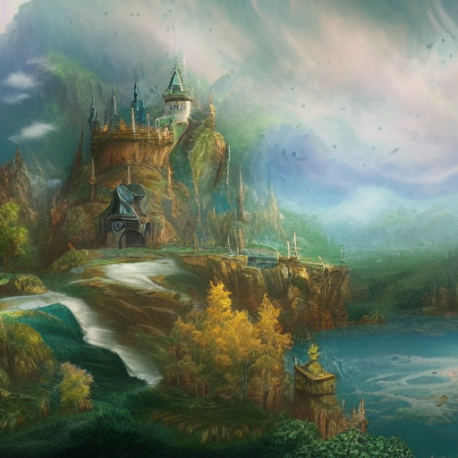

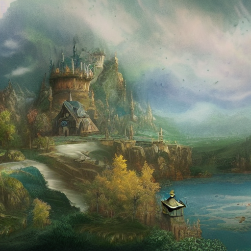

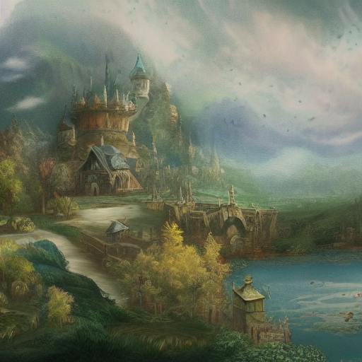

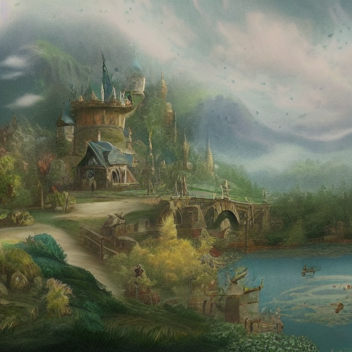

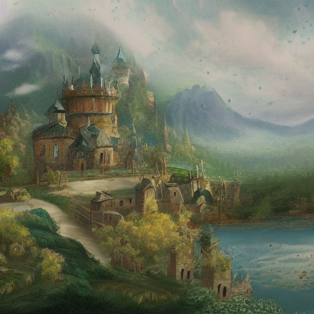

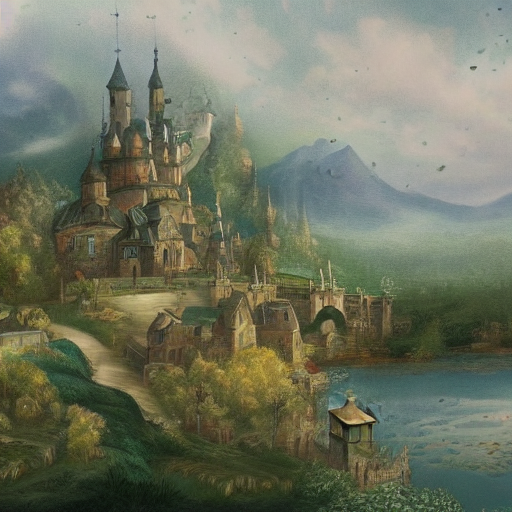

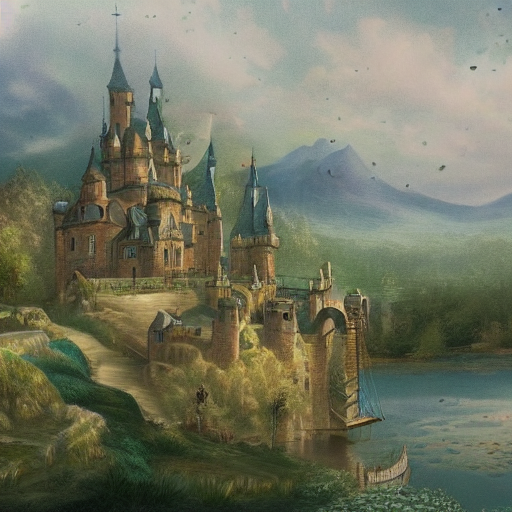

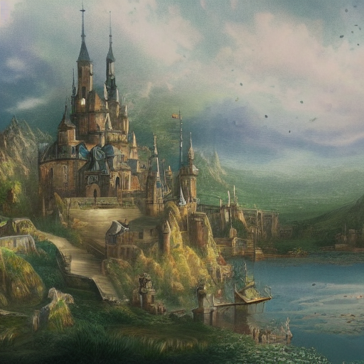

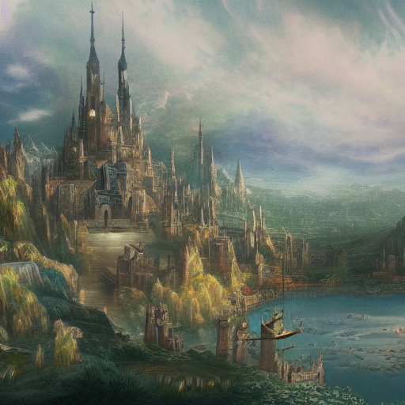

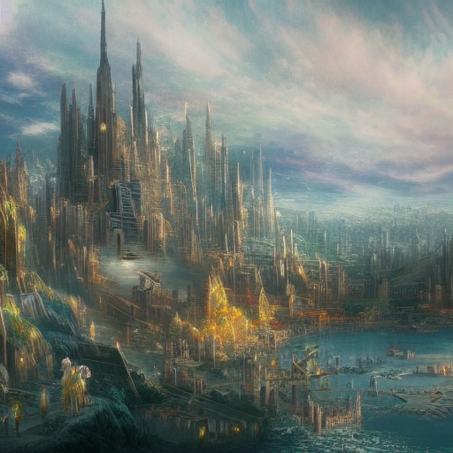

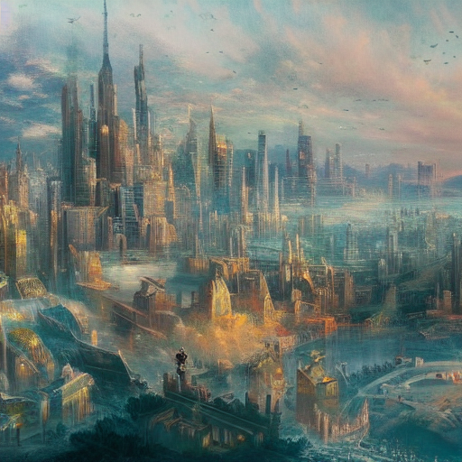

# Seed interpolation [UPDATE 2023-01-16]

The current code works, but if you try to generate more complex animations, you will encounter a problem; The fixed seed value preventing you from fine tuning results.
You might think it is possible to simply do linear interpolation between initial latent space images, but this results in the generation of completely gray images (sometimes you even get a gradient).
This is because the interpolation changes the statistical properties of the noise, in such a way that diffusion fails.
The solution is to use a more complected, [spherical linear interpolation](https://en.wikipedia.org/wiki/Slerp).
This function is complicated enough that it deserves it's own function.

```py
import tqdm
from PIL import Image

# Added code start
def slerp(t, v0, v1, DOT_THRESHOLD=0.9995):
    """helper function to spherically interpolate two arrays v1 v2"""

    if not isinstance(v0, np.ndarray):
        inputs_are_torch = True
        input_device = v0.device
        v0 = v0.cpu().numpy()
        v1 = v1.cpu().numpy()

    dot = np.sum(v0 * v1 / (np.linalg.norm(v0) * np.linalg.norm(v1)))
    if np.abs(dot) > DOT_THRESHOLD:
        v2 = (1 - t) * v0 + t * v1
    else:
        theta_0 = np.arccos(dot)
        sin_theta_0 = np.sin(theta_0)
        theta_t = theta_0 * t
        sin_theta_t = np.sin(theta_t)
        s0 = np.sin(theta_0 - theta_t) / sin_theta_0
        s1 = sin_theta_t / sin_theta_0
        v2 = s0 * v0 + s1 * v1

    if inputs_are_torch:
        v2 = torch.from_numpy(v2).to(input_device)

    return v2
# Added code end
```

The generate function will have to take multiple seeds values.

```py
text_encoder.to(torch_device)
unet.to(torch_device)


# Modifyed code start
def generate(startprompts, endprompts, interp=0, seed1=time.time(), seed2=time.time(), steps=20, width=512, height=512, guidance_scale=7.5):
    batch_size = len(startprompts)

    # RNG for inital state of diffuser
    generator1 = torch.manual_seed(seed1)
    generator2 = torch.manual_seed(seed2)
# Modifyed code end
```

It then has to generate and interpolate the initial noise.

```py
    # Setup scheduler
    scheduler.set_timesteps(steps)
    timesteps = list(scheduler.timesteps)

    # Modifyed code start
    # Generate inital latent space
    latents1 = torch.randn(
        (batch_size, unet.in_channels, height // 8, width // 8),
        generator=generator1,
    )

    latents2 = torch.randn(
        (batch_size, unet.in_channels, height // 8, width // 8),
        generator=generator2,
    )
    latents = slerp(interp, latents1, latents2)

    # Modifyed Code end

    latents = latents.to(torch_device)
```

```py
# Modifyed code start
prompts =  [
    (1,"A fantasy landscape"),
    (1,"A fantasy landscape with a small town"),
    (2,"A fantasy landscape with a small town and castle"),
    (2,"A fantasy landscape with a modern city"),
    (3,"A sprawling cityscape")
]
# Modifyed code end
...
        # Modifyed code start
        interp = i/interpolated_images
        generate([start[1]], [end[1]], seed1=start[0], seed2=end[0], interp=interp, steps=steps)[0].save(f"out_{frame_counter}.png")
        # Modifyed code end
```

# Going further

Try interpolating the latent space instead of the noise predictions to increase speed.

If you want more similarity between images in the generations, simply run some denoising steps half way between the two prompts, then use those as the starting latents when doing interpolation.

It is very common to use Google's open source [FILM](https://film-net.github.io/) video interpolation model to add smooth animations between generations. (FILM is faster per frame than stable diffusion, especially with high step counts, and generates smoother transitions)

Consider stitching the frames into a video so you don't have to do in manually with an external tool
