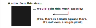
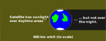

<!-- Sunlight as a service -->

There's this company promising to generate solar power at night using space based mirrors to bounce sunlight down to solar farms. 
This is the single dumbest startup I've ever seen...
and people are actually giving them money.

<!-- Claimed performance is terrible -->

> "We could do solar power at night."

There stated plan is to produce a ground brightness roughly equivalent to the full moon, but that's not nearly enough for anything.
The full moon is around a million times dimmer then the sun --- 0.3 lux compared to 1,000,000 lux<sup><a href=#note1 >1</a></sup> ---
 so a solar farm that normally produces 5 megawatts
(enough to power a small town) would produce only 5 watts:
About enough for a small lightbulb or to run a single cell phone. 

A single AA battery can produce around 3 watts:
your TV remote has access to more power then a million dollar solar farm with this Sunlight-as-a-Service.
They would gain hundreds of times more from installing a single panel:



... and that's if you believe the marketing claims:

Doing some basic math using the published parameters ---
a 10 by 10 meter reflector 625 km above the ground ---
the maximum possible brightness is one 288,000th<sup><a href=#note2 >2</a></sup> of the sun's. 
But if you've ever seen reflective mylar, you will know it's far from an optically perfect mirror:
The actual spot size will be hundreds of times theoretical, so "full moon" brightness is quite the stretch. 

<!-- Shadows -->

> "... but once the satellite's up there, we an use it forever."

No. The planned 625 km altitude is well within Low Earth orbit, and is not fully outside of the earth's atmosphere. 
The proposed satellite will be lightweight and with a huge surface area:
It's a sail in 30,000 kilometer per hour winds<sup><a href=#note3 >3</a></sup> trying bring it crashing down to earth.

Without continual refueling, it will deorbit in somewhere between a few weeks to few months.
Predicting the exact time is hard without knowing more details, but it won't take very long. 

> "... but search and rescue and all that stuff."

A bigger problem is that Low Earth orbit is, well, low.
If you don't have sunlight, odds are, the satellite doesn't either:



They will be useless at night.

> "Assume a spherical cow in vacuum that isotropically emits..." 

Ok, let's give the satellites thrusters with infinite fuel, portals so they have sunlight when behind the earth, and use thermodynamics violating million percent efficient solar panels. 
Even if everything magically works, still wouldn't be a good idea. 

You can't turn a mirror off, and satellites travel over the surface at 8 kilometers per second.
The inevitable result of this is random flashes of light all over the earth's surface. 

These flashes would only be about as bright as the full moon, but because they come from a point source, they will be dangerous for the same reasons lasers are:
A 5 watt light bulb is kinda dim, but a 5 watt laser is a retina destroying beast that can cause instant blindness if mishandled.

If you happen to be looking in the same area of the sky, these satellite-flares-from-hell could damage your eyes. 
If observed though optical aids like binoculars or telescopes, they could blind for much the same reason a looking at a solar eclipse can.

> "..." 

Right now, they company is likely an outright scam:
It's making impossible promises and have an impossible plan.
It's not a "we don't have the technology yet" problem, but it's a "the earth isn't transparent" problem.

However, people throw enough money at them, they will try to do something, and it won't end well. 
In either case: Do not give them any of your money, and don't trust it to anyone who will. 

--- 

<details>
<summary>Footnote #1</summary>
<div id=note1>

<b>[1]:</b> Yes, I know that 100,000 / 0.3 is just above 300 thousand, not a million. 
But this is not a calculation where a factor of 3 in either direction would change anything. 

This is the same reason you can safely ignore anyone talking about "percentage increases" in solar panel efficiency:
It's not a matter of a few percent, but that the idea won't work by a factor of several hundred thousand. 

</div>
</details>

<details>
<summary>Footnote #2</summary>
<br>
<div id=note2>

<b>[2]:</b> Per the conservation of etendue, the spot size produced by a perfect mirror is limited by the angular size of the light source:

```txt
Beam diameter = Angular size of the sun [radians] * Satalite height
Beam diameter = 0.5 [deg] * pi/180 [radians/deg] * 625 [km]
Beam diameter = 5.45 [km]
```

The rest is just some simple geometry:

```txt
Spot area = pi * (diameter / 2)^2
Spot area = pi * (5.45 [km] / 2)^2
Spot area = 23.3 [km^2]

Relative dimness = Spot area / Satalite area
Relative dimness = 23.3 [km^2] / (10 [m] * 10 [m])
Relative dimness = 23.3 [km^2] / 100 [m^2]
Relative dimness = 23.3 [km^2] / 0.0001 [km^2]
Relative dimness = 233,000
```

</div>
</details>

<details>
<summary>Footnote #3</summary>
<div id=note3>

<b>[3]:</b> Satellites don't stay up because they are too far to experience gravity:
They stay up because they are moving so fast that they fall and <em>miss the ground</em>.

The lower a satellite is, the less time it has before hitting the atmosphere, so the faster it has to move.
In Low Earth orbit, the needed speed is around 8 kilometers per second, or 30,000 kilometers per hour. 

</div>
</details>
