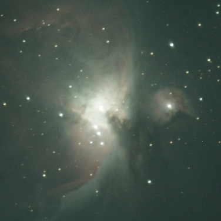
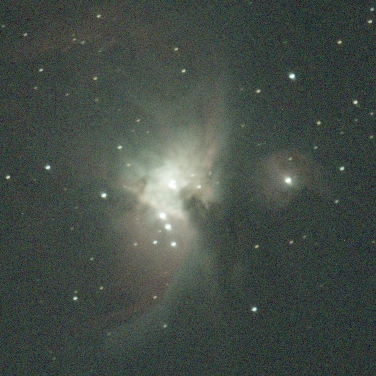
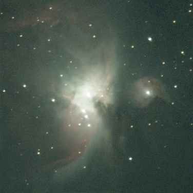
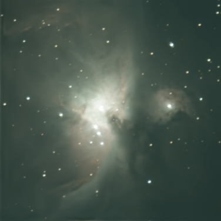
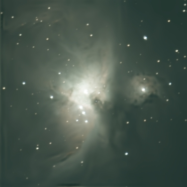
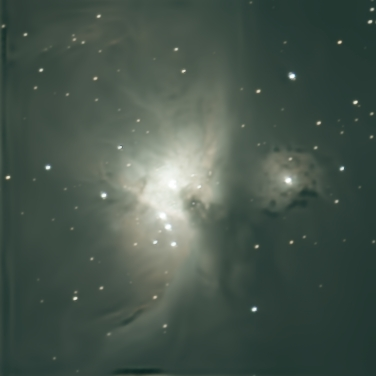
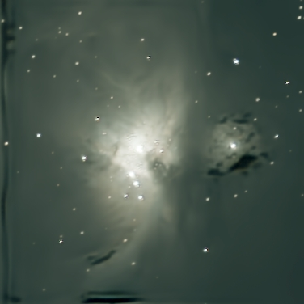
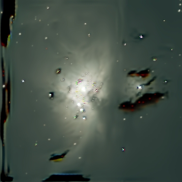

ML-based denoising tools are very popular in photography, but I've always wondered if they have the same problem as ML-based upscalers:
A tendency to inject plausible, but fabricated details into the image.

I started with a single 10-second exposure of the Orion Nebula, down-sampled to 375x375 pixels to keep processing times reasonable:

> 
 Autostretched in Siril using the linked-channel mode. 

Next, I added quite a bit of Gaussian noise to give the computer some work to do:

There are quite a few ML-based denoising tools, but I used GraXpert, because it works well on astronomical images and integrates nicely with my image processing software.
This is what the last image looks like after denoising at 80% modulation:

Not bad. 
To make any issues more apparent, I wrote a script to repeated add noise to and denoise the image, which will cause any artifacts to accumulate and become visible.
This type of repeated denoising is quite similar to how diffusion based AI image generators work, so if the denoising is inventing detail, it should show up very quickly --
Even very high-end image upscalers will [fall apart](https://lcamtuf.substack.com/p/random-finds-ai-image-upscale-collapse) under these kinds of conditions.

Running the script, the first noticeable effect is the loss of the pink hydrogen emission color in M43 (blob on the right side):

> 
 Iteration 10 

This de-pinking soon affects the rest of the nebula, and the edges of the image start to show dark "sharpening" artifacts:

> 
 Iteration 20 

These artifacts soon spread to M43 and the wings of the main nebula:

> 
 Iteration 30 

Some fine detail is beginning to be lost, which continues to around iteration 100, where nearly all the detail outside of the nebula's core is gone.
Several of the dimmer stars are just gone:

> 
 Iteration 100 

After 200 denoising cycles, the image starts showing the classic "color maze" sharpening artifacts:

> 
 Iteration 200 

Here's what this process looks like as a video:

<video src='denoiser.mp4' controls> </video>

> 
 Original image to Iteration 300 

That's actually really good.
I can't think of any image processing step that would leave the image remotely recognizable after being run 300 times, much less with the image being actively messed with between runs.

While this is an very extreme example, but it does show that, at least with GraXpert, it won't to add fake details to you image.
Instead, when overdone, it mutes color, removes details, and creates classic oversharpening artifacts.
