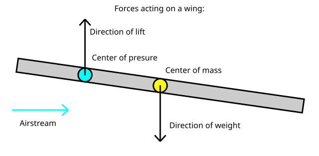
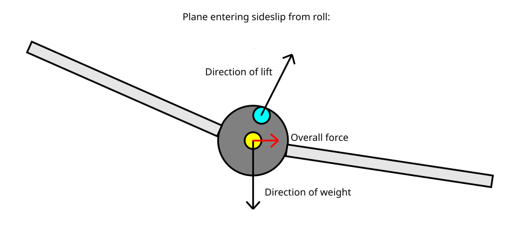

A common misconception about wings is that they need to have the classic airfoil shape to work.
In reality, just about any surface can create lift and function as a wing.
You can see this your by swinging a square of cardboard, foam sheet or any other light, large and flat object through the air.
If the surface is angled upwards a few degrees relative to the incoming air, it pushes the air down, and itself up.

Now, try increasing the angle of attack, the angle the wing makes with the airsteam.
You will notice that past a certain angle, the lift starts to decrease, and is replaced by a lot of drag, a force trying to slow down the wing.
This is called a stall, and it limits how much lift a wing can create at any given speed.
A proper airfoil geometry can generate more lift before stalling, and creates less drag for a given amount of lift, which is why most airplanes use them.

If you now toss the cardboard like a plane, it will immediately pitch up, stalling and then tumbling down to the ground.
To understand why this happenings, it helps to simply the complexity of the forces involved.

# The center of mass and pressure:

The center of mass is the point where you could imagine the entire weight of the plane to be concentrated.
If you hold the plane up by the center of mass, it will balance.
A force applied at the center of mass of a plane will not cause any rotation, just linear motion.
On the other hand, a force applied anywhere else will rotate the plane, with more torque the further away it is applied.

With a plane consisting of just a single rectangular wing, the center of mass is the exact center of the wing.

The center of pressure is the point where you could imagine all the air pushes against on the wing.
In reality, air pushes on all parts of the wing, but the effect of lift and drag on the plane is the same as if it was all applied at this point.

With a simple rectangular wing, the center of pressure is 1/4 of the way along the wing from the leading edge:[^cop]

The air is lifting the wing up quite far away from the center of mass, which causes it to aggressively rotate upwards.

This rotation can be prevented by adding more lift to the back of the plane with a horizontal stabilizer, or by weighing down the nose of the plane. 
With the centers of mass and pressure aligned, the plane will fly for longer, but still eventually crashes.
The plane is, in effect, balancing on the center of pressure; Even a tiny misalignment will cause it to rotate and eventually crash.

# Stability:

To keep flying, a plane has to be stable, designed in such a way that it will return to it's preferred orientation and speed after a disturbance or rotation from a misalignment.
The orientation of a plane can be broken down 3 axes, pitch (nose up/down), yaw (nose left/right), and roll (one wing up, the other down). 

In the yaw axis, a plane acts similar to a wind vane, except rotating around its center of mass instead of a pivot:

When the airplane is not facing into the airstream, the vertical stabilizer creates *sideways* lift, rotating the plane back into the airstream.
This works as long as the vertical stabilizer is behind the center of mass.

## Roll stability:

Roll stability depends on a positive dihedral, where the wings are angled into a slight V shape.

When the aircraft rolls, the lift from the wings will have a horizontal component, pulling the plane sideways, resulting in sideways motion, or sideslip:

With a dihedral, this sideslip reduces the angle of attack of upper wing, because from the point view of that wing, the air is now flowing from above.
The resulting asymmetric lift rolls the plane back to level.

Notably, the vertical stabilizer will try to prevent sideslip, so too much yaw stability can actually reduce roll stability.
A similar thing can happen in the opposite case, too much roll stability relative to yaw stability can cause an oscillation in yaw and roll (dutch roll).

## Pitch stability:

Pitch stability is unique, because unlike in roll and yaw, the plane has to maintain a positive angle of attack to keep flying.
For stability, the center of mass has to be in front of the wing's center of lift, creating a downwards pitching force whenever the wings are creating lift, which increases with the angle of attack.
Additionally, a horizontal stabilizer in the back needs to be pitched down relative to the wings, creating *downwards* lift, pitching the plane up.
As the plane pitches up, the stabilizer's angle of attack falls, reducing the downforce.
This allows the plane to settle at an angle where the 2 torques are equal, which maintains a constant angle of attack:

## Speed stability

Speed stability is provided by the interaction of altitude and pitch stability, and by drag.

As the plane speeds up, the produced lift force (roughly proportional to airspeed squared for any given angle of attack) exceeds it's weight, and the plane starts climbing.
The air is now coming from above, and plane pitches up to maintain a constant angle of attack, leading to an even faster climb, until it exchanges all the extra speed for altitude.
The reverse happens with the plane slows down, less lift is produced, and it begins to fall.
This time, the wings and stabilizer will pitch the plane down, exchanging altitude for speed.

Additionally, when plane speeds up, more drag is produced, slowing it down.
When the plane slows down, it produces less drag, allowing to to pick up more speed.

Altitude and speed are particularly prone to "phugoid" oscillation, damped only by drag, especially on planes with very high lift to drag ratios, like gliders.
Fortunately, the constant angle of attack allows the plane to keep flying even during oscillation, and the oscillations are also very slow, allowing correction by the pilot.

[^cop]: Outside of a stall that is. A stall completely changes the airflow over the wing, and moves the center of pressure back to around half of the wing. With asymmetric airfoil profiles, the angle of attack affects the center of pressure, even outside a stall.
