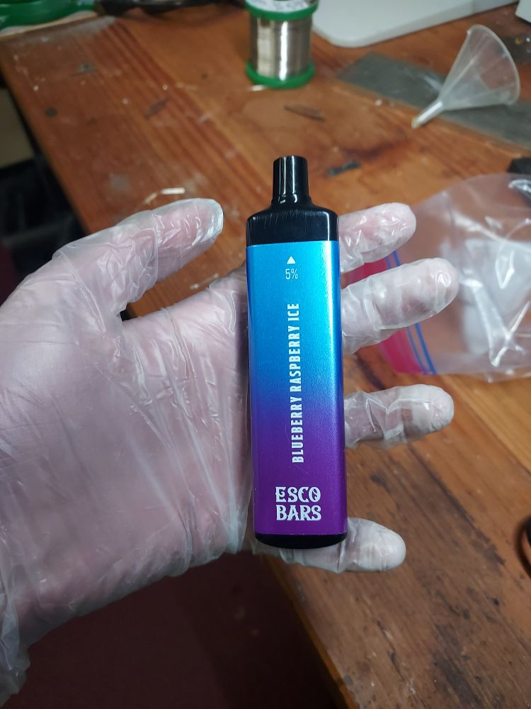
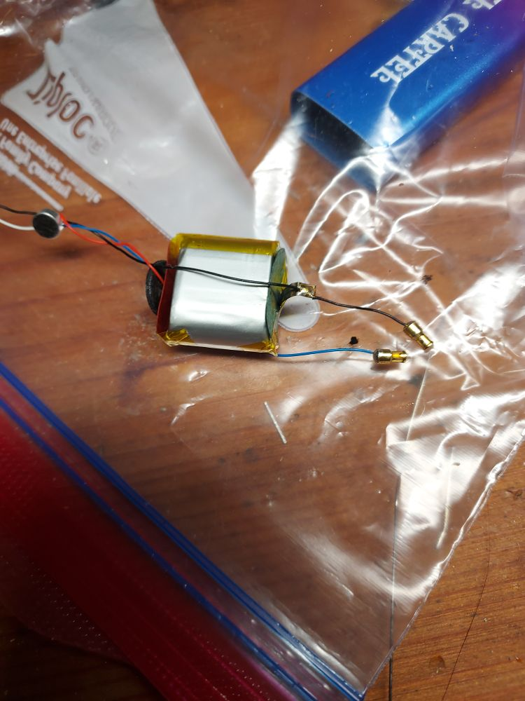
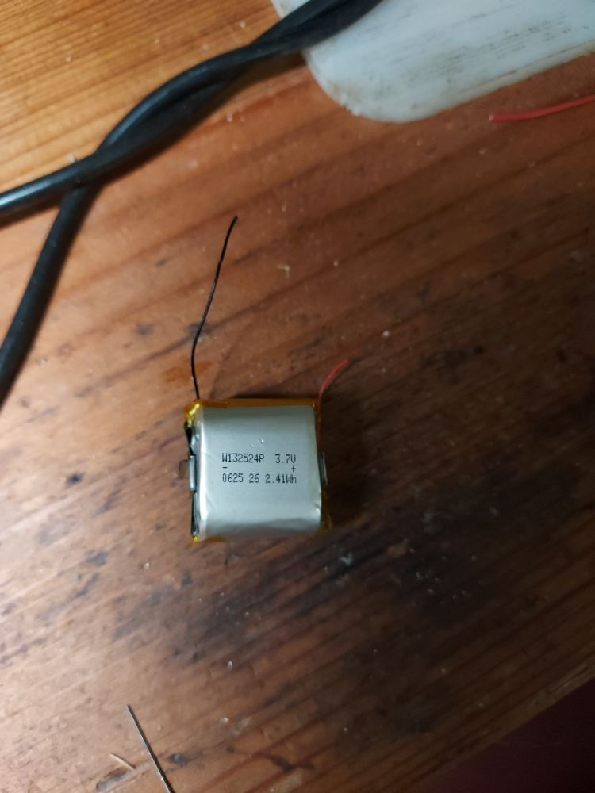

[Electronic cigarette](https://en.wikipedia.org/wiki/Electronic_cigarette) can often be found discarded on the sides of streets or in parking lots.
As (often rechargeable) electronic devices, these often contain a few useful components.

I would highly recommend using gloves while disassembling these, as they are full of toxic chemicals. (nicotine can readily be absorbed by skin)
The device proved hard to disassemble, and I ended up clamping the mouthpiece in a vice and pulling it off. Flowed by removing the rest of the internals with pliers.

The electronics inside a fairly simple, consisting of a small pressure switch (looks like a microphone), li-ion battery, a small charge controller chip with USB-c plug, and a heating element.
Li-ion batteries can catch fire if short circuited, so I highly recommend removing the battery from circuit and covering the terminals
The heating element was completely soaked with nicotine solution, but the other components were salvageable.

The battery clams a capacity of 2.4 Wh (Batteries are often misleadingly marked, but this doesn't seem too unrealistic) and a nominal voltage 3.7V, and has a max charged voltage of 3.9V.
With no protection circuit ("bare cell") the battery is prone to overcharging (catches fire), overcurrent (catches fire), or overdischarging (reduces lifespan/swells); Some additional circuity would be required for most applications.
The Cigarette is missing a overcurrent/overheating and overdischarge protection circuit, so it is unsurprising that electronic cigarettes [have been reported to catch fire.](https://www.usfa.fema.gov/downloads/pdf/publications/electronic_cigarettes.pdf)

