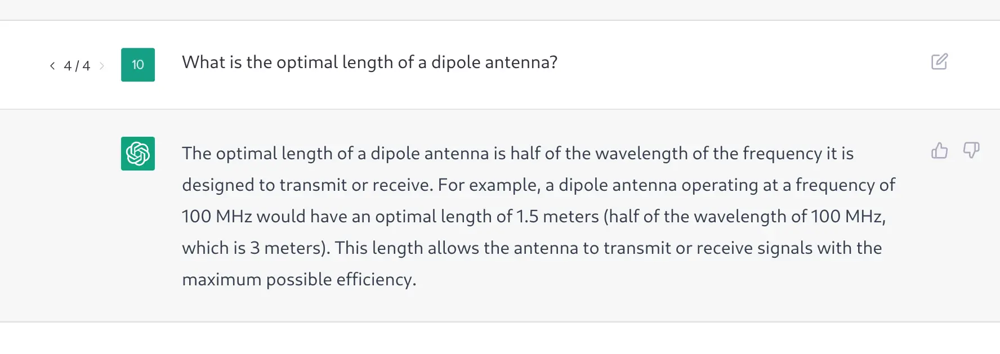

LLM's (Large Language Models) like Chat-GPT are able to hold extended conversations with humans or generate relatively long runs of text (a few paragraphs), however despite sounding authoritative, they consistently create large amounts of fluent bullshit.


The reason for this is that Chat-GPT is not some new magical sentient AI that has access to all the knowledge on the internet.
It is simply a language model, tasked predict text:

```
The quick red fox jumped over the [BLANK]
```

It produces a prediction of the most likely words to follow a string of text.
In this example the model might predict that the next words are `lazy brown dog`.
(Technically, it uses tokens witch are fragments of words or punctuation)
This is fundamentally the same problem to the autocomplete on most phones, just done better.
The differences between LLM's and your phone's autocomplete is the size and complexity of the model (allowing more complex output and the cost of size and speed), and training data size.

While your phone's predictive model might be a small markov chain model trained on just a few megabytes of text, GPT-3 (the base of Chat-GPT) has 175 *billion* parameters and was trained on *petabytes* of text scraped from the internet.
(A parameter is a number used to compute, typically as a coefficient, the output of the model, set during training)

As a result of this, Chat-GPT has a very good grasp of the look and feel of text, but no to very little understanding of the meaning of text.
On a very common question, Chat-GPT often provides the correct answer (or close to correct), because on average, humans are mostly right.
However, when tasked with a novel question, it vividly confabulates fluent and authoritative, but incorrect text.


A half wave dipole, as described by Chat GPT, is a very common variation on the dipole antenna.

Chat-GPT is not doing something different when it confabulates, it is just doing the same as it always does, making text that looks right with no regard to truth.
If you ask it about a non existent chemical compound, it will give a detailed, but completely made up, description including color, smell, taste...
In technical terms, a bullshit generator.


