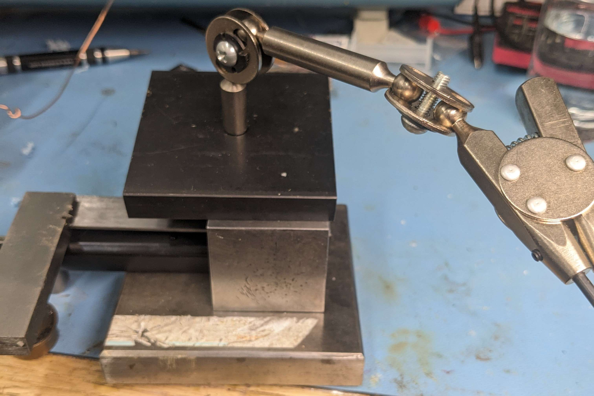
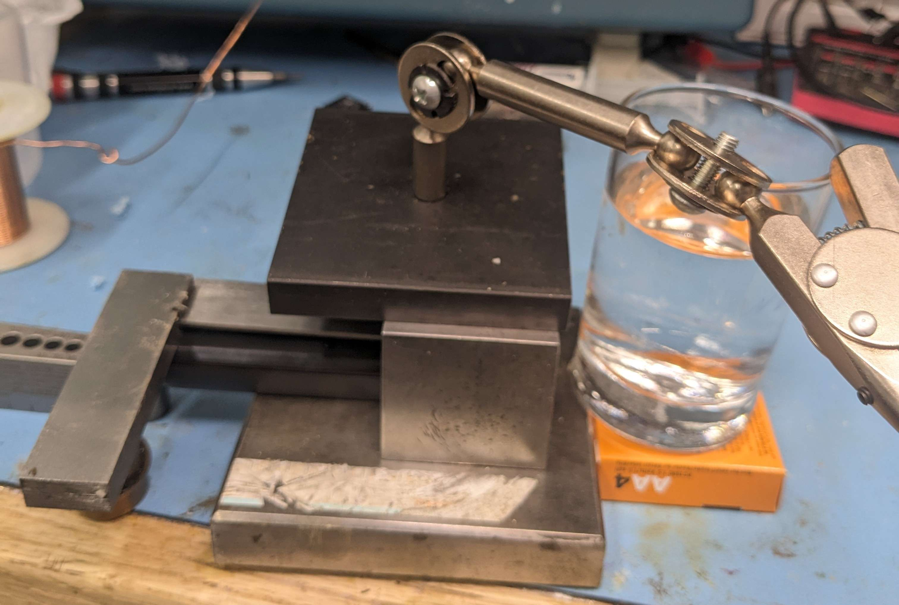
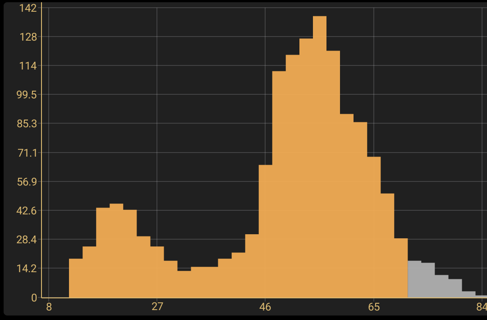
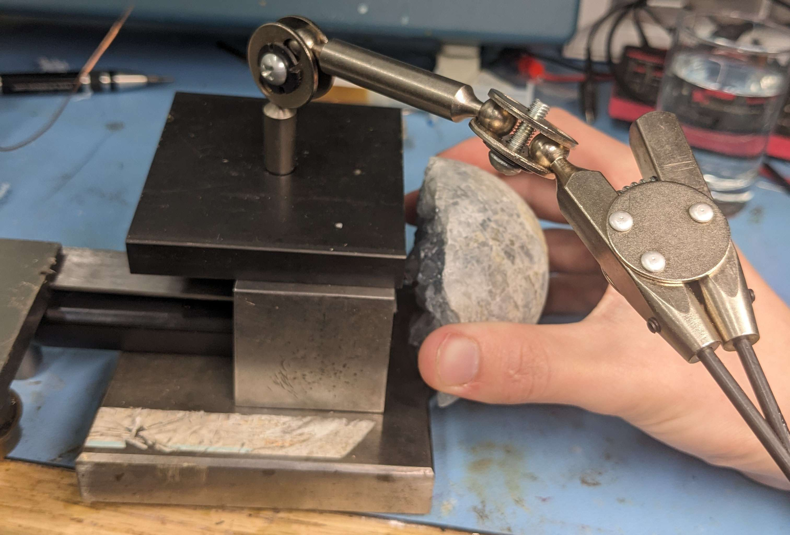
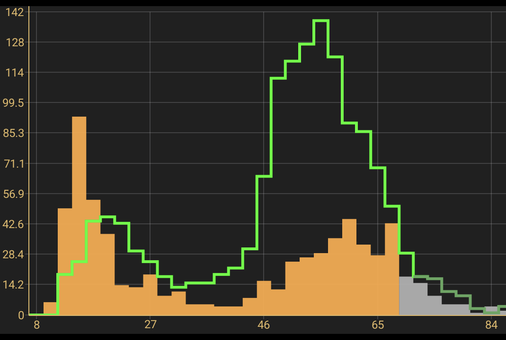
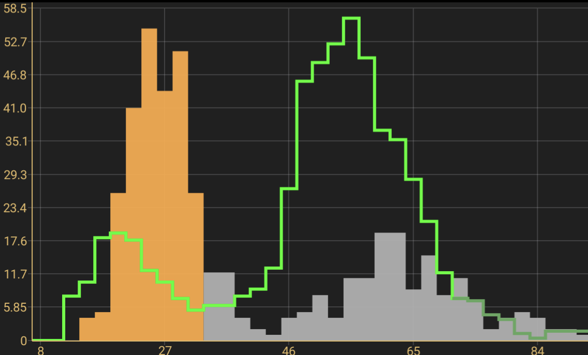
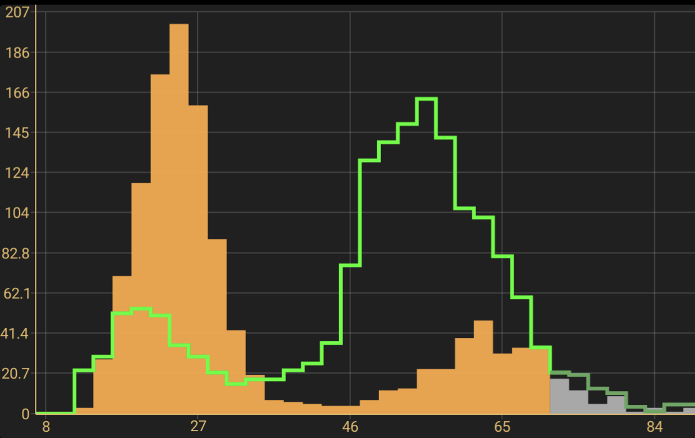
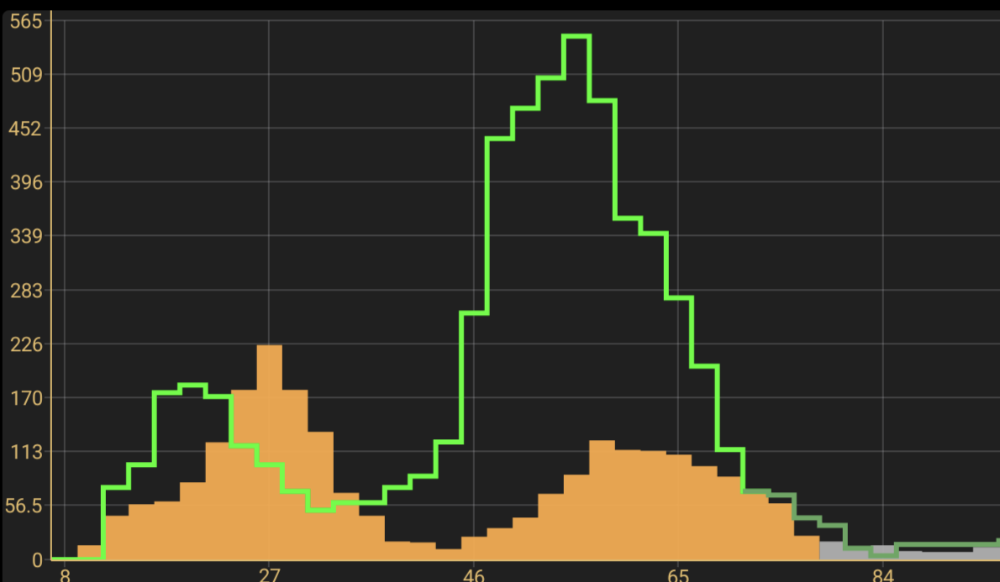

When an atom's inner electron absorbs an X-ray ray, it gets knocked out it's atom, and then falls back into place after a few nanoseconds.
In the process, the electron emits a new X-ray photon, with an energy dependent on the charge of the atom's nucleus, in other words, the atomic number.

I have been intermittently messing around with scratch building an X-ray spectrometer for some time now, with hopes of doing element identification, but in the mean time I tried using the cheap-ish "Radiacode-102" Gamma-ray spectrometer.
It has a tiny 1 cubic centimeter CsI(Tl) scintillator crystal, and a rather unimpressive resolution.

I placed a 37 kBq (1 uCi) americium-241 source on top of the spectrometer, separated by a steel ruler to shield the detector from radiation directly from the source.
I then surrounded the setup in more steel to shield it from background radiation, leaving an opening to place a sample in front of the detector, in the path of the radiation from the source.
The only way radiation from the source could reach the detector was if it was scattered, or absorbed and re-emitted by the sample. 

The setup, in all its jankiness.

The first thing I tested was a glass of water, non of the atoms (hydrogen, oxygen and silicon) should emit X-rays energetic enough to be detected, but the detector will still see X-rays scattering off the water:

Adding the water tripled the count rate, and after 2 minutes, the detector had built up quite a nice spectrum, nearly identical to just measuring the source directly:

I then took another spectrum with a rock that I suspected to be celestine, or strontium (element 38) sulfate:

The spectrum now showed much less backscatter, and had a new peek at 14 keV (the green overlay is the water's spectrum):

This 14 keV peek exactly what is expected from strontium, confirming the composition of my rock.

To make sure this new peak was fluorescence, I also tested some indium, element 49 (24,27 keV):

And some silver, element 47 (22,24 keV):

And some tin busmuth alloy, element 50 (25,28 keV) and element 83 (only the 10 keV line from an outer shell is visible):

Each of these elements created peaks in different positions, as expected from their atomic numbers

It isn't able to identify elements in a sample, but is good enough to confirm the presence of heavier elements.
