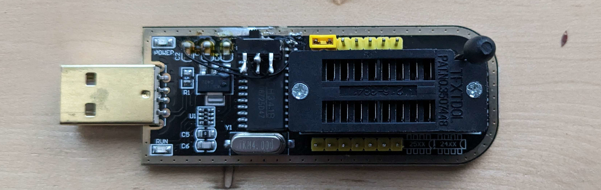

CH341B and CH341A based "MiniProgrammer" boards are by far the most common low cost flash programmers.
They're able to read and write from most SPI and I2C flash chips, often while the chip is still connected to its circuit.

Unfortunately, the designers made some interesting choices: the board supplies 3.3 volts, while using 5 volt logic levels.
When used on 3.3 volt systems, this can burn out the chip, or worse, backfeed onto the rails and damage other parts on board.

The internet already has lots of 3.3 volt modifications, but because 5 volt systems also exist, I decided to add a voltage switch:

First, I cut the trace above the CH341B chip, which supplies 3.3 volts to the socket.
I then lifted pin 28 on the chip, which supplies the voltage used to interface with the flash, and connected it to the right side of the cut trace. (going towards the socket)
This way the voltage used to communicate with the flash is always the same one used to power it.
To actually supply that voltage, I added a switch to connect the lifted pin to the top pin of C2 (5 V), or to the top of C1 (3.3 V).

In one position, the board supplies regulated 3.3 volts, and in the other it directlly uses the 5 volt USB rail.
The switch also works just fine in USB-to-serial mode (with the jumper removed).

I also cut away some plastic below the ZIF socket's locking lever, allowing it to rotate further, making it harder to accidentally release.

The limitations of reading chips in circuit still apply, the biggest one being that the board has to inject power onto the rails.
This can power microcontrollers, which then interfere by driving data lines.
In any case, it's an easy fix, by lifting a pin or cutting a trace to isolate the flash, which defiantly can't be said for blown parts.

As a quick warning, like most generic boards, there are multiple subtly different designs floating around, and your's might be different from mine.
I'd check the voltages on C1 (Should be GND/3.3 V), C2 (should be GND/5 V), and the trace above the chip (should be 3.3 V).

