 

If you repeat this, please <b>wear eye protection</b>.
No project is worth blindness.

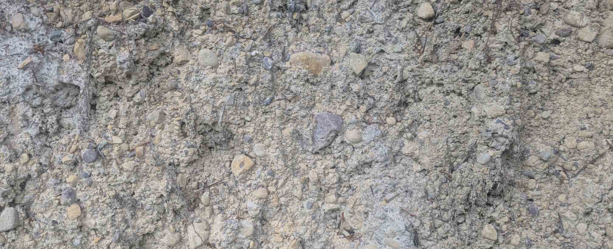
> 
Dirt in its natural habitat.

I started by looking for dirt with lots of clay, very little organic matter, and no carbonate minerals.
(If it bubbles with hydrochloric acid, find something else)

> 
Crude dirt

My dirt had a lot of rocks, so I added some water, stirred it, and and poured the silty water into a separate container.
After letting the silt settle, I transferred 150 mL of the dirt slurry to a beaker:

> 
Technical grade dirt.

Industrially, the aluminium is extracted using hot sodium hydroxide,
but this won't work for my silica rich dirt due to the formation of insoluble sodium aluminosilicate.

Instead, I added 150 ml of hydrochloric acid, which will slowly convert the aluminium oxides into aluminium chloride, but leave the silicon oxides untouched:

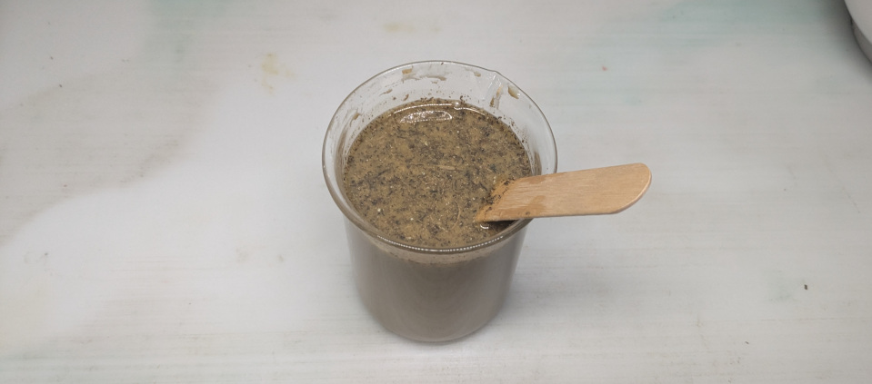
> 
Freshly fed acid

<b>Al2O3 + 6 HCl ➔ 2 AlCl3 + 3 H2O</b>

 

If your dirt contains iron sulfide, this step might generate toxic hydrogen sulfide gas.
Do it outside, and if it stinks, stay outside.

I covered the beaker and and kept the mixture warm (80 °C) for two days, with occasional stirring.
Once it was done reacting, I let the dirt settle for a few hours and poured off the solution:

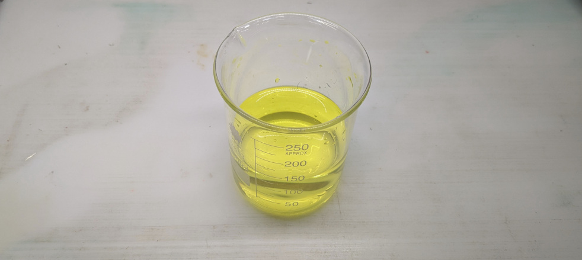
> 
ohno

Well... looks like the acid dissolved a lot of iron.
To remove it, I added sodium hydroxide to neutralize all the acid:

<b>HCl + NaOH ➔ NaCl + H2O</b>

<b>AlCl3 + 3 NaOH ➔ Al(OH)3 + 3 NaCl</b>

<b>FeCl3 + 3 NaOH ➔ Fe(OH)3 + 3 NaCl</b>

This caused both the iron and aluminium to precipitate as a hydroxide. 
Because aluminium hydroxide can't decide if it's a base or an acid, it redissolves once excess sodium hydroxide is added:

<b>Al(OH)3 + NaOH ➔ Na(AlO2) + 2 H2O</b>

After filtering out the iron precipitate, I was left with a mildly yellow alkaline solution: 

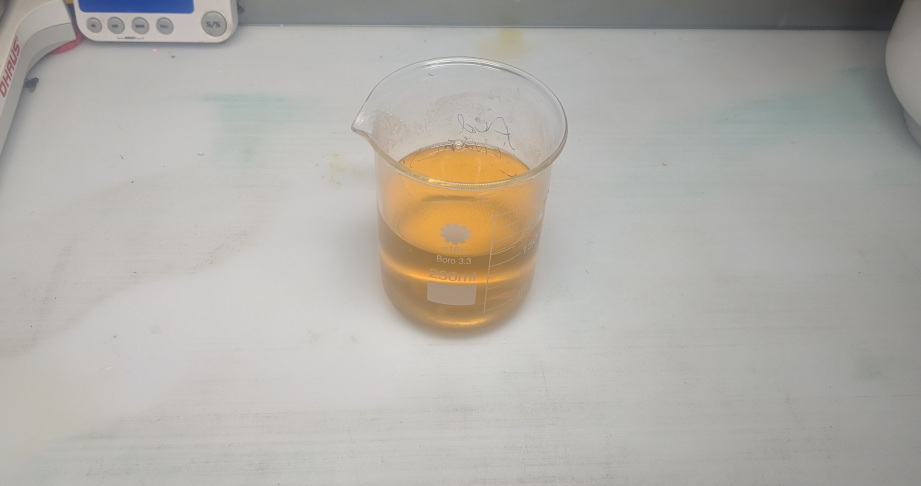

To get the aluminium back out, I slowly poured in hydrochloric acid using phenolphthalein as a pH indicator:

<b>Na(AlO2) + HCl + H2O ➔ Al(OH)3 + NaCl</b>

In strongly basic solutions, phenolphthalein is colorless, but it turns pink when the solution approaches neutral. 
I stopped once all the pink disappeared for a second time, indicating that the solution was slightly acidic
and that all the aluminium had precipitated.
 
After filtering, I washed the aluminium hydroxide precipitate a few times with water and was left with a off-white paste:

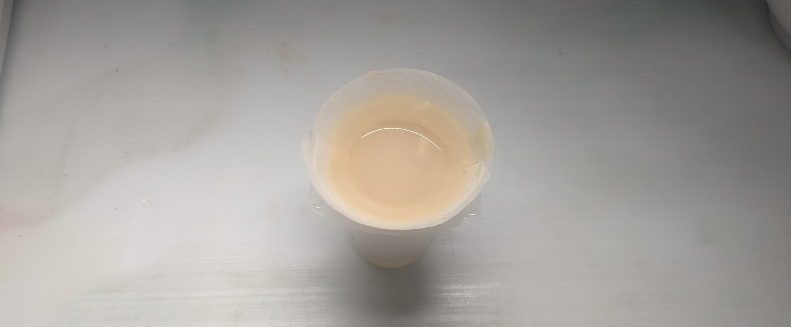

After drying the paste, I heated it to 800 °C, at which aluminium hydroxide decomposes to aluminium oxide:

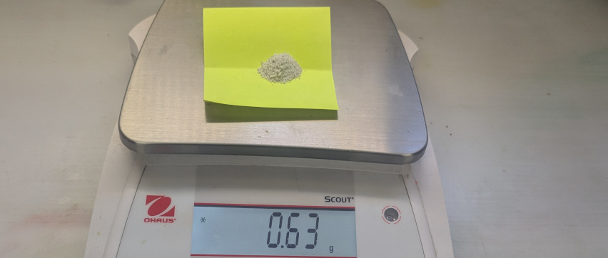
> 
 Lab grade dirt. 

<b>2 Al(OH)3 + heat ➔ Al2O3 + 3 H2O</b>

Aluminium metal is very reactive, and just like with alkali metals, the easiest way to make it is with molten salt electrolysis:

<b>Al2O3 ➔ 3 O 2- + 2 Al 3+</b>

<b>2 O 2- ➔ O2 + 2 electrons -</b>

<b>Al 3+ + 3 electrons - ➔ Al</b>

However, pure aluminium oxide melts at 2,072 °C, which is way hotter then any of my furnaces can get up to.
Instead, I decided to dissolve the alumina in cryolite (sodium hexafluoroaluminate) which melts around 1,000 °C.
Using a flux has the added bonus of protecting the newly formed aluminium from air.

Cryolite can be produced from sodium aluminate and HF, but because it's just a solvent and isn't really consumed in the process, just bought some.
(I also didn't want to work with hydrofluoric acid, which is extremely nasty)

After mixing 500 mg of my aluminium oxide with 12g (~4%) of cryolite, I loaded it into a graphite crucible, which would become the negative electrode:

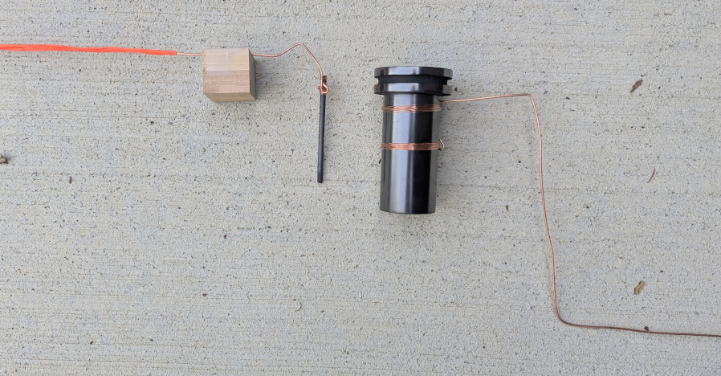
> 
Hall-Héroult cell components

I placed the crucible into an electric furnace and heated it put to 1000 °C.
Once it melted, I stuck in a preheated graphite electrode and ran the cell with a 22 amp, 18 volt power supply:

While the flux is mostly unreactive, it does produce small amounts of hydrogen fluoride and weird fluorocarbons. 
Doing the electrolysis without ventilation is a great way to poison yourself in new and exciting ways.

After running it for 10 minutes, I dumped out the flux and... nothing.

I was kinda expecting this because the power supply was only able to push around 0.8 amps of current though the cell.
Over the course of 10 minutes, this would have at most produced 44mg of metal -- 
a quantity small enough to go unnoticed in the large volume of flux I used. 

This high resistance was due to the "Anode Effect", where above a critical current density, a layer of gas forms around the positive electrode.
Once it forms, the gas layer reduces the available electrode surface, increasing the current density, causing more gas formation, covering more of the electrode...

Once the cycle gets started, it drastically increases the cell resistance, and it only gets worse the harder you try and shove current though it.

For the next run I made a larger electrode, and set up a rig to hold it in place so I could focus on controlling the current:

> 
I forgot to take a picture before using it, so here's the aftermath. 

The critical current density depends on alumina concentration, so for the second run, I bumped it up to 15% by adding some more alumina the flux recovered from the last attempt. 

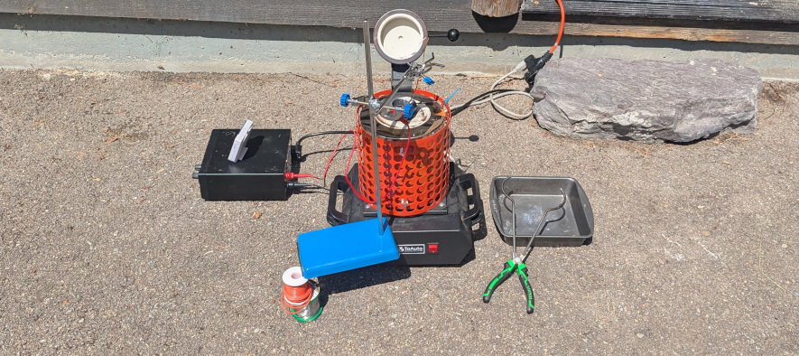
> 
Running the cell

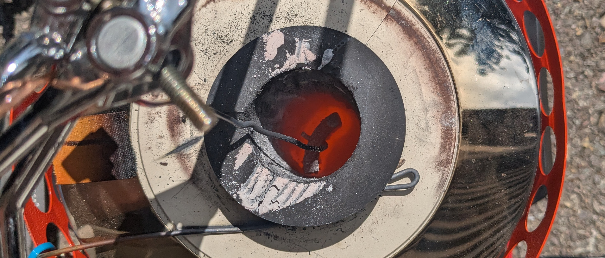
> 
The furnace is turned off. All that heat is being generated by the current.

This time, the cell drew 22 amps running at just under 5 volts, just like the real ones. 

After 20 minutes, I turned off the current and kept it at 1000 °C for 5 minutes let the metal consolidate.
After dumping out the crucible, one piece of flux had an exposed metal bead:

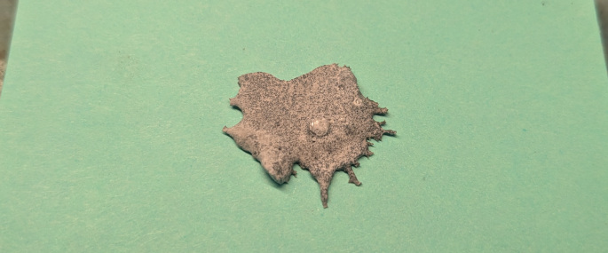

... after breaking away the flux:

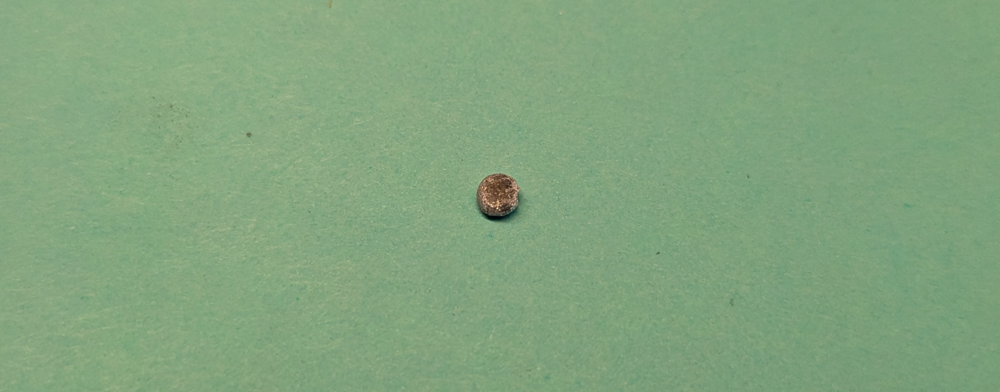
> 
Ooo shiny!

Here's what I collected after smashing apart the rest of the flux:

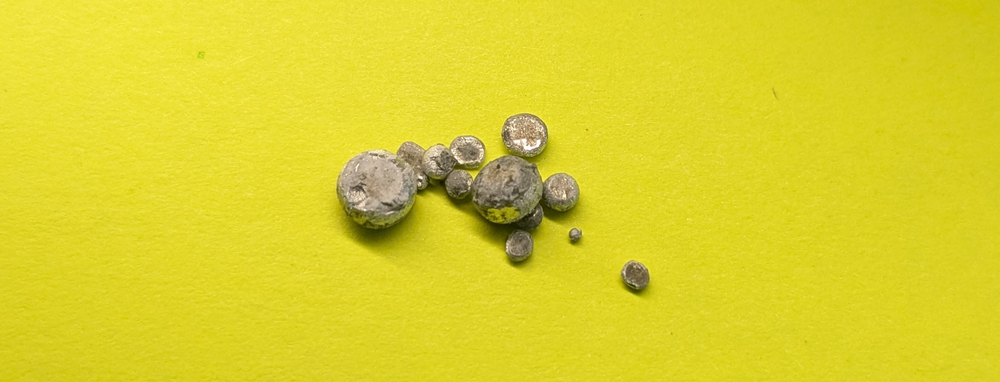
> 
0.29g of aluminium.

It's not quite enough to make an airplane, but still quite neat.

## The math:

The electrolysis was the only step that used reasonably pure starting materials, so it's the only one I can do math on:

Twenty two amps for 20 minutes should have produced around 2 grams of metal, so I had a 13% faradic yield. 
The cell was running at ~4.7 volts, so the energy efficiency was around 7.2% (excluding the heat used at startup). 

Chemically, I had a total of 1.5 grams of alumina in the melt, and a 37% yield.
The chemical yield would probably have been higher if I let the cell run longer. 

## Geology notes:

I couldn't find any aluminium in the wastewater, so I'd guess the main reason for the small yield of Al2O3
was that the acid just didn't leach that much aluminium from the dirt.

Many minerals contain both silicon and aluminium oxides, in which case the reaction will be limited by the formation of a layer of pure silicates on the surface.

The best solution would be to source better ore, but the formation of Bauxite requires very long periods of chemical weathering. 
Something really can't happen at at my place that has constant erosion and glaciers coming though every hundred thousand years or so.

... but if you live somewhere flat, wet and warm, you might have better luck. 
