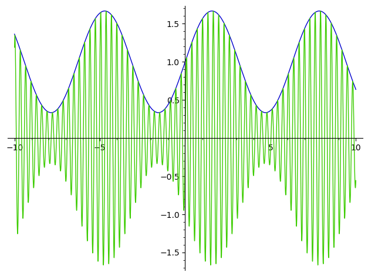
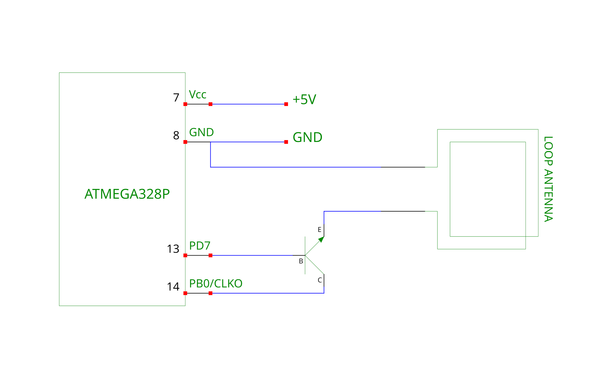
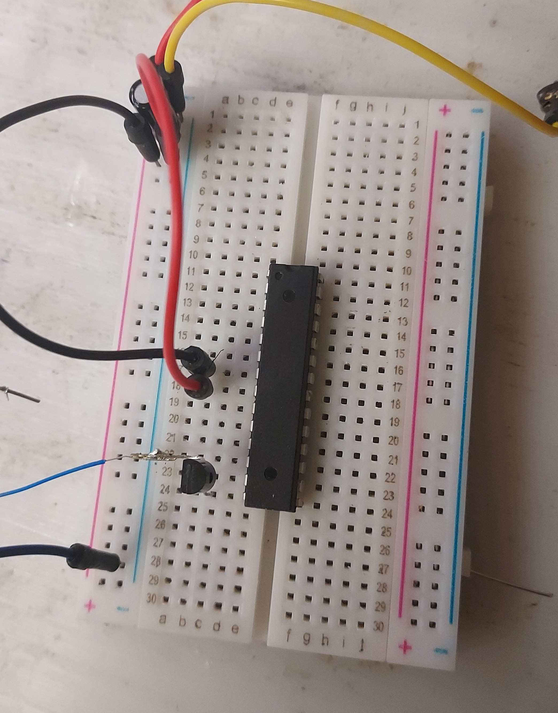

# AVR clock output pin

The AVR has a clock output pin, which if configured, outputs the system clock.

The clock is by default 1MHz on most (all?) AVR microcontroler, right in the middle of the AM broadcast range!

I added ``-U lfuse:w:0x22:m`` to avrdude's flags to enable the pin.

# AM, the simplest modulation type

AM is the simplest scheme to send sound over a radio wave, by varying the signal strength according to the instantaneous voltage of the audio signal.

If a transmitter if turned on and off at 1KHz, the result is a 1KHz (square wave) AM tone!

# The modulator

To send an AM transmission, the signal coming from CLKO (Clock output pin), must be modulated.

This can be done with a NPN transistor which can be obtained for less then .10$ per unit (If you buy in bulk).

A resister between 100Ω and 1KΩ to ground on the antenna seems to improve results when used with a dipole antenna (long wire). 

# Antenna

I got best results with a magnetic loop antenna, made from 3 - 10 turns of thin wire (Optimal turn count depends on wire thickness and voltage) with a diameter of ~50 cm.

A human body (just touch the output with a finger) or a pair of long wires also worked.

# Range

The avr with a 5v supply and loop antenna got a range of around 2m with a cheap off-the-shelf radio.

# Legality

In the US, operating an ultra low power transmitter on the AM bands is legal as long as you stay under 0.05 W (50 mW).

It is very unlikely that you exceed the limit with just the AVR's output and crude antenna, but you shouldn't connect this to an amplifier.

If you do, you *will* be noticed as the square wave produces has a lot of harmonics, which will interfere with a lot of other channels.

# Code

[Working C code for an atmega328p](am.c)

