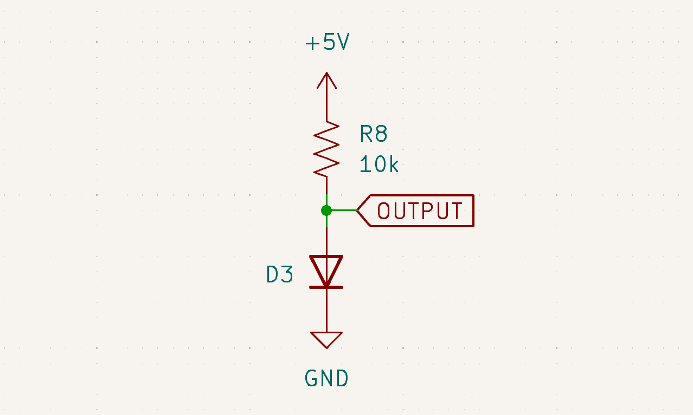
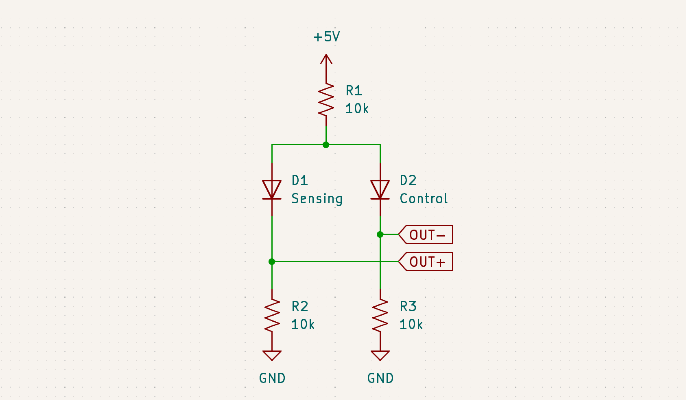
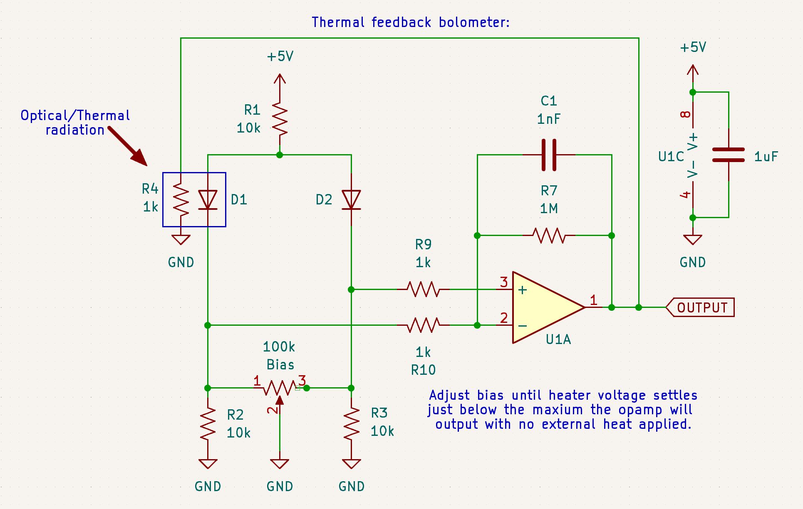

A bolometer uses a weird way to detect light, detecting the heat from absorbing light.
This limits sensitivity and speed, but works at wavelengths which are otherwise very difficult to detect, like thermal infrared.[^bandgap]

At its simplest, a bolometer is simply a black object attached to a heat sensor, both somewhat isolated from the surroundings.
Typically a thermistor is used as the heat sensor, but I did not have any on hand, so I used a 1N4148 silicon diode.
A diode's forward voltage falls with temperature, generally around -2 mV/K.

I covered the diode with lampblack (carbon) becuase it is a fairly good wideband light absorber, and built up a quick circuit to measure the drop:

After the diode cooled to ambient temperature, touching it dropped the output voltage by a good 30 mV.
But, this simple circuit won't work as a bolometer, becuase it is effected by ambient temperature, and even a fraction of a degree of error will ruin the results.
The simplest way to fix this is by adding a second diode as a baseline reference, and measure the difference between the two voltage drops:

There will be some voltage offset even at a equal temperature because 2 diodes will not be perfectly matched, but this can easily be zeroed out.
This circuit is enough to detect a temperature difference, but not to measure the amount of heat flow.

This measurement can be done with a small heater, like a 1k resistor attached to the sensor.
To maintain a constant temperature, the total power flowing into the sensor has to be constant, therefore the needed heater power will fall by exactly the input power.
With an opamp adjusting the heater power to keep a constant sensor temperature, the input power can be measured as the drop in applied heater power:

I glued to the sensor diode (D1) to the heater, but taping them together works fine.
The assembly should not be touching the circuit board to keep heat from escaping before it can be measured.
Watch out for the photoelectric effect, the diodes need to be shielded from light if they are in a glass package (like the 1N4148).
The thermal mass of the absorber/sensor/heater assembly should be as small as possible to keep the thermal time constant reasonable.

The detector is quite sensitive to drafts, make sure to shield the diodes from any air currents.
Commercial bolometers are often placed in a vacuum, but most common vacuum chamber materials are opaque to thermal infrared, making them useless.

To make a measurement, first measure the baseline heater voltage with the sensor covered, then expose sensor to light or thermal radiation.
After it reaches equilibrium (the output stops changing), measure the heater voltage again.
Convert the 2 voltages to powers, `Power = Voltage^2 / 1000 Ohms`, and subtract for the measured power.[^irradiance]

Covering the sensor except for a small aperture it turns it into a terrible 1 pixel thermal camera.
Depending on the thermal mass of the sensor, it is just about be usable as a motion sensor.
Commercial motion sensors and thermal cameras use a similar principle, but have a detector with much less thermal mass and with direct contact between the absorber and sensor.

It also works as a half decent laser power meter, but with a 1k heater resistor running off 5 volts, it will max out at just 25 mW.
This could be improved using a smaller value resistor for the heater, using 100 ohms would bring the max up to 250 mW.

With a 50 ohm resistor attached to the sensor, it works as an RF power meter, but it is hard to get more then 20 dB of dynamic range from such a setup.
On the plus side, it works DC to daylight (literally).

[^bandgap]: Technically some very exotic semiconductors like Mercury Cadmium Teluride also detect thermal infrared, but these need to be cooled to cryogenic temperatures to function. 

[^irradiance]: Dividing power by detector area will give the irradiance, but these values will be slightly wrong because even the best absorbers will reflect some light.
