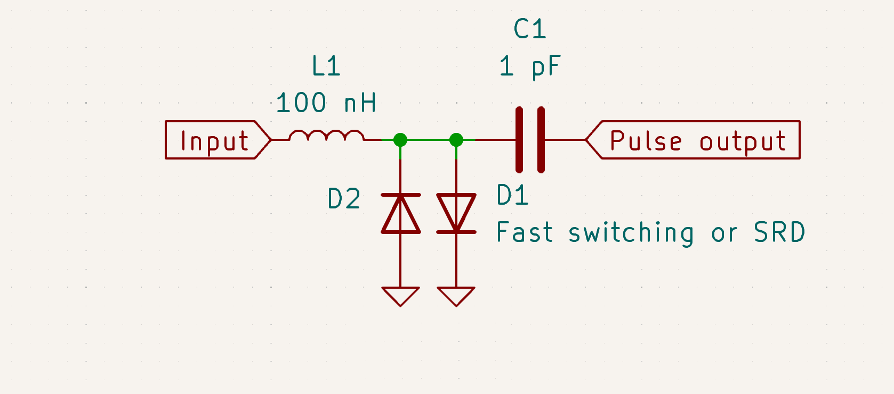

Let's make harmonics, *lots* of harmonics.
This can generate evenly spaced carriers for testing receivers, and create high frequency signals referenced to a stable, low frequency reference.

Harmonics are created by sharp edges, ideally by very short pulse, the furthest a waveform can be from a smooth sine wave.
Historically, this was done with a diode or two, in a configuration like this:

(These values are arbitrary, but these seem to work ok with most switching diodes)

As the diode moves from forward to reverse bias, it conducts in the reverse direction for a short while before abruptly snapping off, creating a falling edge of around a nanosecond even with a 1N4148.

A small inductor converts the rapid fall in current into a very sharp voltage pulse, resulting in harmonics up to hundreds of times the input frequency.
The largest gotcha is that many inductors will act like capacitors at higher frequencies, sometimes even just at tens of MHz.
I fixed this by adding a small hand-wound coil in parallel, but just using an RF suitable inductor to begin with will work fine.

It also takes quite a bit to drive the diodes, a few volts peak to peak from a 50 ohm source should do it.

Specialized "step recovery" diodes can conduct in reverse for quite a while, and snap off just a handful of pico seconds, creating strong harmonics up to hundreds of gigahertz.
Similar circuits can also be built with just diode[^one], but those need a DC path on the input to bias it. 

Many diodes are usable up to a few gigahertz, but the reverse transition time is usually not in the datasheet, so it will take some experimentation to find a particularly good one.
Even the best switching diodes will have comparatively weak output becuase the reverse recovery time is too short to allow very much current to flow in the reverse direction.

That said, even some random 1N4148's generated harmonics up to 2 GHz, tapering (but sill usable) off above 1 GHz.

Nowadays, RF transistors capable of generating sub nanosecond rise times are really cheap, making such diode tricks rather obsolete, but I still think they're neat.

[^one]: Using two diodes favors odd harmonics, while one diode will produce all equally.

