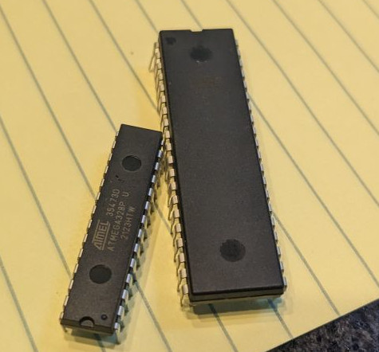

Computers are ubiquitous, but nearly all computers are literal black boxes: integrated circuits.

Sure, in older, larger computers you might be able to see the data being transferred in and out of memory with a few LEDs, but the data still disappears into an black box: the CPU.
Even if you decap an old CPU like the Z80 or MOS 6502, all you can see is a static view of the transistors, you can't see the computer actually *computing*.
The only real option for computer where you can follow data all the way through a computation is to build it yourself.

To avoid replacing one black box with another black box, I want to use as the simplest components available:
No FPGAs, no EPROMs, no integrated registers, latches, adders, logic gates, etc.

I also want a computer that is at least somewhat useful for real life tasks, these are the design goals for the computer:

- It must be capable of evaluating Boolean expressions.
- It must be able to perform simple arithmetic. (adding and subtracting)
- It must support some form of IO, such as memory mapped GPIO.
- It must support conditional execution and branching.
- It must be able to address at least 1Kb of memory, and support indirect addressing.
- It should be modular: A minimal but functional system should be easily expandable to to add more features (GPIO, addressable memory, jumping...)
- It should be able to run anywhere from 0 to 200 thousand instructions per second
- It must be constructed entirely out of discrete, trough hole components (I will make an exception for memory, but the computer should still be able to function without ICs)
- It must be small, a minimal system should fit on my desk with all the components visible.

The last 2 requirements present a huge (literally) problem: Most computers are very complex.
Even supposedly simple designs, like [Ben Eater's 8 bit breadboard computer](https://eater.net/8bit/) require a lot of components:
Just looking at the ALU, it requires 2 8-bit registers, and an 8-bit adder. 
A level triggered D-latch can be built with 4 NAND/NOR gates per bit, and a edge triggered master-slave latch requires 9.
The ALU's accumulator register has to be edge triggered, so it takes 72 gates, while the B register can be level triggered, with 32 gates.
A single bit full adder can be constructed using 9 NAND/NOR gates, so the full 8 bit adder requires 176 gates.
In total, excluding bus transceiver and control logic, the ALU and associated registers take 280 gates or 560 transistors with NMOS logic, just to add 2 8-bit numbers!

The reason this computer is so massive is that it has an 8 bit ALU, registers and data bus, so everything has to be repeated 8 times.
 Would it be possible to get away with just one bit?
Yes, and it has actually been done with the [MC14500](http://www.bitsavers.org/components/motorola/14500/MC14500B_Industrial_Control_Unit_Handbook_1977.pdf) chip.
The MC14500 chip has a *single* 1 bit register (9 gates) and a 1 bit logic unit (4 3-input gates and 1 4-input gate) for doing Boolean arithmetic.
The all of the actual computing could be handled in just 14 gates (33 transistors)! 

The architecture for my computer will be very heavily based on the MC14500 chip, but with built in arithmetic capability.
This requires adding in a full adder (9 gates) and a register (also 9 gates) for storing the carry between bits.

The CPU will have 3 1-bit registers: Accumulator, Carry and Output Enable (and skip, but that one is not user visible, and will be an S/R latch, not a D flip-flop).
The accumulator is used for (Boolean) arithmetic, operations are performed between the accumulator and a value read from the data bus, and the result is written to the accumulator.
Carry is used in alongside to the accumulator for addition to track carries.
Output Enable disables writing to the data bus when zero, this allows simple, if sometimes inefficient conditionals.
(Branching is slow because the CPU has to copy addresses around one bit at a time, and requires a significant amount of hardware)

This is what the instruction set currently looks like, this will probably change later on during the design process:

|Opcode|Name|Function|
|------|----|--------|
|0000 0|NOP |Does nothing|
|0001 1|LD  |Load the bus into the accumulator|
|0010 2|LDC |Load the complement of the bus into the accumulator|
|0011 3|STO |Writes the accumulator on the the bus|
|0100 4|STOC|Writes the complement of the accumulator on the bus|
|0101 5|OEN |Loads the OEN register from the bus|
|0110 6|ADD |Adds the accumulator to the bus, using the carry register to store the carry|
|0111 7|XNOR|XNORs the accumulator with the bus|
|1000 8|XOR |XORs the accumulator with the bus|
|1001 9|AND |ANDs the accumulator with the bus|
|1010 A|OR  |ORs the accumulator with the bus|
|1011 B|ONE |Forces a one into the accumulator and a zero into the carry|
|1100 C|TWO |Forces a zero into the accumulator and a one into the carry|
|1101 D|JMP |Strobes the jump flag|
|1110 E|SKZ |Skips the next instruction of the accumulator is zero|
|1111 F|RET |Skips the next instruction and sets the return flag|

Addressing will be done separately in the interest of modularity, so it can be as simple or as complex as needed for the given application.
Jumping is also handled externally, with the CPU just signaling to external circuitry to execute the jump, at which point it could load a value from a predetermined location in memory into the program counter, or just reset it to address 0.

As for physical implementation, relays are wonderfully mechanical, but are expensive and very slow, adding several milliseconds of delay with every relay.
Transistors, with their very low cost, low power consumption, small size and fast switching are a much more practical option.

There are multiple options for building logic gates out of transistors, the most common are CMOS, NMOS, TTL, DTL and RTL.

CMOS logic has *zero* standby power consumption, but can consume a lot of power during rapid state transitions, especial if built out of larger transistors.
It also has unlimited fanout, but larger fanouts come at a cost of speed.
As far as part count, a 2 input NAND gate constructed out of CMOS requires 4 transistors, and no other components.
One problem with CMOS is that constructing a CMOS gate on a PCB requires multiple layers, or a huge amount of jumpers.

NMOS logic has lower part count then CMOS, with a NAND gate requiring 2 transistors and one resistor, however, NMOS gates consume power when idle.
However this type of logic is quite slow with discrete transistors, with a steep speed/power consumption trade off, for example the well known Monster6502 was limited to a clock speed of 50kHz.
To run the Monster6502 at 1MHz, you would have to reduce the pull up resistors to a 20th of their value, resulting in a power consumption of over 100W!

DTL is different from CMOS and NMOS is that it uses BJT transistors. 
The logic itself is implemented using diodes, and transistors are used to amplify and invert signals between gates.
A 2 input DTL NAND gate DTL requires 3 diodes, one resistor, and one transistor, 

TTL is similar to DTL except that it uses extra transistors instead of diodes to implement the logic and provide better fanout and fanin.
Depending on the specific implementation a TTL NAND gate can take anywhere from 5 to 10 parts.

RTL is also based of BJT transistors, but the logic is directly implemented with a single layer of transistors.
A 2 input RTL NAND gate requires 2 transistors and 3 resistors.
RTL does have a fairly limited fanout, meaning buffering will be required in some places.

There is another, mostly forgotten logic family, ECL, that operates totally differently then any other type of logic.
Instead of operating the transistors fully-on or fully-off like switches (saturation), ECL operates transistors in the linear region, and connects them as differential pairs.
ECL is super fast, even out of discrete transistors, with propagation times of just a few nanoseconds.
ECL NOR gates (effectively equivalent to NANDs) take 3 transistors, and 3 resistors, and consume a more power then RTL, but have better fanout.

ECL has a few other quirks, namely the very close logic levels, logic high and logic low can be as close as 500mV, requiring additional components to couple to LEDs.
Rather annoyingly, ECL requires either dual power supply rails (for example 3.3 and 3.0 volts), or differential signals, which complicates construction.

|Type|Devices per NAND/NOR|Quirks|
|-|-|-|
|CMOS|4|Wires cross, multiple types of transistors|
|NMOS|3|Rather slow|
|DTL|5|Limited fanout w/o buffers|
|RTL|5|Limited fanout w/o buffers|
|TTL|5-10|Multiple types of transistors|
|ECL|6|Dual power supplies, requires level sifters for driving LEDs and other logic types|

Overall DTL/RTL seems the best option, with ECL being an option if speed becomes an issue and a 2 layer PCB is available.
