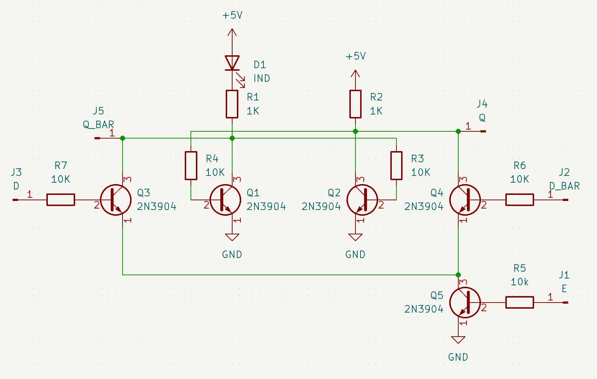

Previously, I looked at [gate level register designs](../4), but now I need a transistor level design:

The loop of NOT gates made from transistors looks like this:

Adding inputs inputs is easier then with logic gates, simply add another transistor to pull the output of a gate low:

To ensure things happen at the right time, the latch needs an enable input.
The simplest way to add this is by connecting/disconnecting the ground to the transistors on the input.
Only if the enable is high, will the input transistors be able to pull down a NOT gate's output and change the state of the latch: 

This SR-latch-with-enable circuit can be used as a D-latch by connecting the data input to the `set` input, and an inverted copy to the `reset` input:

This version also includes an indicator LED on a pull up resistor, which does cut into high level voltage quite a bit, but this can be minimized to just 1.6 to 2 volts by using a red/orange LED.
A logic high of 3 volts should be fine, even with a diode based gate.
Here is what the PCB for a single latch looks like, with as much wiring on the front copper layer as possible:

An edge triggered D-flip-flop can be constructed, by chaining 2 together (the second one's `d` and `d_bar` inputs connected to the first ones `q` and `q_bar` outputs) and using non-overlapping enable signals.
In total the computer will require 7 latches, one for OEN, and 2 each for the accumulator, carry and skip registers.
