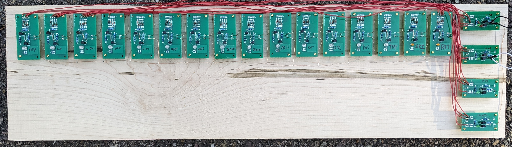

A big problem with the one bit computer architecture is its very low code density.
It takes 2 instructions just to copy a bit, copying a byte takes 16, and 2 bytes 32 instructions.
At two bytes per instructions, that's 64 bytes of code to copy 16 bits!

If you want to loop to avoid repeating code, the jump destination register (16 bits) has to be set, which itself takes 17 instructions. [^1]
However, each instruction has a nice long address, if that was used instead, a jump could be done without any setup.

If the jump instruction jumps the computed memory address[^2], it can do both computed jumps and immediate jumps, depending on the zero page bit.
However, this limits immediate jumps to the first 1,024 instructions, which will be a problem for longer programs (over 2kB).
Jumps above instruction 1,024 can be emulated using offset addressing, up to instruction 32,768, but this occupies one of the two index registers, making actual computing slower, and *longer*.

A better solution is to keep the jump destination register, and use the hacky OR based indirect addressing to compute the jump address.
This requires just 10 more OR gates, but allows one-instruction jumps, up to instruction 65,536 without using an index register.
Adding additional 10 AND gates for a zero page bit, would allow jumping to low address without zeroing the jump destination register, allowing it to be used as a return address for functions.

Shorter jumps help dramatically with code density, a 2 byte copy can be done in just 16 instructions (32 bytes), and a 4 byte copy takes just 3 more instructions.
Still far longer then ideal, but much better then before. [^3]

Anyway, here is what the progress with physically building the decoder looks like (25% done wiring every NOR input):

[^1]: One to set the accumulator to a predictable state, like `one`, `two` or `xor acc`, and the other 16 STO or STOC to set the bits.

[^2]:
	If the zero page bit is 0: offset OR selected index\_register. If zero page bit is one, just the offset.

[^3]:
	It could be improved further by adding hardware to repeat a few instructions with increasing addresses (and possibly a microcode ROM to hold common operations).
	This would effectively turn the computer into a bit-serial machine, allowing it to be used like an 8/12/16/32... bit computer while still being a one bit computer.
	Interestingly, multiple bit serial machines often provide better performance then an equivalent multi bit processor (in terms of component count/power usage).
	Because of this, similar designs were used in many super computers, just repeated many times over. (For example, the [CM-1](https://en.wikipedia.org/wiki/Connection_Machine)) had 65,536 cores!
	
	
