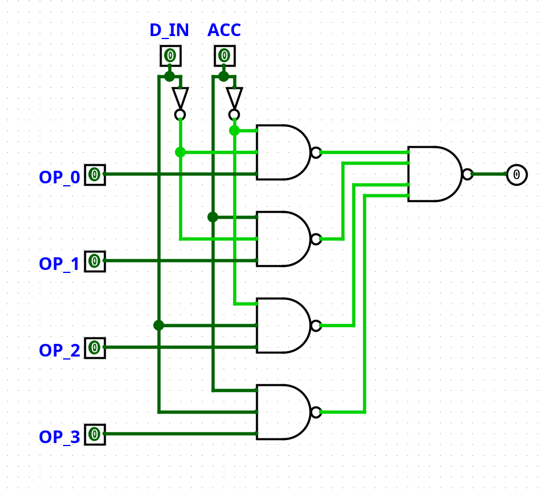
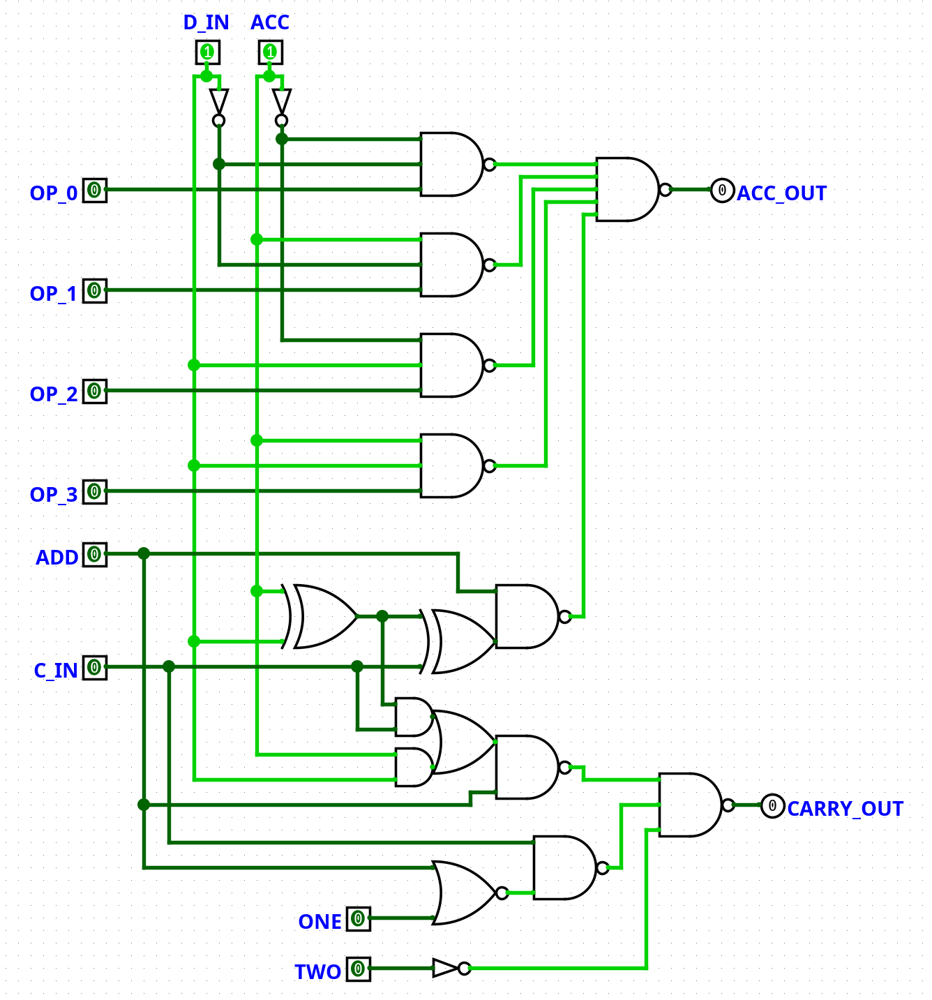
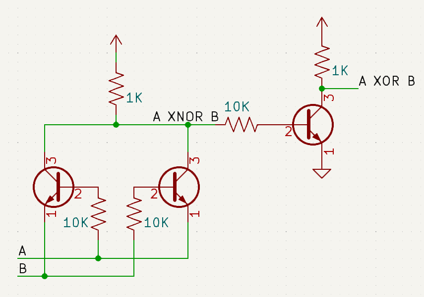

The one bit computer's ALU will have to perform a quite a few different operations:

- Addition
- Loading into the accumulator
- Loading the complement into the accumulator
- Logical AND
- Logical OR
- Logical XOR
- Logical XNOR
- Forcing a 1
- Forcing a 2.

It turns out most of these operations can be implemented using a very simple circuit: A 4 to 1 multiplexer (One can be constructed with just 8 transistors).



If the inputs for the operation (The data bus and accumulator) are feed into the select inputs, then the data inputs control the effective truth table of the multiplexer.
This allows *any* 2 input gate to be simulated, including some weird ones like "(NOT Acc) OR Data", or "Always one"[^1]:

|00|01|10|11|Operation [^2]|
|--|--|--|--|-|
|0 |0 |0 |0 |Always zero|
|0 |0 |0 |1 |AND|
|0 |0 |1 |0 |Data AND (NOT Acc)|
|0 |0 |1 |1 |Load|
|0 |1 |0 |0 |(NOT Data) AND Acc|
|0 |1 |0 |1 |No OPeration|
|0 |1 |1 |0 |XOR|
|0 |1 |1 |1 |OR|
|1 |0 |0 |0 |NOR|
|1 |0 |0 |1 |XNOR|
|1 |0 |1 |0 |NOT|
|1 |0 |1 |1 |Data OR (NOT Acc)|
|1 |1 |0 |0 |Load complement|
|1 |1 |0 |1 |(NOT Data) OR Acc|
|1 |1 |1 |0 |NAND|
|1 |1 |1 |1 |Always one|


The easiest way to implement a sane instruction set using a multiplexer as an ALU is to with a small diode ROM to translate an opcode into a truth table[^3]:

|Opcode|Name|ALU operation|
|------|----|--------|
|0000 0|NOP |0101 (NOP)|
|0001 1|LD  |0011 (LD)|
|0010 2|LDC |1100 (LDC)|
|0011 3|STO |0101 (NOP)|
|0100 4|STOC|0101 (NOP)|
|0101 5|OEN |0101 (NOP)|
|0110 6|ADD\* |0000 (Always zero)|
|0111 7|XNOR|1001 (XNOR)|
|1000 8|XOR |0110 (XOR)|
|1001 9|AND |0001 (AND)|
|1010 A|OR  |0111 (OR)|
|1011 B|ONE\* |1111 (Always one)|
|1100 C|TWO\* |0000 (Always zero)|
|1101 D|JMP |0101 (NOP)|
|1110 E|SKZ |0101 (NOP)|
|1111 F|RET |0101 (NOP)|

Instructions marked with a "\*" require additional ALU circuitry.

This is effectively microcode[^4] for the ALU, but just with 8 bytes total, and most of it is just 0101 (NOP).
There are only 8 distinct values, which would be stored with just 15 diodes (and a few, possibly diode, OR gates).

The ALU also needs to do arithmetic, while that could be accomplished with a sequence of logic operations[^5], it will be much faster and more convenient to have it built in.
Doing this only requires adding a full adder, along with some circuitry to set/reset/preserve the carry flag.


Logisim Evolution circuit file: [alu.circ](alu.circ)

The NANDs right before the output can all be constructed using a wired-and and a NOT gate, only costing a single transistor each.
The collection of gates consisting of 2 ANDs, an OR and an NAND that compute carry can actually be implemented as a single 5 transistor gate.

While the 2 XOR gates look scary, considering how many gates it takes to build them out of NANDs/NORs, they can actually be fairly easily constructed from transistors:



[^1]:
	This actually allows an even simpler computer, where on every opcode is interpreted as a truth table for the operation to be performed, and the result is written back to memory on every cycle. 
	It would be Turing complete with indirect addressing/jumps or self modifying code.
	However, I want built in support for addition and conditional execution, so this is not enough.

[^2]: Assumes that the first bit is the data bus and the second is the data bus

[^3]:
	It is possible to arrange the instructions so that the arithmetic operation's opcode is equal to the desired truth table, so that all the control logic has to do is forward the opcode to the ALU.
	 NOP has to stay at opcode 0000 for instruction skipping to work, but all other operations can be moved around:

	|Opcode|Name|Function|
	|------|----|--------|
	|0000 0|NOP |Does nothing|
	|0001 1|AND\* |ANDs the accumulator with the bus|
	|0010 2|OEN |Loads the OEN register from the bus|
	|0011 3|LD\*  |Load the bus into the accumulator|
	|0100 4|ONE |Forces a one into the accumulator and a zero into the carry|
	|0101 5|TWO |Forces a zero into the accumulator and a one into the carry|
	|0110 6|XOR\* |XORs the accumulator with the bus|
	|0111 7|OR\*  |ORs the accumulator with the bus|
	|1000 8|ADD |Adds the accumulator to the bus, using the carry register to store the carry|
	|1001 9|XNOR\*|XNORs the accumulator with the bus|
	|1010 A|STO |Writes the accumulator on the the bus|
	|1011 B|STOC|Writes the complement of the accumulator on the bus|
	|1100 C|LDC\* |Load the complement of the bus into the accumulator|
	|1101 D|JMP |Strobes the jump flag|
	|1110 E|SKZ |Skips the next instruction of the accumulator is zero|
	|1111 F|RET |Skips the next instruction and sets the return flag|
	
	Instructions marked with "\*" can share control logic.
	However, this ruins to organization, and does't really reduce the amount of logic required compared to a small ROM.

[^4]: Unlike regular microcode, this only has a single step, which avoids any complex seqencer circuits

[^5]:

	This is what manualy implemented arithmatic looks like:

	```asm
	; Compute and store the sum, storing a XOR b in tmp for later use
	LD a
	XOR b
	STO tmp
	XOR carry
	STO sum
	; AND tmp with the carry flag. If the result is one, we should carry
	LD tmp
	AND carry
	STO tmp
	; A carry can also be generated if both a and b are one
	LD a
	AND b
	; Compute and store the final carry value
	OR tmp
	STO carry
	```
	12 instructions for adding 1 bit!

