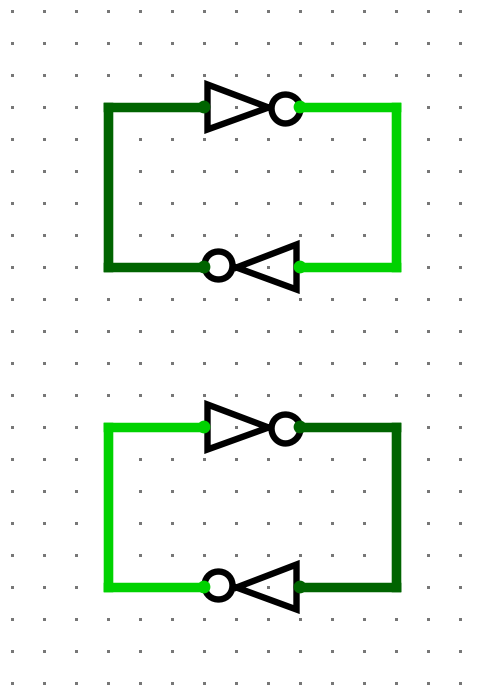
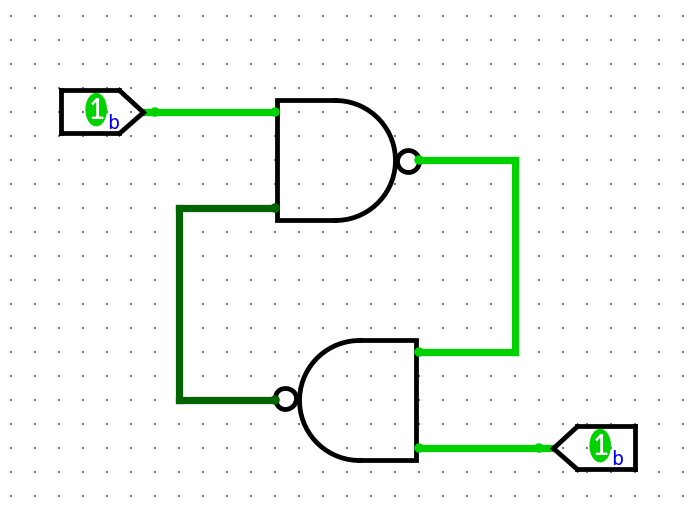
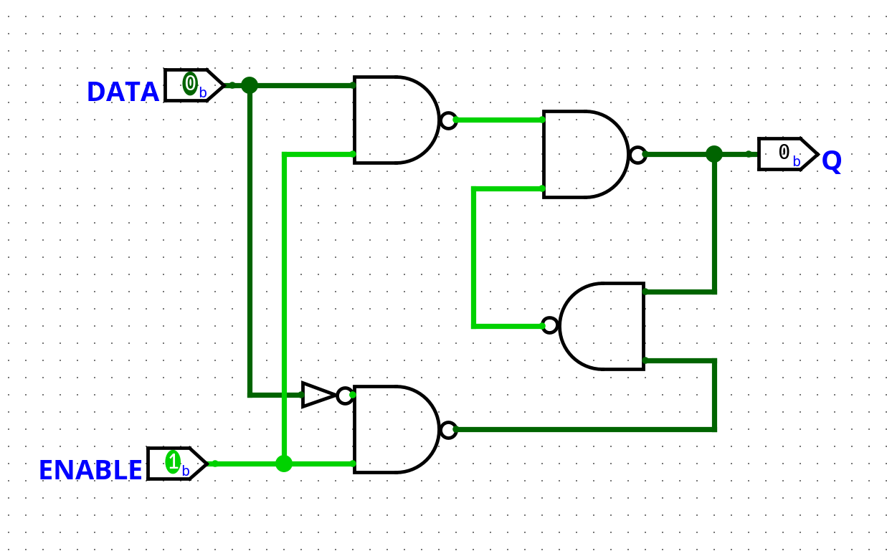
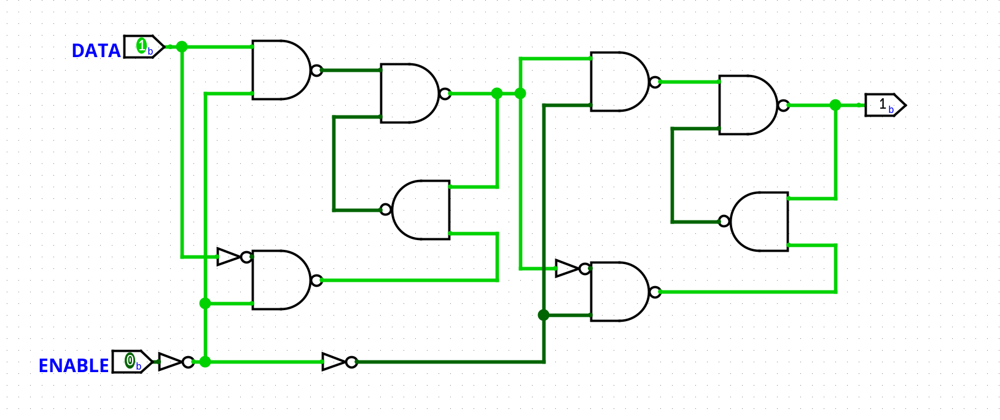
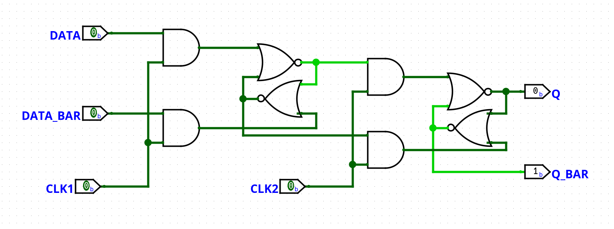

Two NOT gates wired into a loop have a rather interesting property: They have 2 distinct stable states:

This is of limited utility, because there is no way to switch between the two states.
This can be fixed by replacing the not gates with NAND[^0] gates, if an input is high, it behaves like a NOT gate, but if an input is low, the output is forced high:

This circuit stores 1 bit of information, it remembers which input was last pulled low.

The separate set and reset inputs are rather inconvenient for most uses, 2 more NAND gates (and one NOT) makes it a lot easier to use:

If enable is high, it behaves like a wire passing `DATA` out to `Q`, but when enable goes low, it stores the state it is in and outputs it regardless of what the `DATA` input is doing.
This configuration is called a D-latch, because can either let data pass, or "latch" it in place[^1]

While this design will work perfectly for the computer's RAM, it will not work for the accumulator or carry registers because those are both the input, and the output of the ALU.
During the time that the enable is high, data coming out of the ALU can go trough the accumulator, loop back into the ALU, then into the accumulator, etc.
A calculation will performed multiple times in a single clock cycle, with unpredictable results.

The accumulator needs to be implemented in a way that ensures it only changes state once per cycle.
The simplest (and most foolproof) way to do this is by chaining 2 D-latches together, with inverted enable signals:

When enable is low, the first latch is enabled, mirroring the input, and the second one is not.
When enable goes high, the first latch latches in the data, and the second one copies the first.
Because only one latch is ever enabled, their is no time where a feedback loop could be created.
This configuration is known as an edge-triggered D-flip-flop to differentiate it from the simpler high level triggered d-latch.

Using NOR gates to store the data and AND gates to create the set/reset signals requires less components because the AND gates and the the NOR gates can be combined into a single physical gate:

The inverters on the clock input have removed because with multiple registers it is more practical to generate the 2 clock phases separately and feed them in.
This results in a component count of just 12 transistors and 16 resistors per flip-flop.

At least 2 non overlapping clock phases are needed, during the first one the program counter will be incremented, the instruction will be decoded, data fetched from memory if needed, and the calculation will be performed.
During the second, registers (accumulator, carry, skip...) are written to, this will be the second clock input to any registers.

In short, everything happens during phase one, except storing data, which is reserved for phase 2 to avoid issues with feedback loops or transient states.

Obviously, the first phase will take a lot longer then the second, so the clock generator should generate a much longer pulse for phase one then two.

[^0]:  NOR gates can also be used identically, except that an input has to go high to change the state.

[^1]: This is also sometimes known as a transparent latch because it lets signals trough when enable is high
