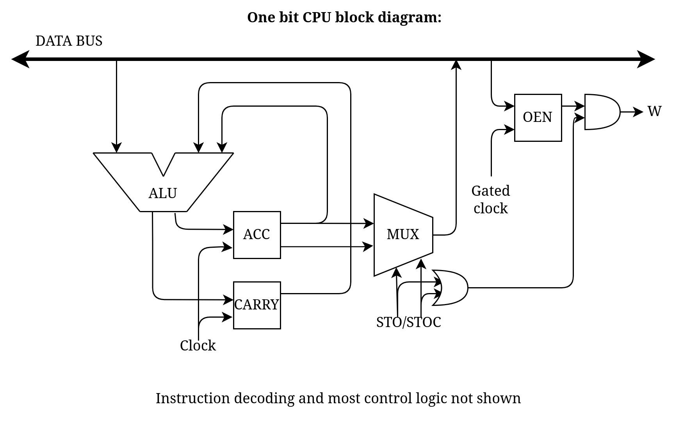

One-bit CPU block diagram, does not include program ROM, addressing, memory, or IO:



Unlike many other simple computers, the data bus (the thick bidirectional arrow, in reality just a long wire) is only used for interacting with memory and IO.
This has the advantage that almost everything can happen at the same time, allowing all instructions to be executed in just one clock cycle, removing the need for microcode or complex sequencing logic.

The one thing that needs sequential control logic is instruction skipping. (implementing the SKZ and RET instructions)
Skipping requires remembering if the next instruction will be skipped *between* instructions.

This can be done with an [edge triggered d-flip-flop](../4) with the clock phases reversed, so that the first stage is enabled during the second clock phase, and the second is during the first.
In this configuration, the flip-flop latches at the end of an instruction, but before the program counter updates, allowing the skip to be applied to the next instruction.

Actually skipping the instruction can be done by gating the phase 2 clock pulse (except to the skip register), so that the instruction does get executed, but has no effect.
Signals like `W`, `RET` and `JUMP` are emitted during phase 2 of the clock, so those don't require additional handling.
One technicality is that the the input to the skip register has to be forced to zero when the output is one[^1].

Another option is to use 4 AND gates to force the instruction to 0000 (NOP), resulting in no operation being performed, but this requires more gates[^0].

The clock gating option requires building an extra clock driver, but because this can just be an emitter follower, I doubt this will be a problem.

The control logic will be primarily a 4 to 16 decoder, that converts the opcode into a dedicated signal for each instruction.
From there, some of the signals can be directly used, like STO and STOC for controlling the bus driver (shown as MUX on the block diagram) and ADD, ONE, TWO going directly to the [ALU](../2).
A small ROM or collection of OR gates is required to generate the truth table for the [ALU](../2), and an AND and OR gate to determine if the next instruction should be skipped.
Finally some AND gates are required to strobe the W, RET and JUMP lines during phase 2, and to gate the phase 2 clock for the OEN register.

[^0]: This is what was done by the [MC14500B](https://www.righto.com/2021/02/a-one-bit-processor-explained-reverse.html) one bit industrial control unit.

[^1]:
	This is important to make sure a skipped instruction doesn't skip the next instruction:
	```asm
	SKZ some_zero_value
	RET
	LD something_else
	...
	```
	In this case, a skip signal will be generated by `SKZ`, skipping the `RET` instruction, but the `RET`, despite being skipped will generate a skip signal skipping the `LD`.
	Another case where this can happen is chained `SKZ`s:
	```asm
	SKZ a
	SKZ b
	STO something
	```
	This looks, like it executes `STO something` if `b` OR NOT `a`, but it would actually run `STO something` if `b`.
	
