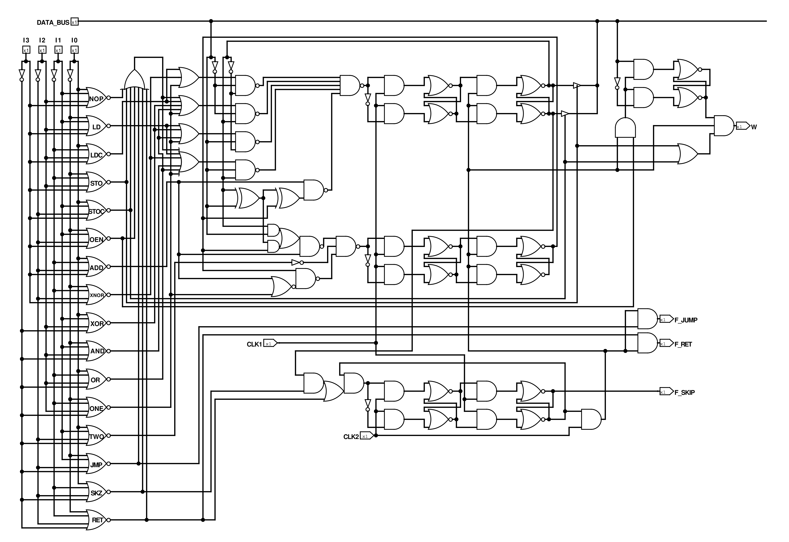
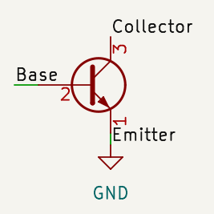
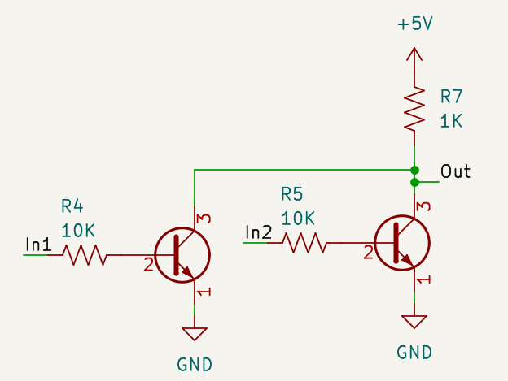
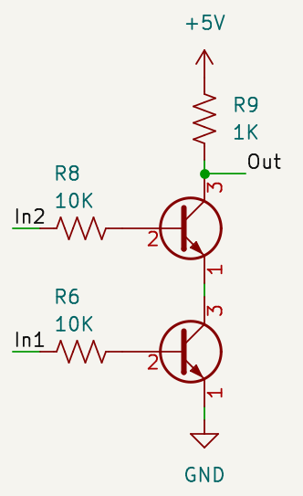
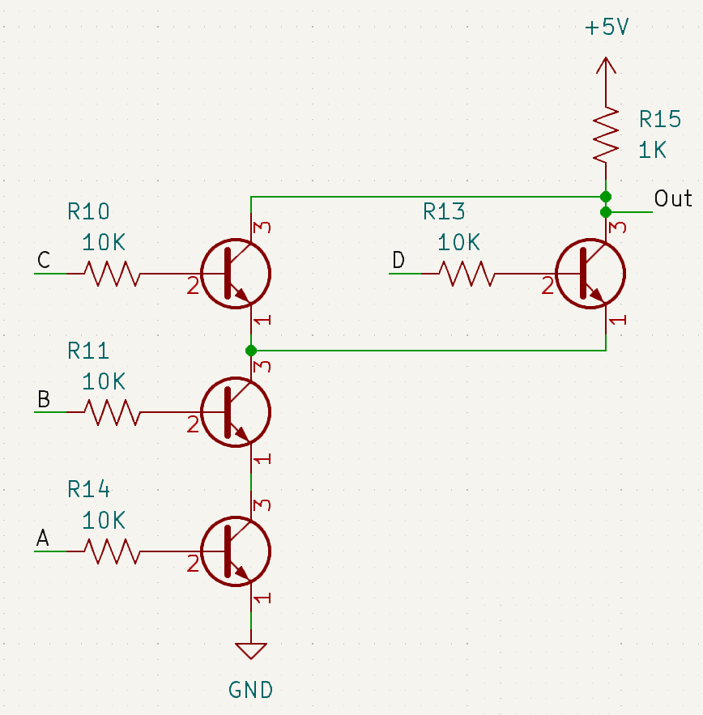

This is a gate level diagram of the one bit CPU:

Not much is new here, it has an [ALU](../2), a few [registers](../4), a fairly standard decoder and some OR gates to drive the ALU.
Together they implement all 16 of the [instructions from the first post](../1):

|Opcode|Name|Function|
|------|----|--------|
|0000 0|NOP |Does nothing|
|0001 1|LD  |Load the bus into the accumulator|
|0010 2|LDC |Load the complement of the bus into the accumulator|
|0011 3|STO |Writes the accumulator on the the bus|
|0100 4|STOC|Writes the complement of the accumulator on the bus|
|0101 5|OEN |Loads the OEN register from the bus|
|0110 6|ADD |Adds the accumulator to the bus, using the carry register to store the carry|
|0111 7|XNOR|XNORs the accumulator with the bus|
|1000 8|XOR |XORs the accumulator with the bus|
|1001 9|AND |ANDs the accumulator with the bus|
|1010 A|OR  |ORs the accumulator with the bus|
|1011 B|ONE |Forces a one into the accumulator and a zero into the carry|
|1100 C|TWO |Forces a zero into the accumulator and a one into the carry|
|1101 D|JMP |Strobes the jump flag|
|1110 E|SKZ |Skips the next instruction of the accumulator is zero|
|1111 F|RET |Skips the next instruction and strobes the return flag|

The diagram is drawn with logic gates, describing abstract logic, like "The output should be true if and only if all of the inputs are true". (AND gate).
While logic gates can be built out of almost anything, including [flowing liquids](https://www.youtube.com/watch?v=IxXaizglscw), [interlocking metal plates](https://en.wikipedia.org/wiki/Z1_(computer)), or even [dominoes](https://www.youtube.com/watch?v=OpLU__bhu2w), transistors are by far the most practical option.
They are cheap, easy to use, reliable and extremely fast.

Before creating any gates, we need to decide on how to represent a true/one and a false/zero in an electrical circuit:
I have, completely arbitrarily, chosen that true will be 5 volts, and false will be 0 volts.
As for the transistor, I used the 2N3904 but most other NPN transistors will work just fine[^4].

A NPN transistor will only allow current flow between the collector and emitter (AKA turn on) if current is flowing between the base and the emitter.[^1]
With a grounded emitter as shown, the transistor will ground the collector when current is going into the base.

Two resistors, on on the base and another on collector can turn the transistor into a useful gate:

If the input is at 0 volts, no current will flow into the base, and the resistor at the will pull the output to 5 volts.
If the input is at 5 volts, current will flow into the base, allowing current to flow from the collector to ground, pulling the output to 0 volts.
This is a NOT gate: The output will only be true (5 volts), if the input is false (0 volts).

A more complex gate can be built by adding another transistor[^2]:

Both transistors can pull the output to zero if their corresponding input is at 5 volts.
The result is that the output is only 5 volts if neither of the inputs are.
In other words, this is a NOT OR, or NOR gate.

A NAND gate can be built similarly:

Here, both transistors have to able to conduct to pull down the output, so the output is 5 volts unless both of the inputs are, so this is a NAND gate.

NAND and NOR have the interesting property, they can be combined to create arbitrarily complex logic, so are all that is needed to build *any* computer, but to keep the part count low, I will be using some more complex gates, like an `(a AND b) NAND (c OR d)` gate:

Despite the complexity, this gate works the same way as all the others: The output is 0 volts if there is a path of turned on transistors from the output to ground.

[^0]:
	To be fair, I settled on the general architecture before the instruction set, these instructions were designed to be easy to implemented with the architecture.

[^1]: Transistors require a certain amount of current to flow, expressed in their beta value. A given base current will allow at most beta (generaly around 100) times more current from the collector.

[^2]: This can also be done with two resistors going to the base of the same transistor, but this is less useful for designing complex gates, witch will be done in a future post.

[^4]: Depending on the leakage of the transistor it can help to add a resistor from the base to ground.
