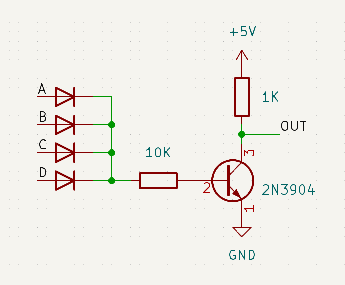
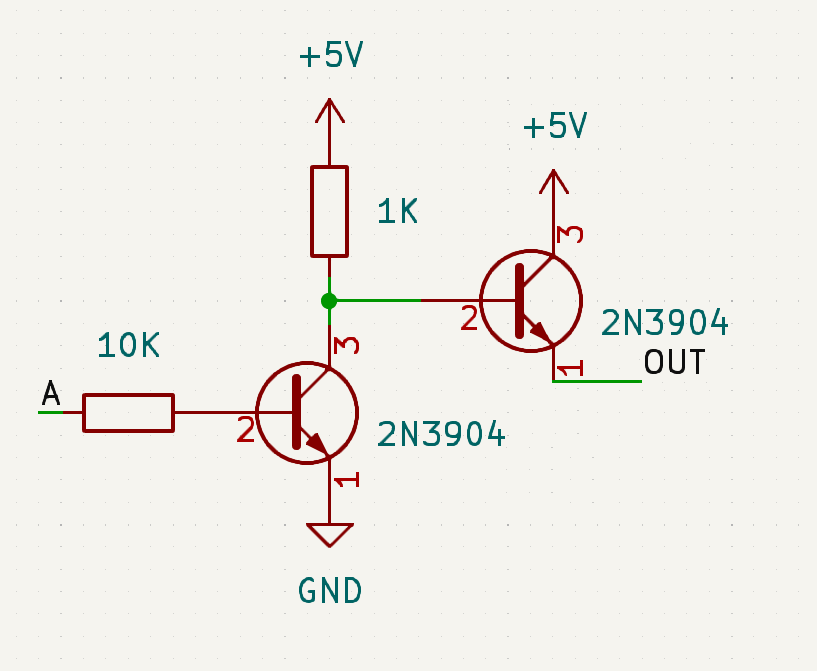

The first thing the computer has to with an instruction is to figure out what instruction it is.
This is done using a fairly standard decoder (in the red box):

A NOR gate only outputs a 1 if all of the inputs, in this case, bits of the instruction are 0.
If a bit of the instruction is inverted before the NOR gate, that bit will have to be a 1 for the output to be a 1.
This way a gate can be set up to output 1 on a specific instruction and a 0 on every other.

When building 4 input NOR gates, implementing the OR part with diodes and only using transistors for the NOT saves a lot of parts:

 

The NOT gates are fairly standard, but because they have to drive quite a few inputs (8), an emitter follower buffer stage makes sure that the inputs don't load down the 1K pull up resistor:

A similar buffer was also added to the NOR gates, because a single one can drive quite a few inputs elsewhere in the computer.

When ordering a PCB for the decoder, I split each NOR and NOT gate onto its own board.
This is because most manufacturers have a minimum order quantity, and allows the decoder nicely fit onto any size backplate.

The decoder really isn't the most interesting part of the computer, but is required by all the other stuff.

