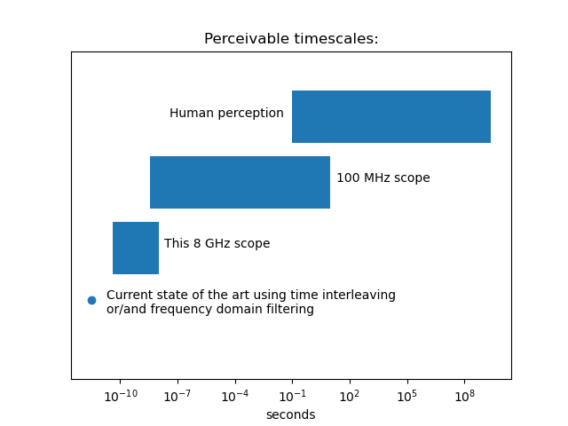

- Realtime is bad

Comercial multi-gigahertz scopes are expensive, sometimes up in the megadollar range.

	- Cost 

The reason for this is that they use real-time sampling, with a really fast ADC, really fast memory and a really fast clock to record the whole waveform in one go.
Parts that can do this are very expensive;
Texas instruments sells the [ADC12DJ5200SE](https://www.ti.com/lit/ds/symlink/adc12dj5200se.pdf?ts=1720926257205), a 10 GS/s 12-bit ADC, for over $2000.
Even a two thosand dollar ADC that would just be enough for a 5 GHz one channel or 2.5 GHz two channel scope.

	- Complexity

The high speed memory and needed glue logic easly bring the part cost into the tens of thosands, and the designing the thing would be a nighmere, with multiple tens of gigabit signals that need to be kept in sync to within a handful of picoseconds.

- Introduction to sampling

For my scope I decided to equivelent time sampling, a neat trick to get 80% of the functionality at 1% the complexity.

# Sampling magic

Nearly all waveforms of intrest are either periodic or repetitive.
This allows the scope to get away with just taking a single voltage measurement some time after the trigger event.
The scope simply increases the delay between the trigger and when the sample taken to reconstruct the original waveform:

This allows (and in fact, requires) the sample rate to be many times lower then the signal bandwith.
Just a few killosamples per second will be perfectly fine, even with multi-gigahetz signals.

Now most ADCs won't work here, because they will take a measurement averaged over quite a good length of time, smearing out any gigahertz level signals.
There are two solutions to this, one is a using a sample-and-hold circuit, and the other is to make a custom ADC using a high speed latching comparitor.

When the positive side of the comparitor is connected to the input, and the negative to a DAC it can be used to measure the input voltage by sweeping trough the voltage range of the DAC and observing the output.
If the comparitor is latched at a consistant time in a waveform, it functions as a near-perfect insantanios voltage measuring ADC.

- Parting out my scope

I ended up using the ADCMP373 a 8 GHz comparitor (42 picosecond rise time), which mouser sells for $22 a pece in small quantities.
There are faster comparitors out there, but I felt this one was a good 

I woulnt recomend this particualar part because it's input range is not centered on zero, making the scope to use annoying for some applications.
If you do swap it, just make sure the logic levels are compatable with the other chips, or include a converter, most high speed logic does not use the standard 0 to positvie supply output swing.

The only other high speed component the scope needs is a trigger, with an adjustable delay.
For the trigger itself, I used another high speed comparitor, combined with a d flip-flop for edge detection and to prevent the comparitor from unlatching on a later part of the waveform.

It took a bit to find a sutable delay chip (min 10 picosecond resolution, longish max delay), but I settled on the MC100EP195, intended for clock deskewing.
The delay range is only 10 nanosecods, so that will be the longest timespan the scope can see without external delaying.
Thats not good enough to work as a general purpose scope, but would complement a comercial 500 MHz - 1 GHz scope nicely.

The low speed side of things is an AVR32DD32 microcontroller and an AD5343, mostly because those were what I had on hand at the time.
The microcontroller runs the whole operation, setting the trigger level, delay, reference voltage and records how often the input is above the reference.

This outputs CDF data for each delay setting, that is, for each reference voltage, it has the number of times the input voltage was above it.

# Actually using the thing

# Schematics / Board design

- Results

The scope has an 20% to 80% rise time of ~40 picoseconds.

Light travels 12 milimeters in 40 picoseconds.

Funnlly enough, 40 picoseconds is  a factor of 7 billion away from the a blink of the eye (300 milliseconds), likely around the shortest instant of time precevable by humans.
A blink of the eye is also a factor of 7 billion away from the longest thing humans can experance, a lifetime, around 2.5 billion seconds.
In other words, the difference between the fastest thing the scope can see and the fastest thing you see is as large as the entire range of human experance:

 

[^bsearch]:
	There are much faster methods to measure the voltage, like binary search, but those will fail if the signal is not perfectly constant.
	The CDF method will still produce a voltage histogram, even for things like non-peroidic digital signals or jittery edges.
