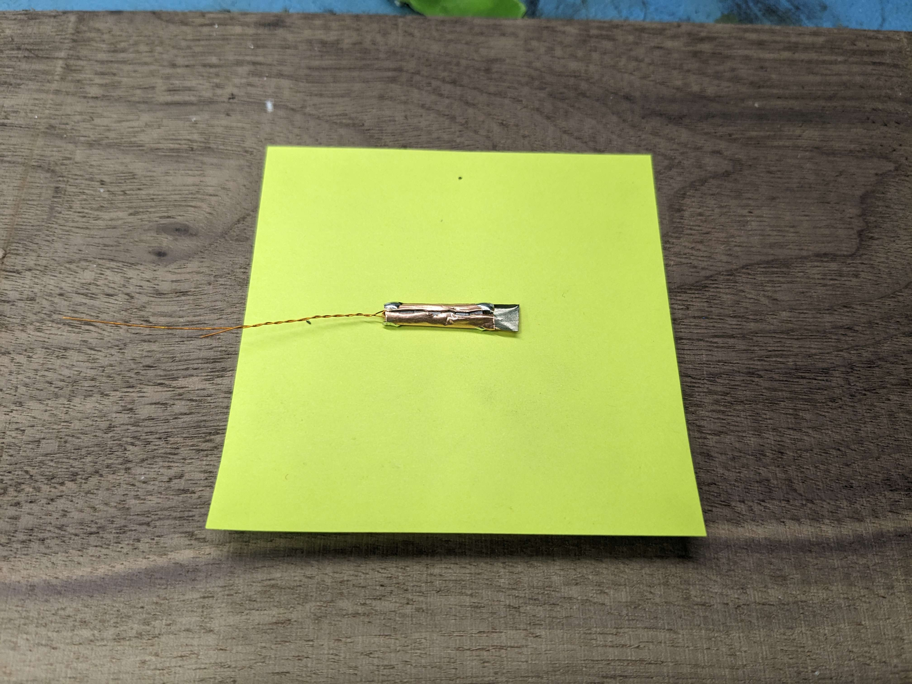

Magnetic materials, like iron and ferrite, limit how much magnetic flux can pass through them.
Normally, they concentrate nearby magnetic fields, but at the limit --- in saturation --- they exclude them.

When a coil is wound around an iron rod, running a large current will saturate the rod and kick out any external magnetic field.
Doing this with alternating current will chop the external field into a pseudo-alternating field, which can be detected using another coil:

A problem with this design is that the sense coil will also pick up the strong magnetic field of the driven coil, drowning out the signal.
This is usually prevented using two magnetic cores driven in opposite directions so that the induced voltages cancel out, but simply putting the two coils at 90 degrees to each other also works:

I could never quite get the cancellation to work right in the parallel version, but the orthogonal design worked every time.
The best results I got were using an orthogonal setup made from small (3.5 mm) binocular ferrites:

Normal torroids should also work, I just happened to have a whole bunch of the binocular ones from other experiments.

I strung together 7 cores and wound the drive coil through both holes for the whole stack:

I was able to fit 5 turns, but using more will reduce the current needed to saturate the cores, making the sensor easier to drive.

Next, I wrapped some copper tape around the cores and cut a lengthwise gap to interrupt eddy currents:

Grounding the tape will shield the sense coil from capacitive coupling with the drive coil, which helps protect the weak induced signal from switching spikes.
For the sense coil, I used around a hundred turns of enameled wire and some CA glue to hold everything together:

My function generator couldn't provide the current needed to saturate the core, so I used a small MOSFET as an amplifier:

My core is small and made from an easy to saturate material, so it only took around 100 mA to saturate.
If you use larger ferrites, you will need to supply more current.

This is what the voltage on sense coil looked like running at 40 kHz:

Blue: Driving waveform, Yellow: Sense coil signal

With how weak these signals are, you don't want to use a scope probe, which are very lossy.
A 10x probe will attenuate the signal down to one tenth of the original, making the scope's noise ten times worse then if the circuit was connected directly.

# Calibration

To measure the sensitivity, I needed a known magnetic field.
A simple coil will work, but using two coils produces a much more uniform field, the strength of which can easily be calculated:

I placed the magnetometer between the two coils and recorded the peak-to-peak output at different coil currents:

|Current&nbsp;&nbsp;&nbsp;&nbsp;&nbsp;|Field strength (calculated)&nbsp;&nbsp;&nbsp;&nbsp;&nbsp;|Output voltage (peak-to-peak)|
|-|-|-|
|0 A|0 uT|50 mV|
|.5 A|187 uT|59 mV|
|1 A|374 uT|70 mV|
|1.5 A|562 uT|83 mV|

From there, I did some quick math to figure out the sensitivity:

|Field strength (calculated)&nbsp;&nbsp;&nbsp;&nbsp;&nbsp;|Output change&nbsp;&nbsp;&nbsp;&nbsp;&nbsp;&nbsp;|Sensitivity (calculated)|
|-|-|-|
|187 uT|9 mV|48 V/T|
|374 uT|20 mV|53 V/T|
|562 uT|33 mV|58 V/T|

The sensitivity isn't great, probably because ferrite really isn't the best core material for these things.
Most real magnetometers either use exotic amorphous metals or nickel-iron-molybdenum alloys, but I don't currently have any of those to try.

It can measure the earths magnetic field (50 uT at my place), but the signal is just a few millivolts.
Geomagnetic storms should be down in the handful of microvolts, but might be detectable with the right amplification.

